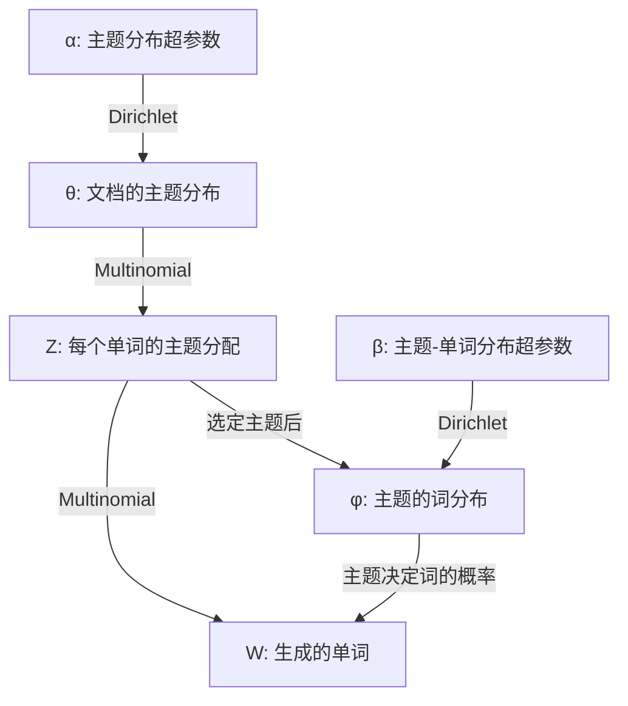
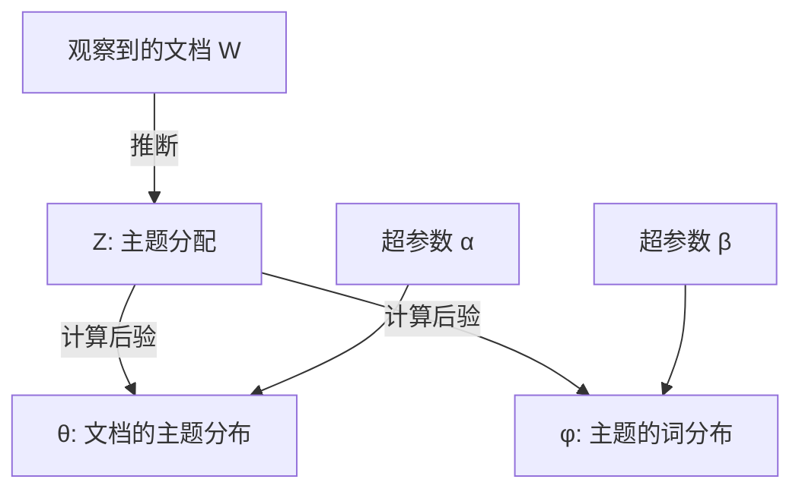
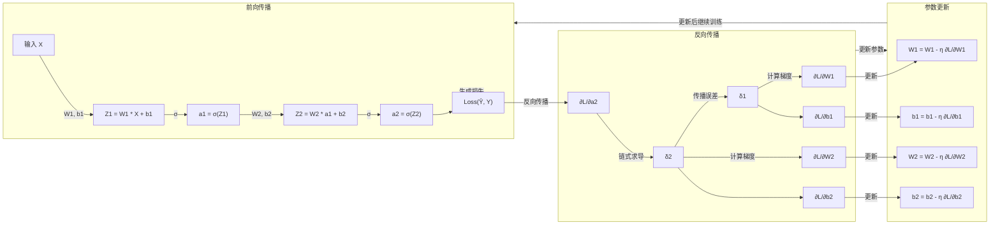

****

｜作者｜于阳｜

****

## 一、总论

### （一）简单介绍

#### 1.机器学习与因果推断

机器学习的指向是预测，即以历史数据为基础，通过X去预测Y。（***泛化**是机器学习的重要概念，指调试的算法具有适用性，能够对未知数据进行预测*）

因果推断的指向是关系，通过构建因果关系验证假设。

#### 2.机器学习关键术语

|      因果推断      |  机器学习  |
| :----------------: | :--------: |
|  自变量、解释变量  | 表征、特征 |
| 因变量、被解释变量 |    响应    |
|       观测值       |    案例    |
|        模型        |    算法    |

#### 3.有监学习与无监学习

**有监督学习**是根据已有数据集，知道输入和输出结果之间的关系，并根据这种关系训练得到一个最优模型（*既有特征也有标签*）。

**无监督学习**处理的是只有输入变量，没有相应的输出变量的训练数据。

### （二）基本原理

#### 1.过拟合和欠拟合

**过拟合**是指，算法在训练样本中过于优越，导致在测试数据集中表现不佳。

<div style="text-align: center;">
  
  <span style="display:block; margin-top: 10px; font-family: 'STHeiti', '华文细黑', sans-serif;">狸花猫</span>
</div

<div style="text-align: center;">
  <div style="display: flex; justify-content: center; gap: 10px;">
    
    
     </div>
  <span style="display:block; margin-top: 10px; font-family: 'STHeiti', '华文细黑', sans-serif;">橘猫与柯基犬</span>
</div>

> 例如，根据特征识别出猫和狗，但训练集中都是狸花猫的数据，因而训练集中的算法表现十分优秀。
> 但当测试集中不再是狸花猫的数据而是橘猫时，算法准确度就会变得很糟糕，难以分辨这是猫还是柯基犬。

**欠拟合**是指，算法在训练集和测试集中的表现都不好（*包含了太多无意义的噪音*）。

#### 2.偏差和方差

由于机器学习的重点是预测。因此，判断算法好坏即估计值与真实值之间的差距，在机器学习中称为**偏差（*Bias*）**，其定义为：
$$
Bias=\mathbb{E}\hat f(x)-f(x)
$$
其中$\hat{f(x)}$为给定$x$的估计值，$f(x)$ 为真实值。

**方差**是衡量在大量抽样过程中，估计量$\hat{f(x)}$本身围绕着其期望$\mathbb{E}\hat f(x)$的波动幅度，其定义为：
$$
Var=\mathbb{E}[\hat f(x)-\mathbb{E}\hat f(x)]^2
$$
事实上，算法的预测能力取决于**均方误差(*MSE*)**：
$$
\begin{align}
MSE(\hat{f}(x)) &= \mathbb{E}[(y - \hat{f}(x)]^2= \mathbb{E}[(f(x) + \epsilon - \hat{f}(x)]^2 \\
											&= \mathbb{E}[f(x)- \mathbb{E}\hat f(x)+\mathbb{E}\hat f(x)-\hat f(x)+\epsilon]^2 \\
											&=[\mathbb{E}\hat f(x)-f(x)]^2+\mathbb{E}[\hat f(x)-\mathbb{E}\hat f(x)]^2+\mathbb{E}(\epsilon^2)\\
											&=Bias^2+Variance+Var(\epsilon)
\end{align}
$$
也就是说，算法的预测性能同时受偏差和方差影响。一般来说，偏差小而方差大，会出现“过拟合”；偏差大而方差小则是“欠拟合”。

<div style="text-align: center;">
<div style="display: flex; justify-content: center; gap: 10px;">
  
   
     </div>
  <span style="display:block; margin-top: 10px; font-family: 'STHeiti', '华文细黑', sans-serif;">偏差和方差</span>
</div

总的来说，偏差表示算法是否准确，方差表示算法是否稳定。

#### 4.泛化

泛化是机器学习的首要目标，甚至是唯一目标。由于偏差和方差之间是此消彼长的关系，因此如何实现二者之间的最优是个难题。在这过程中，机器学习有三个最重要的方式以实现目标。

**（1）正则化**

在我们进行预测中，会用到最小二乘法。基于高斯-马尔可夫定理，我们很容易得到无偏估计，但无偏估计并不一定等于最优估计量。以最小二乘法建模时，我们的偏差为0，方差为$\sigma^2$。当模型过于复杂，$\sigma^2$会变得非常大，此时模型处于过拟合状态，泛化性能很低。因此需要通过引入惩罚项牺牲无偏性以减小方差，这个思路就叫做正则化。正则一词的本意为“*使某物变得规则、标准或规范*”，正则化就是使过拟合的模型变得更简单、规范，以避免模型在训练数据上学习到不必要的复杂性或噪声。

其中，最常用的正则化方式为岭回归和Lasso回归。具体来说，岭回归和Lasso回归都是在OLS的目标函数基础上加上惩罚项：
$$
\begin{align}
\text{岭回归}&:min(\sum_{i}(y_i-X_i^T\beta)^2+\lambda \sum_{i=1}^p\beta_j^2)\\
\text{Lasso回归}&:min(\sum_{i}(y_i-X_i^T\beta)^2+\lambda \sum_{i=1}^p|\beta_i|)
\end{align}
$$
惩罚项是对过拟合模型的一种“惩罚”，目的是限制模型的自由度。试想一下，你在一个城市的路上开车，目标是找到一个最佳路径，但你不能在每个街道上都停下来（*过拟合*），你希望找到一个尽可能简短、平稳的路径来避免走冗余的弯路。惩罚项就像是在路径的每个转弯点施加了一个“罚款”，每次转弯越多（*模型越复杂*）就要支付更多的“罚款”，最终你会选择一个更加简单、平稳的路径。

**（2）集成算法**

简单来说，集成算法的核心就是通过一些方式提高算法的预测性能（*力大砖飞*），例如，进行多次有放回的抽样求平均值。

**（3）深度学习法**

以神经网络为例，进行多次嵌套。

### （三）特点与应用

#### 1.特点

机器学习有以下几种优势与特点：

处理高维数据、处理非结构化数据、处理非线性关系、强调模型的泛化性能、对异质性估计重视、数据驱动。

#### 2.应用

机器学习的主要应用范围：

预测、生成数据（*将海量的非结构化数据处理成社会科学能够使用的结构数据*）、因果识别。

***

## 二、经典回归算法

### （一）OLS回归算法

#### 1.OLS基本原理

<div style="text-align: center;">
  
  <span style="display:block; margin-top: 10px; font-family: 'STHeiti', '华文细黑', sans-serif;">最小二乘法</span>
</div>

OLS（*Ordinary Least Squares*）的思想极其简单，在一群散点间我们能够画出无数条直线，我们希望其中一条直线能够使所有点到直线的距离最短，即残差和最小。由于散点不规则地分布在直线的上下两侧，因此残差必然会出现正负值，而我们很难比较$-1+1=0$与$-0.5+0.5=0$之间谁的残差和更小，为此我们对残差取平方，比较其平方和大小。因为我们追求的是残差平方和最小，所以这个方法就叫做最小二乘法。

通过计算残差，即观测值与期望值之间的差距，使得残差平方和最小而形成一条拟合曲线，其目标函数为：
$$
min(\sum_{i}(y_i-X_i^T\beta)^2)
$$
当OLS是BLUE（*Best Linear Unbiased Estimator*）时：
$$
Bias_{ols}=\mathbb{E}\hat (\beta)-\beta=0,Var_{ols}=\sigma^2
$$
因此，即便通过OLS预测得到的估计系数是无偏的，但方差大的缺点依旧让该方法在预测性能上表现较差。当然，其优点在于简单易用、参数估计无偏性和有效性、估计参数容易解释（*参数=特征变量对相应变量的边际影响*）。

#### 2.OLS算法的操作代码

我们用sklearn模块自带的糖尿病数据集进行演示，该数据集收集了442位糖尿病人的10个特征，用以预测糖尿病人的病情。

一般来说，使用python对OLS回归算法进行数据分析时，有六个步骤：

**（1）导入模块并加载数据**

首先，调用pandas、numpy和sklearn。

```python
# python演示代码

# 导入可能需要调用的包:sklearn, scipy, numpy, pandas
from sklearn.datasets import load_diabetes
import scipy
import numpy as np
import pandas as pd
```

接着从`load_diabetes()`加载数据，并查看数据特征。

```python
# 加载数据集
diabetes = load_diabetes()

# 查看特征数据维度
print(diabetes.data.shape)     # 特征矩阵
print(diabetes.target.shape)   # 目标向量
```

**（2）指定特征变量和响应变量**

示例中为糖尿病人的数据集，一共442条数据。其中，`data`是数据集中的特征变量，一共10个，类型为NumPy数组；`target`为数据集中的目标变量，同样也是NumPy数组。

```python
# 特征变量为X
X = diabetes.data
print(X.shape)
print(diabetes.feature_names)
print(diabetes.data)

# 定义响应变量为y
y = diabetes.target
print(y.shape)
print(diabetes.target)
```

**（3）划分训练集和测试集**

为了强化算法的预测性能，机器学习会将样本划分成训练集和测试集。首先，机器学习会在训练集中训练模型，得到参数估计值，然后将训练后的模型应用到测试集中，用于观察模型的预测能力。

一般来说，训练集和测试集的划分没有客观统一的标准，我们可以通过`test_size`进行调节。如果不指定`test_size`，则会默认训练集和测试集比为3:1。

```python
# 从sklearn中进一步调用train_test_split，用以划分训练集和测试集
from sklearn.model_selection import train_test_split

# 划分测试集和训练集，并将训练集和测试集的规模比例定义为0.7:0.3（默认是3:1）
X_train, X_test, y_train, y_test = train_test_split(X, y, test_size= 0.3, random_state= 1) # random_state是随机值，由于计算机伪随机，因此为了能够复现结果，这里设置为1

# 分别打印训练集和测试集中的特征变量和响应变量的数据结构
print(X_train.shape, y_train.shape)
print(X_test.shape, y_test.shape)
```

**（4）使用训练集训练模型**

在划分完训练集和测试集后，使用训练集来建模。首先定义一个算法，即实例化一个对象，在本示例中为建立线性回归模型。然后利用训练集`X_train`和`y_train`来训练这个模型。

```python
# 从sklearn中调用LinearRegression，并用这个线性模型来拟合
from sklearn.linear_model import LinearRegression
from sklearn import metrics

# 默认所有超参数
# 实例化一个对象
linreg = LinearRegression()

# 调用实例方法fit()
linreg.fit(X_train, y_train)  # 对应stata中的reg y X

# 打印计算的结果：模型估计的参数和截距
print("参数：", linreg.coef_)
print("截距：", linreg.intercept_)
```

**（5）评估模型预测性能**

训练完模型后，需要评估模型的预测性能。对于线性回归而言，一般使用测试集上的均方误差（*MSE*）或均方误差平方根（*RMSE*）。其中，$MSE(\hat y)=\mathbb{E}(\hat y-y)^2$而$RMSE =\sqrt{MSE}$。MSE和RMSE越小，则算法的预测性能越好。

```python
# 根据训练集和测试集中的特征变量计算出预测值
y_pred = linreg.predict(X_test)
y_pred1 = linreg.predict(X_train)
print(y_pred[0:5])
print(y_pred1[0:5])

# 用scikit-learn计算MSE
print("MSE for train sample：", metrics.mean_squared_error(y_train, y_pred1))
print("MSE for test sample：", metrics.mean_squared_error(y_test, y_pred))

# 用scikit-learn计算RMSE
print("RMSE for test sample：", np.sqrt(metrics.mean_squared_error(y_test, y_pred)))
```

**（6）调整参数选择最优模型**

一般而言，为了得到预测性能最佳的模型需要多次调整超参训练模型，每次都会得到一个MSE或RMSE。将这些进行对比，选择MSE或RMSE最小以获得最终训练的模型。在示例中，我们将特征变量转变成`dataframe`后，选择`bmi、bp、s5`这几个特征，观察是否会提升模型的预测性能。

```python
import pandas as pd
import numpy as np
from sklearn.linear_model import LinearRegression
from sklearn.datasets import load_diabetes
from sklearn.model_selection import train_test_split
from sklearn import metrics

# 加载数据
diabetes = load_diabetes()

# 重新对数据进行指定
X_full = pd.DataFrame(diabetes.data, columns=diabetes.feature_names)
y = diabetes.target

# 只选择几个特征
X = X_full[['bmi', 'bp', 's5']]

# 重复之前的步骤
X_train, X_test, y_train, y_test = train_test_split(X, y, test_size= 0.3, random_state= 1)
linreg = LinearRegression()
linreg.fit(X_train, y_train)

# 拟合模拟测试集
y_pred = linreg.predict(X_test)

# 用scikit-learn计算MSE
print("MSE for test sample:", metrics.mean_squared_error(y_test, y_pred))

# 用scikit-learn计算RMSE
print("RMSE for test sample:", np.sqrt(metrics.mean_squared_error(y_test, y_pred)))
```

### （二）岭回归算法

当我们需要面临的处理数据不再是简单的调查数据，而是海量大数据与高维数据，甚至出现变量数量超过样本的情况时，再使用OLS回归算法会存在十分严重的共线性问题。因为$\hat \beta=(X'X)^{-1}X'Y$，$\hat \beta$的求解依赖于$(X'X)^{-1}$是否可逆。在多重共线性的情况下，$X$存在线性相关，即$(X'X)$是个奇异矩阵不再可逆，因而$\hat \beta$不存在唯一解。想要规避该问题，我们需要进行正则化。

#### 1.岭回归算法的基本原理

**(1)岭回归算法的原理**

在总论的泛化部分，我们提到过岭回归的目标函数为：
$$
f=\sum_{i}(y_i-X_i^T\beta)^2+\lambda \sum_{i=1}^p\beta_j^2
$$
等式右边第二项是对所有待估计系数$\beta$求平方和（*L2范数惩罚项*）乘上一个调节参数（*超参数*）$\lambda$。其中，调节参数$\lambda\ge0$。参考OLS的思想，我们需要使目标函数最小，因此$\lambda$越大表明对模型复杂程度的惩罚力度越大，会更大程度的收缩系数$\beta$的估计值；当$\lambda\to \infty$时，惩罚力度极大，系数估计值$\beta \to 0$；当$\lambda=0$时，岭回归算法会回退到OLS回归算法。

我们将目标函数重写成：
$$
min((Y-X\beta)^T(Y-X\beta)+\lambda\beta^T\beta)
$$
为找到最小化目标函数，我们对$\beta$求导并令其等于0:
$$
\begin{align}
\frac{\partial }{\partial \beta}((Y-X\beta)^T(Y-X\beta)+\lambda\beta^T\beta) &=0 \\
-2X^T(Y-X\beta)+2\lambda\beta &=0 \\
X^TX\beta-X^TY+\lambda\beta &=0 \\
(X^TX+\lambda I)\beta &= X^TY \\
(X^TX+\lambda I)^{-1}X^TY &= \beta
\end{align}
$$
由于$\lambda I$为正定矩阵，$X^TX+\lambda I$可逆，因此$\beta$存在唯一解。

为了更直观理解惩罚含义，我们以几何形式进行解释。公式12可以等价改写成：
$$
\text{min}\sum_{i=1}^n(y_i-X \hat \beta)^2 \\
\text{s. t. }\beta_j^2\le t
$$
其中，$t \ge 0$。换言之，我们相当于需要在估计系数平方和不大于$t$这个条件下，根据最小化残差平方和求解参数。在二维空间下，约束条件等同于以$\sqrt t$为半径的圆，即$\beta_1^2+\beta_2^2=t$。

残差平方和的等值线可以表示为：
$$
\sum_{i=1}^n(y_i-(x_{i1} \beta_1+x_{i2}\beta_2)^2)=C
$$
其中，C是一个常数，表示残差平方和的某个固定值。因而$\beta$的所有可能取值的几何图形是一个椭圆形。

<div style="text-align: center;">
  
  <span style="display:block; margin-top: 10px; font-family: 'STHeiti', '华文细黑', sans-serif;">岭回归几何图形</span>
</div>

从图中我们可以更直观理解，如果要在圆形组成的可行解中将残差平方和最小化，那么最优解一定产生于圆形曲线与椭圆形曲线的交点，即岭回归的系数估计值。

同时，从图中也可以看到，在加入惩罚项后系数会向0收缩，但并不至于收缩至0。

**（2）岭回归算法的预测能力**

从估计值可知，$\hat \beta_{ridge}=\hat \beta_{ols}/(1+\lambda)$，即在加入惩罚项的情况下系数一定是有偏的。但相对而言，其系数的方差会缩小至$\sigma^2/(1+\lambda) $。也就是说，岭回归算法相较于OLS算法牺牲了模型的无偏性，降低了模型的方差，从而得到更好的样本之外的预测能力。

**（3）岭回归的优缺点**

岭回归算法相较于OLS回归算法有几个突出的优点：

**解决多重共线性问题**、**防止过度拟合**、**能够处理高维数据集**、**易于实现与计算**。

但同时，岭回归也有一些无法忽视的缺陷：

**调节参数选择困难（*$\lambda$值究竟取多少最合适*）**、**假设线性关系**、**不能自动选择变量（*Lasso算法的优势*）**。

#### 2.岭回归算法的操作代码

简单来说，岭回归算法相对于OLS算法只是增加了L2惩罚项，因此操作步骤与OLS回归算法几乎一致。

**（1）导入模块并加载数据**

```python
# python演示代码

# 导入可能需要调用的包:sklearn, scipy, numpy, pandas
from sklearn.datasets import load_diabetes
import scipy
import numpy as np
import pandas as pd

# 加载数据集
diabetes = load_diabetes()

# 查看特征数据维度
print(diabetes.data.shape)     # 特征矩阵
print(diabetes.target.shape)   # 目标向量
```

**（2）指定特征变量和响应变量**

在岭回归算法中，我们一样使用OLS中演示的例子。

```python
# 特征变量为X
X = diabetes.data
print(X.shape)
print(diabetes.feature_names)
print(diabetes.data)

# 定义响应变量为y
y = diabetes.target
print(y.shape)
print(diabetes.target)
```

**（3）划分训练集和测试集**

在示例中，我们将训练集和测试集默认为3:1，同时为了方便复现，随机状态`random_state`我们设置成0（*实际上设置成任何整数都可行*）。

```python
# 从sklearn中进一步调用train_test_split，用以划分训练集和测试集
from sklearn.model_selection import train_test_split
from sklearn.linear_model import Ridge

# 划分测试集和训练集，并将训练集和测试集的规模默认3:1
X_train, X_test, y_train, y_test = train_test_split(X, y, random_state= 0)

# 分别打印训练集和测试集中的特征变量和响应变量的数据结构
print(X_train.shape, y_train.shape)
print(X_test.shape, y_test.shape)
```

**（4）使用训练集训练模型**

在使用岭回归算法时，我们需要设定调节参数的取值，即$\lambda$值的大小。在示例中，我们暂时将超参数设定为2，然后使用训练集数据进行模型训练。最后输出岭回归的测试性能得分、系数估计值和常数项。

```python
# 指定正则化参数，这里暂时设定为2。之后用岭回归算法对数据进行拟合
# 正则化必须是正浮点数
ridge = Ridge(alpha= 2)
ridge.fit(X_train, y_train)

# 打印岭回归算法的测试性能得分、参数估计值和常数项
print(ridge.score(X_train, y_train))
print(ridge.coef_)
print(ridge.intercept_)
```

**（5）评估模型预测性能**

与OLS算法类似，岭回归算法同样通过MSE或RMSE来判断训练模型的测试性能。

```python
# 使用验证集进行性能测试
from sklearn import metrics

y_pred = ridge.predict(X_test)

# 用scikit-learn计算MSE
print("MSE for test sample:", metrics.mean_squared_error(y_test, y_pred))

# 用scikit-learn计算RMSE
print("RMSE for test sample:", np.sqrt(metrics.mean_squared_error(y_test, y_pred)))
```

**（6）调整参数选择最优模型**

岭回归算法的调参过程与OLS算法类型，目的是获得MSE或RMSE最小的预测模型。在岭回归算法中，我们主要通过调整调节参数$\lambda$。一般来说，我们会根据个人研究的需求设置一系列可能取值的列表，然后观察每一个取值对应的MSE或RMS的变化和数值大小，从而选择最优模型。

```python
from sklearn import linear_model

# 划分测试集和训练集，并设置随机状态
X_train, X_test, y_train, y_test = train_test_split(X, y, random_state= 0)

# 建立一个备选参数的列表
alphas = [0.01, 0.02, 0.05, 0.1, 0.2, 0.5, 1, 2, 5, 10, 20, 50, 100, 200, 500, 1000]
scores = []

# 循坏计算每一个参数对应的预测结果
for i, alpha in enumerate(alphas):
    ridge = Ridge(alpha=alpha)
    ridge.fit(X_train, y_train)
    scores.append(ridge.score(X_test, y_test))
print(scores)
```

### （三）Lasso回归算法

在面对高维数据时，我们会想在大量的特征变量中筛选出那些最能解释响应变量的特征变量。这一需求催生出了Lasso（*Least Absolute Shrinkage and Selection Operator*）回归算法。

#### 1.Lasso回归算法的基本原理

**（1）Lasso回归算法的原理**

在总论的正则化部分我们指出，Lasso回归算法同样也是在OLS回归算法的基础上加入惩罚项。但与岭回归算法不同，Lasso回归中不使用L2范数惩罚项，而是变更成L1范数惩罚项：
$$
f=\sum_{i}(y_i-X_i^T\beta)^2+\lambda \sum_{i=1}^p|\beta_j|
$$
等式右边第二项是对所有待估计系数$\beta$求绝对值和（*L1范数惩罚项*）乘上一个调节参数$\lambda$。其中，调节参数$\lambda\ge0$，当$\lambda=0$时，岭回归算法会回退到OLS回归算法。

根据链式法则，我们对L1范数惩罚项进行求导：
$$
\frac{\partial }{\partial \beta_j}|\beta_j| =
\begin{cases} 
1, & \beta_j > 0 \\
-1, & \beta_j < 0 \\
\text{不可导}, & \beta_j = 0
\end{cases}
$$
因此，目标函数在$\beta_j=0$处不可微，只能使用梯度下降法进行求解。正是因为不可微性使得Lasso估计产生稀疏解，导致一些系数为0，从而实现变量选择。

为了更直观理解，我们从几何图形的角度展示Lasso回归算法挑选变量的功能。我们将公式20等价成：
$$
\text{min}\sum_{i=1}^n(y_i-X\hat \beta)^2 \\
\text{s. t.}|\beta_j| \le t
$$
在二维空间下，约束条件变为$|\beta_1|+|\beta_2|=t$，即一个以原点为中心，边长为$\sqrt{t^2+t^2}=\sqrt{2}t$​的正方形。

残差平方和的等值线几何图形依然是个椭圆形。

<div style="text-align: center;">
  
  <span style="display:block; margin-top: 10px; font-family: 'STHeiti', '华文细黑', sans-serif;">Lasso回归几何图形</span>
</div>

从图中我们可以更直观的理解，如果要在正方形组成的可行解中将残差平方和最小化，那么最优解一定产生于正方形顶点与椭圆形曲线的交点，即Lasso回归的系数估计值。

在图中的情况下，$\beta_1=0$，因此可以筛除变量$x_1$。基于此，Lasso回归算法能够通过筛选对模型没有帮助的变量，以提高预测性能。

**（2）Lasso回归算法的优缺点**

Lasso回归算法相较于OLS回归算法和岭回归算法有一些优点：

**特征选择**、**可解释性强**、**能够处理大规模模型数据**、**稳健性强**、**可以与其他算法相结合**。

当然，Lasso回归算法也存在一些缺点：

**参数调节**、**只适用于线性关系**、**估计系数的偏向**、**注意力不平衡**。

#### 2.Lasso回归算法的操作代码

与岭回归算法一样，Lasso回归也有六个操作步骤：

**（1）导入模块和加载数据**

```python
# python演示代码

# 导入可能需要调用的包:sklearn, scipy, numpy, pandas
from sklearn.datasets import load_diabetes
import scipy
import numpy as np
import pandas as pd

# 加载数据集
diabetes = load_diabetes()

# 查看特征数据维度
print(diabetes.data.shape)     # 特征矩阵
print(diabetes.target.shape)   # 目标向量
```

**（2）指定特征变量和响应变量**

```python
# 特征变量为X
X = diabetes.data
print(X.shape)
print(diabetes.feature_names)
print(diabetes.data)

# 定义响应变量为y
y = diabetes.target
print(y.shape)
print(diabetes.target)
```

**（3）划分训练集和测试集**

```python
# 划分测试集和训练集，并将训练集和测试集的规模默认3:1
X_train, X_test, y_train, y_test = train_test_split(X, y, random_state= 1)

# 分别打印训练集和测试集中的特征变量和响应变量的数据结构
print(X_train.shape, y_train.shape)
print(X_test.shape, y_test.shape)
```

**（4）使用训练集训练模型**

```python
# 指定正则化参数，这里暂时设定为2
from sklearn.linear_model import Lasso
lasso = Lasso(alpha= 2)

# 用Lasso回归算法进行模拟
lasso.fit(X_train,y_train)

# 打印Lasso回归算法的测试性能得分、参数估计值和常数项
print(lasso.score(X_train, y_train))
print(lasso.coef_)
print(lasso.intercept_)
```

**（5）评估模型预测性能**

```python
# 使用验证集进行性能测试
from sklearn import metrics

y_pred = lasso.predict(X_test)
# 用scikit-learn计算MSE
print("MSE for test sample:", metrics.mean_squared_error(y_test, y_pred))

# 用scikit-learn计算RMSE
print("RMSE for test sample:", np.sqrt(metrics.mean_squared_error(y_test, y_pred)))
```

**（6）调整参数选择最优模型**

```python
# 划分测试集和训练集，并设置随机状态
X_train, X_test, y_train, y_test = train_test_split(X, y, random_state= 1)

# 建立一个备选参数的列表
alphas = [0.01, 0.02, 0.05, 0.1, 0.2, 0.5, 1, 2, 5, 10, 20, 50, 100, 200, 500, 1000]
scores = []

# 循坏计算每一个参数对应的预测结果
for i, alpha in enumerate(alphas):
    lasso = Lasso(alpha=alpha)  # 使用Lasso回归
    lasso.fit(X_train, y_train)
    scores.append(lasso.score(X_test, y_test)) 
print(scores)
```

### （四）算法调参

在机器学习中，为了寻找最优模型，我们需要选择最优参数。一般来说，机器学习的常见调参方式包括验证集法和交叉验证法。

#### 1.验证集法

验证集法就是我们前边提及的，将样本数据分为训练集和测试集。该方法简单易懂、节约开支，但同时存在数据利用率低等缺点。并且，如果面对的未知数据是训练集中未出现过的，该模型的预测性能将会严重降低。

#### 2.交叉验证法

交叉验证法的基本思想非常简单，通过重复使用数据实现模型稳定：**把给定的数据进行切分，将切分的数据集组合成训练集和测试集，并在此基础上进行反复训练、测试和模型选择**。

机器学习中会大量使用K折交叉检验来度量测试误差，以K=10，10折交叉验证法为例：

​	步骤一、**将样本中数据随机进行10等分（*形成大致相等的10个子集*）**。

​	步骤二、**将其中1个子集作为验证集（*测试集*），其余9个子集都作为训练集**。进行模型的训练、评估、验证预测并计算MSE和RMSE。

​	步骤三、**重复步骤二10次，直到每个子集都被作为验证集**。

​	步骤四、**将所有验证集的MSE进行平均**，即“交叉验证误差”（*CVE*）作为对测试误差的估计。

K折交叉检验的优点在于减小了验证集法的随机性和波动性，增加了模型评估的稳定性和准确性，让所有数据都有机会进入训练集。除了K折交叉检验法外，在样本量较小时还可使用留一交叉检验法，当然，其本质依旧是k=n的n折交叉检验法。其中，n为样本容量。换言之，将样本数据等分为n折，每折仅包含一个样本，因此不在具有随机性。

#### 3.岭回归和Lasso回归的调参

在岭回归和Lasso回归算法中，当$\lambda=0$时，算法会退化为OLS回归算法；当$\lambda \to \infty$时，估计参数$\beta$会趋于0。因此，最优$\lambda$会分布在$[0,\lambda_{max}]$中。由于交叉检验法考量的是MSE，而MSE是凸函数，即：
$$
\begin{align}
\text{MSE}(\beta) &= \frac{1}{n}\sum_{i=1}^n(y_i-X_i^T\beta)^2 \\
\text{MSE}(\beta) &= \frac{1}{n}\|y-X\beta\|_2^2
\end{align}
$$
MSE是个二次函数。此外，L1范数惩罚项和L2范数惩罚项均为凸函数。因此，$[0,\lambda_{max}]$中，必然会有一点使得$CV(\lambda)$达到最小值，此点就是最优超参$\lambda$。

#### 4.算法调参的操作代码

我们将介绍几种算法调参的具体操作步骤

**循环寻找最优超参**

**（1）导入可能用到的模块，并加载数据**

```python
import matplotlib.pyplot as plt
import numpy as np
from sklearn import datasets
from sklearn import linear_model 
from sklearn.linear_model import Lasso
from sklearn.model_selection import train_test_split

# 加载数据diabetes
diabetes = datasets.load_diabetes()

# 指定特征变量和响应变量
X = diabetes.data
y = diabetes.target
print(X.shape)
dir(diabetes)

# 划分训练集和测试集
X_train, X_test, y_train, y_test = train_test_split(X, y, test_size = 0.25, random_state = 1)
```

**（2）先使用默认超参，观察模型的预测性能**

```python
# 默认超参
lasso = Lasso()
lasso.fit(X_train, y_train)
print("权重向量:%s, b的值为:%.2f" % (lasso.coef_, lasso.intercept_))
print("损失函数的值:%.2f" % np.mean((lasso.predict(X_test)-y_test) ** 2))
print("预测性能得分:%.2f" % lasso.score(X_test, y_test))
```

**（3）设置一系列备选的超参集，然后通过循环的方式计算每个超参对应的预测性能**

```python
# 通过循环，寻找最优参数
X_train, X_test, y_train, y_test = train_test_split(diabetes.data, diabetes.target, test_size = 0.25, random_state = 1)
alphas = [0.01, 0.02, 0.05, 0.1, 0.2, 0.5, 1, 2, 5, 10, 20, 50, 100, 200, 500, 1000]
scores = []

for i, alpha in enumerate(alphas):
    lasso = Lasso(alpha=alpha)
    lasso.fit(X_train, y_train)
    scores.append(lasso.score(X_test, y_test))
print(scores)
```

**（4）将每个参数对应的预测解出，并可视化**

```python
# 可视化结果
fig = plt.figure()
ax = fig.add_subplot(1, 1, 1)
ax.plot(alphas, scores)
ax.set_xlabel(r"$\alpha$")
ax.set_ylabel(r"score")
ax.set_xscale("log")
ax.set_title("Lasso")
plt.show()
```

**交叉验证选择超参**

**（1）导入可能用到的模块和数据集，采用10折交叉验证法，并设置一组备选的超参集（*初始为0.01、最终为100、一共包含100个数的等比数列*）**

```python
import matplotlib.pyplot as plt
import numpy as np
from sklearn import datasets
from sklearn.linear_model import Lasso
from sklearn.model_selection import KFold
from sklearn.linear_model import LassoCV

#加载数据
diabetes = datasets.load_diabetes()
kfold = KFold(n_splits = 10, shuffle = True, random_state = 20)
alphas = np.logspace(-2, 2, 100)
print("First 10 alphas:", alphas[0:10])
print("Last 10 alphas:", alphas[-10:])
```

**（2）采用10折验证法，在备选超参中选择最优参数**

```python
# 交叉验证法寻找最优参数

diabetes = datasets.load_diabetes()
kfold = KFold(n_splits = 10, shuffle = True, random_state = 20)
alphas = np.logspace(-2, 2, 100)
model = LassoCV(alphas = alphas, cv = kfold)
model.fit(diabetes.data, diabetes.target)
print("Optimal alpha:", model.alpha_)
```

**重要特征选择**

**（1）导入可能用到的模块并加载数据集**

```python
import matplotlib.pyplot as plt
import numpy as np
from sklearn import datasets
from sklearn.linear_model import Lasso
from sklearn.model_selection import KFold
from sklearn.linear_model import LassoCV
import pandas as pd
from sklearn.preprocessing import StandardScaler

# 加载数据
diabetes = datasets.load_diabetes()
scaler = StandardScaler()
X = scaler.fit_transform(diabetes["data"])
Y = diabetes["target"]
names = diabetes["feature_names"]
```

**（2）采用10折交叉验证，并设置一组备选的超参集（*初始为0.01、最终为100、一共包含100个数的等比数列*）**

```python
kfold = KFold(n_splits = 10, shuffle = True, random_state = 30)
alphas = np.logspace(-2, 2, 100)
print("First 10 alphas:", alphas[0:10])
print("Last 10 alphas:", alphas[-10:])
```

**（3）交叉验证，在备选超参中选择最优参数**

```python
model = LassoCV(alphas = alphas, cv = kfold)
model.fit(X, Y)
print("Optimal alpha:", model.alpha_)
```

**（4）查看模型最终选择和剔除了几个特征变量**

```python
# 输出模型最终选择了几个特征变量，剔除了几个特征变量
import pandas as pd
coef = pd.Series(model.coef_, index = names)
print("Lasso picked " + str(sum(coef != 0)) + " variables and eliminated the other " + str(sum(coef == 0)) + " variables")
```

**（5）通过画图展示各变量的重要程度**

```python
import matplotlib.pyplot as plt

# 提取系数值最大和最小的三个特征
imp_coef = pd.concat([coef.sort_values().head(3),
                     coef.sort_values().tail(3)])
print(imp_coef)

# 绘制每个特征变量的估计值条形图
plt.rcParams['figure.figsize'] = (8.0, 10.0)
coef.plot(kind = "barh")
plt.title("Coefficients in the Lasso Model1")
plt.show()
```

****

<!-- pagebreak -->

## 三、经典分类算法

分类算法是一种用于将数据分为不同类别或标签的算法。其中，机器学习的分类算法可分为有监督和无监督。在总论部分我们提到，有监督机器学习分类算法是指，在训练过程，使用带有标签的数据样本进行学习，每个数据样本都有一个已知的标签或类别，例如“是”或“否”，“好”或“坏”。有监督学习的目的就是通过学习数据样本与标签之间的关系，建立预测新数据样本标签的模型，常见的算法包括逻辑回归、决策树、随机森林、支持向量机等。无监督机器学习算法则试图在没有明确指导的情况下，自动对数据进行分类或聚类，常见的无监督学习算法包括主成分分析、聚类分析等。无监督学习的优点在于能够在没有标签的情况下探索数据的内在结构，有助于对数据进行理解和预处理，同时，无监督学习的结果依赖于人的解释。

举个直观的应用场景。

> 例如，我们需要根据政府留言板来判断人们对政府的评价。
> 若留言数量不多，我们可以人工识别；但当留言数量超过10万甚至100万条时，人工识别费时费力。
> 为此，我们可以借助有监督学习算法，先从100万条留言中随机抽取1000条，手动打上标签（*“好政府”或“坏政府”*），再根据训练数据特征和标签之间的关系建立模型，最后让机器帮我们将剩余的99.9万条留言都打上标签。

无监督学习则是我们让机器自己根据一定算法寻找特征之间的联系。

> 例如，我们不知道留言板中的留言都讨论哪些话题。为此，我们可以采用LDA主题模型，通过词汇概率对留言主题进行推测。

在本章节中，我们主要介绍几种常用的有监督机器学习算法，而无监督机器学习算法则会在后续章节中详细介绍。

### （一）K临近算法

#### 1.K临近算法的基本原理

**（1）K临近算法的原理**

K临近算法（*K-Nearnest Neighbors，KNN*）的核心思想正如其名——**近朱者赤，近墨者黑**。

<div style="text-align: center;">
<div style="display: flex; justify-content: center; gap: 10px;">
  
   
  </div>
  <span style="display:block; margin-top: 10px; font-family: 'STHeiti', '华文细黑', sans-serif;">涛声依旧和学猫叫</span>
</div>

<div style="text-align: center;">
  
  <span style="display:block; margin-top: 10px; font-family: 'STHeiti', '华文细黑', sans-serif;">涛声依旧</span>
</div>

举个生活中的例子。

> 不同时代的音乐风格差异很大，假如我们知道《涛声依旧》是1990年代的流行歌，而《学猫叫》是2020年代的。当我们听到《再回首》时，会下意识认为它更贴近《涛声依旧》而非《学猫叫》，从而将其归类为90年代流行歌曲。

K临近算法便是根据未知样本和训练样本之间的距离，预测分类。具体步骤如下：

​	第一步，**收集包含已知类别标签的训练数据集**。

​	第二步，**选择K值**。K值是KNN算法的一个超参数，表示在分类时要考虑多少个最临近的样本。

​	第三步，**计算距离**。对于未知类别的新数据样本，在特征空间中计算其与训练数据集中每个样本之间的距离。常用的距离度量方法包括欧氏距离、曼哈顿距离、切比雪夫距离等。

​	第四步，**确定最近邻**。最近邻是指，在特征空间中距离目标样本最接近的样本点。

​	第五步，**投票选择类别**。根据K个最近邻的标签，投票决定新样本的类别。

**（2）计算距离的选择**

在不确定距离对结果影响的情况下，我们常用**闵可夫斯基距离**：
$$
d(x_1,x_2)=(\sum_{i=1}^m|x_{1i}-x_{2i}|^p)^\frac{1}{p}
$$
$p$是闵可夫斯基指数，决定了距离的计算公式。

当$p=1$时，变成**曼哈顿距离**：
$$
d(x_1,x_2)=\sum_{i=1}^m|x_{1i}-x_{2i}|
$$
当$p=2$时，变成**欧几里德距离（*欧氏距离*）**：
$$
d(x_1,x_2)=\sqrt{\sum_{i=1}^m(x_{1i}-x_{2i})^2}
$$
当$p \to \infty $时，变成**切比雪夫距离**：
$$
d(x_1,x_2)=\text{man}_i|x_{1i}-x_{2i}|
$$
除此之外，在遇到文本型数据时会使用**余弦相似度**：$\text{cos}(\theta)=\frac{x·y}{||x||||y||}$。在后续章节我们会进行更为详细的叙述。

总之，我们在使用KNN时需要依据应用场景，选择合适的距离公式。

| $p$值          | 对应距离     | 特点               |
| -------------- | ------------ | ------------------ |
| $p=1$          | 曼哈顿距离   | 适用于高维稀疏数据 |
| $p=2$          | 欧氏距离     | 适用于大多数情况   |
| $p \to \infty$ | 切比雪夫距离 | 只考虑最大坐标差   |

**（3）KNN操作注意事项和优缺点**

在操作过程中，我们需要关注：

<div style="text-align: center;">
  
  <span style="display:block; margin-top: 10px; font-family: 'STHeiti', '华文细黑', sans-serif;">KNN的不同取值</span>
</div>

​	第一、**K值的选择**。如图片所示，当K值取3时，绿点的预测结果为红；而K值取5时，则为蓝。换言之，K值的选取对结果影响很大。当采用最临近法（*K值为1*）时，偏差为0但方差很大，此时决策边界很不规则，导致过拟合；当K值取非常大时，决策边界过于光滑，无法捕捉数据中的信号，使得预测性能下降，导致欠拟合。因此，与经典回归算法的$\lambda$一样，我们需要通过交叉验证或网格搜索（*穷举*）进行调参来选择合适的K值。一般来说，K值取一个较小的数值，3-5较为合适。

​	第二、**选择合适的距离度量方式**。

​	第三、**数据归一化**。在使用KNN算法之前，通常需要对数据进行归一化，以避免某些特征对距离的计算产生过大影响。

​	第四、**处理样本不平衡问题**。当某些类别的数量较少时，需要考虑是否采取加权KNN算法，赋予不同的邻居样本不同权重。

诚然，KNN算法简单直观，但其依旧存在一些应用局限：

​	第一、**KNN是懒惰学习算法**。在KNN算法中，模型并不进行显式学习，而是将所有训练数据存储起来，直到需要预测时才根据距离计算以找到最接近的k个样本，进行投票或加权平均。

​	第二、**KNN在高维空间很难找到邻居，会遇到“维度灾难”**。因此，KNN算法要求样本容量n必须远大于特征向量的维度p。

​	第三、**KNN对噪音变量不稳健**。KNN算法无法区别对待对预测毫无关系的噪音变量，这会导致估计效率的降低。

#### 2.K临近算法的操作代码

在示例中，我们会用到sklearn模块自带的鸢尾花分类数据。该数据包含150个样本，分为3类，每一类50个数据，每个数据包含4个特征，通过花萼长度、花萼宽度、花瓣长度、花瓣宽度来预测鸢尾花属于哪个种类（*Setosa，Versicolor，Virginica*）。我们会先导入数据，然后通过手动编写代码来实现K临近分类算法（*帮助理解KNN如何实现*），最后我们使用sklearn模块自带的KNN分类器实现分类。

**加载数据和可能用到的模块**

```python
# 鸢尾花可以被分为Setosa，Versicolor，Virginica三个品种，我们需要建立一个预测模型，用以对未知数据判定其类型
import numpy as np
import matplotlib.pyplot as plt
from sklearn import datasets
plt.rcParams['font.sans-serif'] = ['Heiti TC'] #  用来正常显示中文标签

# 准备数据集
iris = datasets.load_iris()
X = iris.data  # X对应样本的四个特征
Y = iris.target  # Y对应样本的分类标签

# Y中的原始数据为0,1,2。为了简化处理，将其变成二分类问题，所以针对Y=0,1的行，从这些行中取X的前两列
x = X[Y<2,:2]  # 从X样本数据中选择Y<2的数据，并选择X中的前两列特征（花萼长度和花萼宽度）
print(x.shape)
print('x:\n',x)
y = Y[Y<2]
print('y:\n',y)
```

**手动实现KNN算法**

**（1）进行数据可视化**

将Y=0的点标记为空心点，Y=1的点标记为实心点。横坐标为花萼长度，纵坐标为花萼宽度。我们随机标记某一点（5.6，3.2），之后判断它属于哪个颜色。

```python
# 绘制散点图
plt.scatter(x[y == 0, 0], x[y == 0, 1], color='red', label='Class 0')
plt.scatter(x[y == 1, 0], x[y == 1, 1], color='green', label='Class 1')

# 画出要预测的新数据点
x_1 = np.array([5.6, 3.2])
plt.scatter(x_1[0], x_1[1], color='blue', marker='x', s=100, label='New Point')

# 添加图例和标签
plt.xlabel(iris.feature_names[0])  # x轴特征名称
plt.ylabel(iris.feature_names[1])  # y轴特征名称
plt.legend()
plt.show()
```

**（2）计算预测点到其他所有点的距离**

在示例中，我们选择欧氏距离，计算预测点（x_1）到其他所有点的距离。

```python
# 采用欧氏距离计算预测点到其他点的距离
distances = [np.sqrt(np.sum((x_t-x_1)**2)) for x_t in x]

# 对上述距离组进行排序，并获取排序后的索引
d = np.sort(distances)
nearest = np.argsort(distances)
print(nearest)
```

**（3）选择K值，确认最近邻并投票选择类别**

在示例中，我们暂时将K取值为6，即根据预测点的6个最临近样本确定其颜色。

```python
# 选择6个临近
k = 6
topk_y = [y[i] for i in nearest[:k]]
print(topk_y)

from collections import Counter # 导入Counter计数工具

# 对topk_y进行统计，返回一个字典{类别:票数}
votes = Counter(topk_y)
print(votes)

# 获取投票最多的类别
predict_y, count = votes.most_common(1)[0]  # 直接解包得到预测的类别和票数
print(votes.most_common(1))  # 返回投票结果与具体票数
print(predict_y)  # 输出最终预测类别
```

**使用KNN分类器实现分类算法**

**（1）加载数据导入可能用到的模块，并划分训练集和测试集**

```python
from sklearn import datasets
from sklearn.model_selection import train_test_split
from sklearn.neighbors import KNeighborsClassifier
iris = datasets.load_iris()
x = iris.data
y = iris.target
x_train, x_test, y_train, y_test = train_test_split(x, y, test_size= 0.25, random_state= 123)
```

**（2）建立KNeighborsClassifier分类器并调用fit方法进行训练，最后调用predict方法使用模型预测并输出分类准确率**

```python
knn_classifier = KNeighborsClassifier(n_neighbors = 5)  #设置5个邻居，即K=5
knn_classifier.fit(x_train, y_train)  # 训练模型
y_predict = knn_classifier.predict(x_test)  ## 在测试集中使用预测模型
scores = knn_classifier.score(x_test, y_test)  ## 计算准确率。准确率（accuracy）=（正确预测的样本数）/（总样本数量）

print('acc: {} scores: {}'.format(sum(y_predict == y_test) / len(y_test), scores))  #手动计算准确率
```

**（3）进行调参**

与岭回归算法和Lasso回归算法类似，K临近算法同样需要调整超参数来实现最优模型。对机器学习而言，参数可分为模型参数和超参数。其中，KNN没有模型参数，因此我们需要调整两个超参数——**K值**和**权重**。

在调参中，我们使用sklearn库中自带的digits数据集。这是一个经典的手写数据子图数据集，属于典型的分类问题。在这个数据集中包含了8$\times$8像素的手写数字图像，每个图像都是一个数字（*0到9*）。即，每个图像由64个特征组成，每个图像都对应一个数字标签，一共10个类别。

```python
# 加载数据、导入模块，指定特征变量、响应变量，划分训练集和测试集
from sklearn import datasets
from sklearn.model_selection import train_test_split, cross_val_score
from sklearn.neighbors import KNeighborsClassifier
from sklearn.model_selection import cross_val_score
from sklearn.metrics import make_scorer, f1_score

# 加载数据
digits = datasets.load_digits()
x = digits.data
y = digits.target
x_train, x_test, y_train, y_test = train_test_split(x, y, test_size=0.25, random_state=123)

# 初始化
best_k = -1
best_score = 0
best_method = None  # 初始化为None，表示未找到最好的方法

# 寻找最好的K和weights
for method in ['uniform', 'distance']:  # weights默认是uniform，参数可以是uniform、distance。当然KNeighborsClassifier也可以自定义权重，比如def custom_weights(distances):return 1 / (distances + 1e-5)，之后将weights=custom_weights
    for i in range(1, 11):
        knn_clf = KNeighborsClassifier(n_neighbors=i, weights=method)
        cv_scores = cross_val_score(knn_clf, x_train, y_train, cv=10)  # 使用10折交叉验证来评估模型的性能
        mean_cv_score = cv_scores.mean()  # 计算交叉验证的平均得分
        if mean_cv_score > best_score:
            best_score = mean_cv_score
            best_k = i
            best_method = method

print('最好的K值:%d, 最好的准确率:%.4f, 最好的方法:%s' % (best_k, best_score, best_method))

# 用F1替换best_score进一步检验模型预测性能
# 初始化
best_k = -1
best_method = None  # 初始化为None，表示未找到最好的方法
best_f1 = 0  # 初始化F1分数

# 寻找最好的K和weights
for method in ['uniform', 'distance']:  # weights默认是uniform，参数可以是uniform、distance
    for i in range(1, 11):
        knn_clf = KNeighborsClassifier(n_neighbors=i, weights=method)
        
        # 进行10折交叉验证，返回F1分数
        cv_scores = cross_val_score(knn_clf, x_train, y_train, cv=10, scoring='f1_macro')  # 使用macro平均方式计算F1分数
        mean_f1_score = cv_scores.mean()  # 计算交叉验证的平均F1分数

        # 更新最佳F1分数和K值、权重方法
        if mean_f1_score > best_f1:
            best_f1 = mean_f1_score
            best_k = i
            best_method = method

print('最好的K值:%d, 最好的F1分数:%.4f, 最好的方法:%s' % (best_k, best_f1, best_method))
```

### （二）朴素贝叶斯算法

#### 1.朴素贝叶斯算法的基本原理

**（1）朴素贝叶斯算法的原理**

朴素贝叶斯算法（*Naive Bayes，NB*）是一种基于概率统计的简单高效的机器学习分类器，基于贝叶斯定理和特征条件独立性假设，用于解决分类问题。朴素贝叶斯算法的核心思想可以简单概括为：**倒推**，即在给定一组特征的情况下，根据已知类别的数据计算每一个类别的后验概率，然后选择具有最大后验概率的类别作为预测结果。

**后验概率**（*Posterior Probability*），是指某件事已经发生，计算事情发生是由某个因素引起的概率；**先验概率**（*Prior Probability*），是指根据以往经验和分析，在实验或采样前就可以得到的概率。

举个例子。

> 假如发生了凶杀案，需要我们找到凶手。
> 此时我们可以根据过往的案子中“有类似情况时，嫌疑人通常是谁”，从而推断凶手，这个过程就是朴素贝叶斯。

当然，朴素贝叶斯是个被美化的翻译。“朴素”原词是“navie”，即天真的。朴素贝叶斯算法之所以“天真”，是其假定**特征之间相互独立**，即在给定类别的情况下，特征之间没有关联性（*现实中几乎不存在完全相互独立的特征，所以这种算法其实是十分“天真”的设定*）。但这样做的好处在于，能够使计算后的概率更加简化，从而提高计算效率。

**（2）数学描述**

设定输入空间$X\subseteq R^n$为$n$维向量的集合，输出空间维类标记集合$Y={c_1, ,c_2,...,c_i,...,c_k}$，输入特征向量$x \in X$，输出空间分类标记$y \in Y$。训练集数据$T={(x_1,y_1),(x_2,y_2),...,(x_n,y_n)}$，$P(X,Y)$独立同分布。其条件独立性为：
$$
\begin{align}
P(X=x|Y=c_i)&=P(X^{(1)}=x^{(1)},...,X^{(n)}=x^{n}|Y=c_i) \\
&=\prod_{j=1}^nP(X^j=x^j|Y=c_i)
\end{align}
$$
朴素贝叶斯使用后验概率：
$$
\begin{align}
P(Y=c_i|X=x) &=\frac{P(Y=c_i,X=x)}{P(X=x)} \\
&=  \frac{P(X=x|Y=c_i)P(Y=c_i)}{P(X=x)} \\
&= \frac{P(X=x|Y=c_i)P(Y=c_i)}{\sum_iP(X=x|Y=c_i)P(Y=c_i)} \\
&= \frac{P(Y=c_i)\sum_jP(X^j=x^j|Y=c_i)}{\sum_iP(Y=c_i)\prod_{j}P(X^j=x^j|Y=c_i)}
\end{align}
$$
其中，$P(Y=c_i)$是先验概率，我们在分析之前需要先假设**事件的概率分布**，主要包括高斯分布（*应用于连续数据*）、多项式分布（*应用于计数数据*）、伯努利分布（*应用于二分类数据*）。

此外，因为朴素贝叶的“概率连乘”具有“一票否决”的特点，所有我们有时还需要进行**拉普拉斯修正**，即加一平滑。我们假设，一个随机变量$X$中，存在多个取值可能$x_1,x_2,...,x_i$。计算特征条件概率：
$$
P(x_i|Y=c_j)=\frac{\text{count}(x_i,c_j)}{\text{count}(c_j)}
$$
其中，$\text{count}(x_i,c_j)$是特征$x_i$在类别$c_j$中出现的次数，$\text{count}(c_j)$是类别$c_j$中的总样本数。如果$x_i$在$c_j$中从未出现过，$\text{count}(x_i,c_j)=0$，则后续概率都会为零。为了避免计算问题，我们加上拉普拉斯修正:
$$
P(x_i|Y=c_j)=\frac{\text{count}(x_i,c_j)+1}{\text{count}(c_j)+k}
$$
其中，1是计数上的常数，表示我们假设每个事件至少出现1次；$k$是特征空间的大小。继而避免了概率为0的情况。

举个现实中的例子。

<div style="text-align: center;">
  
  <span style="display:block; margin-top: 10px; font-family: 'STHeiti', '华文细黑', sans-serif;">可乐与雪碧</span>
</div>

> 我们在超市会看见非常多饮料，每种饮料都包含两个特征：含糖和含气。同时，我们知道可乐和雪碧含糖与含气的情况。现在，我们看到一款甜味气泡饮料，我们需要判断它是可乐还是雪碧。
> 首先，算法会计算先验概率。比如，可乐的市场占比是60%，雪碧是40%；
> 然后计算含糖和含气的可乐和雪碧的概率。假设含糖的可乐占市场70%，含气占80%；雪碧含糖占60%，含气占90%；
> 最后我们根据朴素贝叶斯计算新产品是可乐还是雪碧的概率。

可乐的概率：$70\%\times 80\% \times60\%=33.6\%$

雪碧的概率：$60\% \times 90\% \times 40\%=21.6\%$

因此，朴素贝叶斯算法会预测这个新产品是可乐。

#### 2.朴素贝叶斯算法的操作代码

在示例中，我们同样采用sklearn模块自带的鸢尾花数据集。基于不同的分布，朴素贝叶斯算法大致有三类：高斯朴素贝叶斯（*Gaussian Naive Bayes*）、多项式分布朴素贝叶斯（*Multinomial Naive Bayes*）、伯努利朴素贝叶斯（*Bernoulli Naive Bayes*）。

**（1）高斯朴素贝叶斯**

高斯朴素贝叶斯常用到的参数包括：

`var_smooth`，用于调整方差平滑的参数。它是一个非常小的常数，目的是避免某些特征的方差为零。该值越小，模型对小方差的特征越敏感；越大，模型对方差小的特征容忍度越高。一般默认为`1e-9`。

`priors`，用于指定每个类的先验概率，一般默认`None`。

`fit_prior`，是否学习分类的先验概率，一般默认`True`。如果设置为`True`，模型会根据训练数据自动估算类别的先验概率；如果设置为`False`，则先验概率由`priors`参数给定（*如果*`priors=None`，*则使用均匀分布*）。

```python
# 高斯朴素贝叶斯
from sklearn.naive_bayes import GaussianNB
from sklearn import datasets
from sklearn.model_selection import train_test_split

# 加载数据集
iris = datasets.load_iris()
x = iris.data
y = iris.target

# 划分训练集和测试集
x_train, x_test, y_train, y_test = train_test_split(x, y, test_size=0.3, random_state=123)

# 初始化模型并训练
clf = GaussianNB()
clf.fit(x_train, y_train)

# 计算测试集的准确率
score = clf.score(x_test, y_test)
print("score:", score)
```

**（2）伯努利朴素贝叶斯**

伯努利朴素贝叶斯的操作过程与高斯朴素贝叶斯基本一致，只是参数会略微不同。

`alpha`，平滑参数，防止零概率问题，默认值为1，即拉普拉斯平滑。通常通过交叉验证来选择最佳的`alpha`值。较大的`alpha`值通常会增加平滑程度，从而降低模型的复杂度。

`fit_prior`，如果为`True`，则模型会根据训练数据自动计算各类别的先验概率；如果为`False`，则假设所有类别的先验概率是相等的（*如果数据集类别分布不均，可以尝试将其设置为`False`，使得每个类别的先验概率相等，从而改善不均衡分类的效果*）。默认值为`True`。

`class_prior`，手动指定各类别的先验概率，覆盖`fit_prior`参数的效果。默认值：`None`，表示根据训练数据自动计算（*例如，在鸢尾花示例中，可以指定三种类别的先验概率分别为`[0.2, 0.4, 0.4]`*）。

```python
# 伯努利朴素贝叶斯
from sklearn.naive_bayes import BernoulliNB
from sklearn import datasets
from sklearn.model_selection import train_test_split
from sklearn.preprocessing import Binarizer

# 加载数据集
iris = datasets.load_iris()
x = iris.data
y = iris.target

# 进行数据转换
threshold = 2.5  # 自定义阈值为2.5
scaler = Binarizer(threshold=threshold)  # 创建一个Binarizer对象并设定阈值
x = scaler.fit_transform(x)  # 使用该阈值将数据进行二值化，小于2.5为0，大于为1。

# 划分训练集和测试集
x_train, x_test, y_train, y_test = train_test_split(x, y, test_size=0.3, random_state=123)

# 初始化模型并训练
clf = BernoulliNB()
clf.fit(x_train, y_train)

# 计算测试集的准确率
score = clf.score(x_test, y_test)
print("score:", score)
```

**（3）多项式朴素贝叶斯**

多项式朴素贝叶斯的参数主要包括：

`alpha`，平滑参数。如果设置为1.0，则表示进行拉普拉斯平滑。`alpha`是浮点型数据，值越大，平滑效果越强；如果设置为0，则不进行平滑。默认值为1.0。

`fit_prior`，是否使用类的先验概率。如果为`True`，则模型会根据训练数据估算每个类的先验概率。如果为`False`，则假定每个类的先验概率是相同的。`fit_prior`是布尔型数据，默认值为`True`。

`class_prior`是一个数组，表示每个类别的先验概率。它的长度为类别数`n_classes`，每个元素是一个类别的先验概率。如果这个参数为`None`（*默认值*），模型会自动根据训练数据计算每个类别的先验概率。

`binarize`用于二值化输入数据的阈值。如果特征的值大于该阈值，则该特征会被视为`1`，否则视为`0`。此参数在处理布尔特征时非常有用（*例如，`binarize=0`*）。

```python
# 多项式朴素贝叶斯
from sklearn.naive_bayes import MultinomialNB
from sklearn import datasets
from sklearn.model_selection import train_test_split

# 加载数据集
iris = datasets.load_iris()
x = iris.data
y = iris.target

# 划分训练集和测试集
x_train, x_test, y_train, y_test = train_test_split(x, y, test_size=0.3, random_state=123)

# 初始化模型并训练
clf = MultinomialNB()
clf.fit(x_train, y_train)

# 计算测试集的准确率
score = clf.score(x_test, y_test)
print("score:", score)
```

总的来说，高斯朴素贝叶斯、伯努利朴素贝叶斯、多项式朴素贝叶斯算法各有不同，需要根据实际的应用场景和数据情况进行选择。

| 特点         | 高斯朴素贝叶斯  | 伯努利朴素贝叶斯    | 多项式朴素贝叶斯   |
| ------------ | --------------------------------------- | ---------------------------------------------- | ------------------------------------------------------ |
| 适用场景     | 特征是连续值，符合高斯（*正态*）分布    | 特征是二值化的（*即每个特征的值是0或1*）       | 特征是计数数据或离散值，适用于文本分类等计数特征的数据 |
| 假设特征分布 | 假设特征的分布是高斯分布                | 假设每个特征的值独立且服从伯努利分布（*0或1*） | 假设每个特征的值符合多项式分布（*适合计数数据*）       |
| 特征类型     | 适合连续特征                            | 适合二元（*0/1）*特征                            | 适合计数特征（*词频*）                                 |
| 常见应用     | 生物学数据、股票市场预测                | 文本分类中每个特征是否出现                     | 文本分类、情感分析、推荐系统等                         |
| 整体优点     | 计算效率高，简单易实现                  | 适合分类中有二进制特征的情况                   | 适用于大规模的离散数据集，尤其是文本分类任务           |

### （三）决策树算法

#### 1.决策树算法的基本原理

**（1）决策树算法的原理**

本质上，决策树也是一种临近方法，可视为“自适应临近法”（*Adaptive Nearest Neighbor*）。但与KNN不同的是，决策树（*Decision Tree，DT*）考虑了$y$的信息。

<div style="text-align: center;">
  
  <span style="display:block; margin-top: 10px; font-family: 'STHeiti', '华文细黑', sans-serif;">决策树</span>
</div>

如图片所示，DT是一种基于属性结构的机器学习算法。从根节点开始，根据特定特征逐步划分，形成一系列决策节点，最终达到叶节点，从而实现对新数据的分类。

举个直观的例子。

> 我们在生病时会出现许多症状。在就诊过程中，医生为了知道我们究竟得的什么病，会对我们逐一询问。
> “*哪里不舒服？*”$\to$“*什么时候不舒服*”$\to$“*有没有吃什么不干净的东西*”$\to$“*有没有拉肚子*”

在这个过程中，每一个问题都对应一个特征变量的划分，可能需要经过问多个问题（*多次分裂*）才能得到最后的判断（*叶子节点*）。

医生是如何决定先问什么问题，后问什么问题，什么时候停止继续发问而做出病情判断的？这个逻辑构成了决策树的规则。

|决策树|医生问诊|
|-----|-----|
|基于特征划分数据|基于病症筛选疾病|
|逐步分裂节点|逐步询问病情|
|叶子节点（*分类或回归*）|诊断明确或需要进一步检查|
|规则固定，基于数据训练|结合经验、直觉和背景知识|

参照这样的话语体系，构建决策树的步骤大致如下：

步骤一、**将所有数据看成一个节点，进入步骤二**。

步骤二、**从所有的数据特征中挑选一个数据特征分割节点，进入步骤三**。

步骤三、**生成若干子节点，判断每一个子节点，如果满足停止分裂的条件，进入步骤四；否则退回到步骤二**。

步骤四、**设置该节点为叶子结点，其输出的结果为该节点数量占比最大的类别**。

因此，决策树生成的关键在于：第一，如何进行特征选择；第二，数据如何分割（*离散性*）；第三，什么时候停止分裂。

在分裂特征上，我们理应希望找到一个属性刚好能够将不同的类别分开。通常，特征选择的准则是**信息增益（*Information Gain，IG*）**或**信息增益率（*Information Gain Ratio，IGR*）**。为此，我们需要理解何为信息熵。**信息熵**是信息量大小的度量，表示随机变量不确定的度量。具体而言，事件$x_i$的信息量$H(x_i)$可以度量为：
$$
H(x_i)=-\sum_{i=1}^nP(x_i)log_2P(x_i)
$$
其中，$P(x_i)$表示事件$x_i$发生的概率，$\log_2$表示信息以比特（*bit*）为单位（*以二进制为单位的原因是高效与普及*），信息熵越大，随机不确定越大。

例如，一个均质硬币的信息熵为：$-\sum_{i=1}^2\frac{1}{2}log_2\frac{1}{2}=log_22=1$；一个六面均匀的骰子信息熵为：$-\sum_{i=1}^6\frac{1}{6}log_2\frac{1}{6}=log_26=\frac{ln6}{ln2}\approx2.58$。

信息增益表示得知特征$X$的信息而使得分类$Y$的信息不确定性减少的程度，反映了通过某一特征的划分，信息熵的减少程度。信息增益越大，说明这个特征越能有效地减少不确定性，从而帮助做出更好的分类。假如，数据集$D$的不确定信息熵为$H(D)$，在得知特征$A$后，数据集$D$会根据特征$A$的不同取值被划分成多个子集，信息熵变为条件熵：
$$
H(D|A)=\sum_{v\in values(A)}\frac{|D_v|}{|D|}H(D_v)
$$
其中，$values(A)$表示特征$A$的所有可能取值集合；$D_v$表示特征$A$取某个特定值$v$时，数据集$D$被划分出的子集；$\frac{|D_v|}{|D|}$是每个子集的权重，即子集$D_v$占数据集$D$的比例。

举个现实中的例子。

> 我们有数据集$D$，特征$A$是天气（*取值为“晴天”、“阴天”、“雨天”*），我们的目标是计算条件熵（*是否出去打球*）。

|天气|打球|
|-----|-----|
|晴天|是|
|晴天|是|
|晴天|否|
|阴天|是|
|雨天|否|
|雨天|否|
|雨天|否|

此时，每个子集的信息熵为：
$$
\begin{align}
H(D_{晴天}) &=-(\frac{2}{3}log_2\frac{2}{3}+\frac{1}{3}log_2\frac{1}{3})=0.918 \\
H(D_{阴天}) &=-log_21=0 \\
H(D_{雨天}) &=-(\frac{1}{3}log1+\frac{1}{3}log1+\frac{1}{3}log1)=0

\end{align}
$$
从而，条件熵为：
$$
H(D|A)=\frac{3}{7}\times 0.918+\frac{1}{7}\times0+\frac{3}{7}\times 0=0.393
$$
信息增益为：
$$
\begin{align}
g(D,A) &=H(D)-H(D|A) \\
&=-(\frac{3}{7}log_2\frac{3}{7}+\frac{4}{7}log_2\frac{4}{7})-0.393 \\
&=0.985-0.393 \\
&=0.592

\end{align}
$$
信息增益率（*信息增益比*）是信息增益的一个改进版本，主要用于解决信息增益在选择特征时，偏向于选择取值较多的特征的问题。特征取值较多时，信息增益通常较大（*比如，城市这种可能有几十甚至几百取值的特征，其信息增益本就比性别这种二值特征更大。因此以城市作为分裂特征会得到更多信息增益，但这并意味着城市更有意义*），而通过信息增益率的计算，可以避免这种倾向。$信息增益率=\frac{信息增益}{特征的熵}$ ，即：
$$
\begin{align}
g_R(D,A) &=\frac{g(D,A)}{H_A(D)} \\
H_A(D) &=-\sum_{i=1}^n\frac{|D_i|}{|D|}log_2\frac{|D_i|}{|D|}

\end{align}
$$
其中，$n$是特征$A$取值的个数。我们还是以天气与打球的例子展开。

特征“天气”的熵（*固有值*）为：
$$
H(A)=-(\frac{3}{7}log_2\frac{3}{7}+\frac{1}{7}+log_2\frac{1}{7}+\frac{3}{7}log_2\frac{3}{7})=1.448
$$
所以，信息增益率为$\frac{0.592}{1.448}=0.4088$

除了信息熵外，我们也可以使用基尼系数表征样本的纯度，即基尼不纯度（*Gini Impurity*）。其公式如下：
$$
Gini=1-\sum_{i=1}^np_i^2
$$
其中，$p_i$为事件发生概率。

我们在选择属性后，决策树根据属性进行分裂。分裂属性的数据类型分为离散与连续两种。对于离散型数据，可以按照属性值分裂，每个属性值对应一个分裂节点；对于连续型数据，一般的做法是对数据按照属性排序，再将数据分成若干区间，每个区间对应一个节点，若数据的属性值落入某一区间，则该数据就属于其对应的节点（*例如，将1-100岁进行分割[0,18]、[18,25]、[25,40]、[40,60]…*）。同时，决策树也不可能无限增长，总会有停止分裂的时候，最极端的情况是当节点分裂到只剩下一个数据点时自动停止分裂，从而导致过拟合。决策树停止分裂的常见条件（*我们在决策树中需要调整的超参数*）包括：

   第一、**最小节点数**。当节点的数据量少于一个指定数值时，将不在继续分裂。

​	第二、**熵或基尼值小于阈值**。数据纯度相对较大时，节点可以不在分裂。

​	第三、**决策树的深度达到指定条件**。节点深度可以理解成决策树根节点与节点之间的距离。根节点的深度定义为1，根节点后面以及的子节点深度为2，以此类推。当深度达到一定上限时，停止分裂。

**（2）决策树的剪枝**

对于任意子树$T\subseteq T_{max}$，我们将其“复杂性”定义为子树$T$的最终节点数，计作$[T]$。为了避免过拟合，我们当然希望降低决策树的复杂程度。仿照回归算法，我们也可以对决策树的复杂程度进行惩罚：
$$
\text{min}_TR(T)+\lambda[T]
$$
其中，$T_{max}$是最大决策树，即在没有任何限制下，决策树的完全结构。$R(T)$是树$T$的损失函数，表示模型的拟合度（*例如，分类问题中的误差或回归问题中的均方误差*）。$\lambda$是调节参数，用来平衡损失函数和复杂度之间的权重。较大的$\lambda$会更强烈地惩罚树的复杂性，促使模型更简洁，避免过拟合；较小的$\lambda$则允许更复杂的树结构。$[T]$是树$T$的复杂度，通常是树的叶子节点数量。增加叶子节点数会增加树的复杂度，正则化项$\lambda[T]$就是为了抑制这一点。

这个正则化的过程在决策树中又被称作剪枝（*Pruing*），即在构建完决策树后，通过删除一些不必要的节点或子树来减少模型的复杂性，从而提升其在未知数据上的泛化能力。剪枝通常分为两个类型：

​	前剪枝：在构建决策树时，提前停止分裂过程。当某个节点的分裂不再带来足够的信息增益，或者分裂后得到的子节点数量过少时，就停止分裂。这相当于限制树的最大深度或节点数。（*例如，限制树的最大深度、限制叶子结点的最小样本数、最小信息增益*）

​	后剪枝：后剪枝是在决策树构建完成后，对树进行修剪，删除一些不必要的分支。后剪枝方法：首先构建一棵完整的决策树，然后从底到顶地考虑每个子树。如果去掉某个子树的效果不会导致过多的性能下降，就将这个子树删除，替换成一个叶节点。（*例如，最小化验证集误差、代价复杂度剪枝*）

**（3）回归树**

除了分类外，决策树也可以应用到回归问题上，即回归树（*Regression Tree，RT*）。在回归树中，每一个叶子都输出一个预测值，预测值一般是该叶子所含训练集元素的均值。对于回归问题，其响应变量$y$为连续变量，因此回归树一般以MSE作为结点的分裂规则。在进行结点分裂时，我们选择能够最大程度降低MSE的划分点，即两个子节点（*左和右*）的残差平方和最小。

举个生活中的例子。

> 我们需要根据房屋面积预测房子价格。数据如下：

|面积(*平方米*)|价格(*万元*)|
|-----|-----|
|50|80|
|60|90|
|70|100|
|80|110|
|90|120|
|100|130|

我们计算整体MSE：
$$
\begin{align}
\bar{y} &=\frac{80+90+100+110+120+130}{6}=105 \\
MSE_{总}&=\frac{(80-105^2)+...+(130-105)^2}{6}\approx 291.67
\end{align}
$$
接着计算不同分裂点的MSE：

```markdown
# 分裂点：面积=55
左子集（<=55）：
	样本：{(50,80)}
	均值：80
	MSE：0
右子集（>55）：
	样本：{(60,90),(70,100),(80,110),(90,120),(100,130)}
	均值：110
	MSE：200
加权MSE：1/6×0+5/6×200=166.67
信息增益：291.67-166.67=125

# 分裂点：面积=65
左子集（<=65）：
	样本：{(50,80),(60,90)}
	均值：85
	MSE：25
右子集（>65）：
	样本：{(70,100),(80,110),(90,120),(100,130)}
	均值：115
	MSE：125
加权MSE：2/6×25+4/6×125=91.67
信息增益：291.67-91.67=200

# 分裂点：面积=75
左子集（<=75）：
	样本：{(50,80),(60,90),(70,100)}
	均值：90
	MSE：66.67
右子集（>75）：
	样本：{(80,110),(90,120),(100,130)}
	均值：120
	MSE：66.67
加权MSE：3/6×66.67+3/6×66.67=66.67
信息增益：291.67-66.67=225

# 分裂点：面积=85
左子集（<=85）：
	样本：{(50,80),(60,90),(70,100),(80,110)}
	均值：95
	MSE：125
右子集（>85）：
	样本：{(90,120),(100,130)}
	均值：125
	MSE：25
加权MSE：3/6×66.67+3/6×66.67=91.67
信息增益：291.67-66.67=200
```

基于最大信息增益（*$\text{MSE}_{75}=225$*），我们选择75平米作为最佳分裂点。从而生成回归树：

```markdown
           房屋面积 ≤ 75m²?
           /         \
        是            否
       /               \
   价格=90            价格=120
```

因此，当房屋面积$\le75m^2$时，预测价格为90万元；房屋面积$\ge75m^2$时，预测价格为120万元。

当然，回归树也可以使用惩罚项进行剪枝：
$$
\text{min}_T=\sum_{m=1}^{[T]}\sum_{x_i\in R_m}(y_i-\hat y_{R_m})^2+\lambda[T]
$$
**（4）决策树算法的几个模式**

一般来说，决策树可分为ID3、C4.5、CART树。

ID3（*Iterative Dichotomiser 3*）建立在奥卡姆剃刀定律（*若无必要，勿增实体*）的基础上：小型树优于大型树。ID3的核心思想是以信息增益来度量特征选择，选择信息增益最大的特征进行分裂，该算法采用自上而下的贪婪算法（*局部最优、不回溯、希望全局最优*）构建决策树。

C4.5是ID3的改良版，其核心思想是使用信息增益率来划分特征，从而解决ID3偏向取值较多特征的问题。同时，相较于ID3，C4.5引入了悲观剪枝（*一种特定的后剪枝方法，通过对每个子树的误差估计，保守地判断是否进行剪枝*）。

CART（*Classification and Regression Tree*）的核心思想是，面对不同的任务选择不同的划分规则。对于分类任务，CART使用基尼系数作为划分标准；对于回归任务，CART使用MSE作为划分标准。在剪枝上，CART使用成本复杂度剪枝（*Cost Complexity Pruning，后剪枝的一种方法*）。具体而言，**首先**，CART会生成一颗完整的树；**其次**，从最复杂的树开始，计算每个节点的成本复杂度（$\text{Cost Complexity}=\text{misclassification error}+\alpha \times \text{number of terminal nodes}$，*其中misclassification error是分类错误率；number of terminal nodes是最终节点数；$\alpha$是正则化参数，控制树的复杂度*）；**再次**，对每个节点进行评估，选择一个$\alpha$值来最小化误差和复杂度的组合（*CART会评估每个子树的剪枝后误差，如果剪枝后误差变化较小，则保留剪枝操作，如果剪枝后的误差显著增加，则该子树不会被剪枝*）；**最后**，确定最优的剪枝策略（*通过交叉验证，CART会选择一个最佳的$\alpha$值来平衡树的复杂度和误差。当$\alpha$较大时，CART倾向于剪去更多的节点，使树变得更加简单；当$\alpha$较小时，树的复杂度较高*）。

总体而言，我们同样需要根据应用场景合理选择决策树的模式。

| 特性               | ID3                      | C4.5                         | CART                               |
| ------------------ | ------------------------ | ---------------------------- | ---------------------------------- |
| 算法类型       | 分类树                   | 分类树                       | 分类树/回归树                      |
| 分裂标准       | 信息增益                 | 信息增益率                   | 基尼不纯度/均方误差                |
| 处理连续值     | 不能直接处理，需要离散化 | 可以处理，基于阈值划分       | 可以处理，基于回归方法划分         |
| 树的类型       | 二叉树                   | 不一定是二叉树，允许多叉树   | 二叉树                             |
| 剪枝           | 没有内建剪枝机制         | 后剪枝                       | 后剪枝                             |
| 节点选择       | 选择最大信息增益的属性   | 选择最大信息增益率的属性     | 选择基尼不纯度或均方误差最小的属性 |
| 处理缺失值     | 不处理                   | 通过概率或分裂策略处理       | 通过不纯度的分布处理               |
| 树的复杂度控制 | 没有直接的复杂度控制机制 | 可以通过信息增益率控制复杂度 | 通过剪枝和正则化参数控制复杂度     |
| 适用性         | 主要用于分类问题         | 主要用于分类问题             | 适用于分类和回归问题               |

#### 2.决策树算法的操作代码

在决策树的操作示例中，我们同样使用鸢尾花数据集。

**（1）加载数据和可能用到的模块，划分训练集和测试集后进行模型三步走（*声明分类器、训练模型、预测结果*）**

```python
# 加载数据和可能用到的模块
from sklearn.datasets import load_iris
from sklearn.model_selection import train_test_split
from sklearn.tree import DecisionTreeClassifier
from sklearn.metrics import accuracy_score, classification_report

# 加载鸢尾花数据集
data = load_iris()

# 提取特征和标签
X = data.data
y = data.target

# 划分训练集和测试集
X_train, X_test, y_train, y_test = train_test_split(X, y, test_size=0.2, random_state=123)

# 初始化并训练决策树分类器
clf = DecisionTreeClassifier()
clf.fit(X_train, y_train)

# 进行预测
y_pred = clf.predict(X_test)

# 计算并输出准确率和分类报告
accuracy = accuracy_score(y_test, y_pred)
report = classification_report(y_test, y_pred)

print(f"准确率: {accuracy:.4f}")
print("分类报告:\n", report)
```

**（2）进行调参**

为了防止过拟合问题，我们需要进行调参，主要包括：

| 方法     | 代码                                            | 作用                             |
| -------- | ----------------------------------------------- | -------------------------------- |
| 降低深度 | 例如：`max_depth=3`                             | 限制树的最大深度，减少过拟合     |
| 预剪枝   | 例如：`min_samples_split=5, min_samples_leaf=2` | 限制节点分裂，防止树过度生长     |
| 后剪枝   | 例如：`ccp_alpha=0.01`                          | 先生成完整树，再剪枝，减少复杂度 |

此外，由于`sklearn`模块的默认决策树算法是CART，以基尼不纯度为分裂规则。想要换成ID3算法需要手动更改分裂标准，即`criterion=entropy`。

对超参的选择上，常使用网络搜索（*Grid Search，适用于参数范围较小*）和随机搜索（*Randomized Search，适用于参数范围较大*）。

```python
# 网络搜索
import matplotlib.pyplot as plt
from sklearn.tree import plot_tree
from sklearn.datasets import load_iris
from sklearn.model_selection import GridSearchCV, train_test_split
from sklearn.tree import DecisionTreeClassifier
from sklearn.metrics import accuracy_score, classification_report

# 加载鸢尾花数据集
data = load_iris()

# 提取特征和标签
X = data.data
y = data.target

# 划分训练集和测试集
X_train, X_test, y_train, y_test = train_test_split(X, y, test_size=0.2, random_state=123)

# 定义超参数网格
param_grid = {
    'criterion': ['gini', 'entropy'],  # 分裂规则
    'max_depth': [3, 5, 10, None],  # 树的最大深度
    'min_samples_leaf': [1, 2, 5, 10],  # 叶子节点最少样本数
    'ccp_alpha': [0.0, 0.01, 0.02, 0.05, 0.1]  # 剪枝参数
}

# 声明分类器
clf = DecisionTreeClassifier()

# 使用GridSearchCV进行超参数优化
grid_search = GridSearchCV(clf, param_grid, cv=10, scoring='accuracy', n_jobs=-1, return_train_score=True)
grid_search.fit(X_train, y_train)

# 输出最佳参数
print("最佳参数:", grid_search.best_params_)
print("最佳得分:", grid_search.best_score_)

# 用最佳模型测试
best_model = grid_search.best_estimator_
test_score = best_model.score(X_test, y_test)
y_pred = best_model.predict(X_test)
print("测试集准确率:", test_score)
print(classification_report(y_test, y_pred))

# 获取每个ccp_alpha对应的训练误差和测试误差
results = grid_search.cv_results_

# 直接从grid_search.cv_results_中提取对应的训练和测试得分
ccp_alphas = param_grid['ccp_alpha']
mean_train_scores = results['mean_train_score'][:len(ccp_alphas)]
mean_test_scores = results['mean_test_score'][:len(ccp_alphas)]

# 输出训练和测试得分
for idx, ccp_alpha in enumerate(ccp_alphas):
    mean_train_score = mean_train_scores[idx]
    mean_test_score = mean_test_scores[idx]
    print(f"ccp_alpha={ccp_alpha} => 平均训练得分: {mean_train_score:.4f}, 平均测试得分: {mean_test_score:.4f}")

# 绘制训练和测试误差的变化
plt.figure(figsize=(8, 6))
plt.plot(ccp_alphas, [1 - score for score in mean_train_scores], marker='o', label='Training error')
plt.plot(ccp_alphas, [1 - score for score in mean_test_scores], marker='o', label='Test error')
plt.xlabel('ccp_alpha')
plt.ylabel('Error Rate')
plt.title('Effect of ccp_alpha on Training and Test Error')
plt.legend()
plt.grid(True)
plt.show()

# 绘制决策树
plt.figure(figsize=(12, 8))  # 设置图形尺寸
plot_tree(best_model,
          feature_names=data.feature_names,  # 特征名称
          class_names=data.target_names,  # 类别名称
          filled=True,  # 使用颜色填充节点
          rounded=True,  # 设置圆角
          fontsize=12,  # 增大字体大小
          precision=2,  # 控制数值精度
          proportion=True,  # 设置每个节点的样本占比
          label='root',  # 标签显示方式，可以选root, all, or none
          ax=None)  # 使用默认图形区域
plt.title('Decision Tree for Iris Dataset', fontsize=16)  # 设置标题并调整字体大小
plt.show()


# 随机搜索
import matplotlib.pyplot as plt
from sklearn.tree import plot_tree
from sklearn.datasets import load_iris
from sklearn.model_selection import RandomizedSearchCV, train_test_split
from sklearn.tree import DecisionTreeClassifier
from sklearn.metrics import accuracy_score, classification_report
from scipy.stats import uniform  # 用于随机生成ccp_alpha

# 加载鸢尾花数据集
data = load_iris()

# 提取特征和标签
X = data.data
y = data.target

# 划分训练集和测试集
X_train, X_test, y_train, y_test = train_test_split(X, y, test_size=0.2, random_state=123)

# 定义超参数分布
param_dist = {
    'criterion': ['gini', 'entropy'],  # 分裂规则
    'max_depth': [3, 5, 10, None],  # 树的最大深度
    'min_samples_leaf': [1, 2, 5, 10],  # 叶子节点最少样本数
    'ccp_alpha': uniform(0, 0.1)  # 剪枝参数，随机选择一个范围
}

# 声明分类器
clf = DecisionTreeClassifier()

# 使用RandomizedSearchCV进行超参数优化
random_search = RandomizedSearchCV(clf, param_distributions=param_dist, n_iter=100, cv=10, scoring='accuracy', n_jobs=-1, random_state=123, return_train_score=True)

random_search.fit(X_train, y_train)

# 输出最佳参数
print("最佳参数:", random_search.best_params_)
print("最佳得分:", random_search.best_score_)

# 用最佳模型测试
best_model = random_search.best_estimator_
test_score = best_model.score(X_test, y_test)
y_pred = best_model.predict(X_test)
print("测试集准确率:", test_score)
print(classification_report(y_test, y_pred))

# 获取每个ccp_alpha对应的训练误差和测试误差
results = random_search.cv_results_

# 获取不同ccp_alpha对应的训练得分和测试得分
ccp_alphas = [x for x in results['param_ccp_alpha']]  # 获取ccp_alpha参数
mean_train_scores = results['mean_train_score']
mean_test_scores = results['mean_test_score']

# 输出训练和测试得分
for idx, ccp_alpha in enumerate(ccp_alphas):
    mean_train_score = mean_train_scores[idx]
    mean_test_score = mean_test_scores[idx]
    print(f"ccp_alpha={ccp_alpha} => 平均训练得分: {mean_train_score:.4f}, 平均测试得分: {mean_test_score:.4f}")

# 绘制训练和测试误差的变化
plt.figure(figsize=(8, 6))
plt.plot(ccp_alphas, [1 - score for score in mean_train_scores], marker='o', label='Training error')
plt.plot(ccp_alphas, [1 - score for score in mean_test_scores], marker='o', label='Test error')
plt.xlabel('ccp_alpha')
plt.ylabel('Error Rate')
plt.title('Effect of ccp_alpha on Training and Test Error (Randomized Search)')
plt.legend()
plt.grid(True)
plt.show()

# 绘制决策树
plt.figure(figsize=(12, 8))  # 设置图形尺寸
plot_tree(best_model,
          feature_names=data.feature_names,  # 特征名称
          class_names=data.target_names,  # 类别名称
          filled=True,  # 使用颜色填充节点
          rounded=True,  # 设置圆角
          fontsize=12,  # 增大字体大小
          precision=2,  # 控制数值精度
          proportion=True,  # 设置每个节点的样本占比
          label='root',  # 标签显示方式，可以选root, all, or none
          ax=None)  # 使用默认图形区域
plt.title('Decision Tree for Iris Dataset', fontsize=16)  # 设置标题并调整字体大小
plt.show()
```

总的来说，我们同样需要根据具体的应用场景来选择超参。

| 特点                 | 网格搜索                                             | 随机搜索                                                 |
| -------------------- | -------------------------------------------------------- | ------------------------------------------------------------ |
| 搜索方式         | 穷举法，遍历所有可能的超参数组合                       | 随机选择超参数的组合进行测试                               |
| 计算复杂度       | 随着超参数数量和每个超参数可能值的增加，计算量迅速增大 | 在超参数空间大的时候计算量较小，可以通过设置次数控制计算量 |
| 寻找最佳解的能力 | 对于小空间的超参数，能够找到最优解                     | 在大空间中可能会找到接近最优的超参数                       |
| 适用场景         | 超参数空间较小，或者对精度要求很高                     | 超参数空间较大，或者计算资源有限时                         |
| 优缺点           | 精度高，但计算成本高；适合超参数少且范围小的情况       | 计算成本低，速度快，能探索更广阔的空间，但不能保证找到最优解 |
| 代码             | `GridSearchCV`                                           | `RandomizedSearchCV`                                         |

### （四）支持向量机算法

#### 1.支持向量机算法的基本原理

**（1）支持向量机算法的原理**

<div style="text-align: center;">
  
  <span style="display:block; margin-top: 10px; font-family: 'STHeiti', '华文细黑', sans-serif;">支持向量机</span>
</div>

正如图片展示，为了分割蓝点和绿点，我们可以找到无数条直线。但现实情况往往没有图中那么理想，有时蓝点和绿点是相互参杂的。假如我们想要的是一条能够最大限度将蓝点和绿点分开，并保证两边不会混进太多异色点，那么支持向量机（*Support Vector Machine，SVM*）就可以帮助我们找到这条线。

这只是二维平面的情况，如果是在高维数据中，支持向量机将不再是一条直线，而是一个“超平面”（*超平面是一个比空间低一维度的对象，比如在二维空间中超平面是条直线；三维空间中，超平面是个二维平面*），就像图片中所展示的那样。

<div style="text-align: center;">
  
  <span style="display:block; margin-top: 10px; font-family: 'STHeiti', '华文细黑', sans-serif;">超平面</span>
</div>

当然，在进行分割时，我们一般只关心与距离超平面最接近的几个点，这些点就是“支持向量”。总的来说，支持向量机就是在一个数据中找到最佳分界线或者分界面的工具，它**通过寻找最大化间隔来让不同类别的数据点尽量分开**。

**（2）数学描述**

在公式推导之前，我们需要先理解超平面与法向量（*Normal Vecto，垂直于超平面的向量*）之间的垂直关系。我们以二维空间为例。

在二维空间中，超平面是一条直线，即：
$$
w_1x+w_2y+b=0
$$
在这里，法向量为$(w_1,w_2)$。我们以原点$(0,0)$出发，沿着法向量作一条直线，即：
$$
y=\frac{w_2}{w_1}x
$$
此时，直线斜率为$\frac{w_2}{w_1}$。根据公式55可知，超平面的斜率为$-\frac{w_1}{w_2}$。两条直线的斜率乘积为$-\frac{w_1}{w_2}\times\frac{w_2}{w_1}=-1$，说明两条直线相互垂直（*例如，$y=x$和$y=-x$相互垂直*），故法向量与超平面始终垂直。

假设现在我们知道一点$P(x_1,y_1)$，需要求点到超平面的距离。为此，我们需要在超平面上找到一点$Q(x_2,y_2)$，使得$\overrightarrow{PQ}=(x_1-x_2,y_1-y_2)$与超平面垂直，换言之$\overrightarrow{PQ}$与法向量平行。为了计算$PQ$的长度，我们会将$\overrightarrow{PQ}$投影到法向量上。根据公式：
$$
投影长度=\frac{|a\cdot b|}{||b||}
$$
其中，$a\cdot b$是点积$a\cdot b=||a||\times||b||\text{cos}\theta$；$||b||$是$b$的模长。由于$\overrightarrow{PQ}$与法向量平行，因而$\text{cos}\theta=1$，即$a\cdot b=||a||\times||b||$。我们将数据带入公式，获得点$P$到超平面的距离：
$$
\begin{align}
d&=\frac{|w_1(x_1-x_2)+w_2(y_1-y_2)|}{\sqrt{w_1^2+w_2^2}} \\&=\frac{|w_1x_1+w_2y_1-(w_1x_2+w_2y_2)|}{\sqrt{w_1^2+w_2^2}} \\
&=\frac{|w_1x_1+w_2y_1+b|}{\sqrt{w_1^2+w_2^2}} \\
&=\frac{|w\cdot P+b|}{\sqrt{w_1^2+w_2^2}}
\end{align}
$$
举个直观的例子，我们假设在二维空间中，超平面为$x=5$即，$x+0y-5=0$，所以法向量为$(1,0)$。此时，我们想知道点$(1,1)$到超平面的距离。带入公式$d=\frac{|1-5|}{1}=4$。根据直观的判断，我们也知道点$(1,1)$到点$(5,1)$为4。

现在，我们将这个公式推广到多维空间中，便可求出多维空间某一点到超平面的距离。参照二维空间，多维空间的超平面公式为：
$$
w^Tx+b=0
$$
其中，$w$是法向量，决定超平面方向；$b$是偏置项，决定超平面的位置；$x$是输入样本。对于空间中样本$x_i$，其到超平面距离为：
$$
d=\frac{|w^Tx_i+b|}{||w||}
$$
$w^Tx_i+b>0$说明样本在超平面的一侧；$w^Tx_i+b<0$说明样本在超平面的另一侧；$w^Tx_i+b=0$说明在超平面上，此时$d=0$。

<div style="text-align: center;">
  
  <span style="display:block; margin-top: 10px; font-family: 'STHeiti', '华文细黑', sans-serif;">最大间隔法</span>
</div>

由于支持向量机考虑的是一个二分类问题，因而对于数据点$(x_i,yi)$，$y_i$是类别，$y_i \in (+1,-1)$，分类规则是$y_i(w^Tx_i+b)\ge1$，表示所有数据点都在间隔边界外。为了简化计算，我们将$w^Tx_i+b$定义为1，表示1个间隔（*并非真实距离1*）。根据支持向量机的对称性，两个支持向量的间隔为$d=\frac{|2|}{||w||}$。换言之，这是一个关于$||w||$的函数。为了尽可能将数据分开，我们理应希望两个支持向量的间隔最大，即$||w||$尽可能小。在对间隔取平方后$d^2=\frac{4}{||w||^2}$，4是常数，对结果并不会产生任何影响。因此，我们将找到最大化间隔的超平面问题转变成最小化法向量范数：
$$
\begin{align}
min_{w,b}\frac{1}{2}||w||^2 \\
\text{s.t. }y_i(w^Tx_i+b)\ge1,\forall i
\end{align}
$$
（*由于常数并不会对最小化问题有产生任何影响，因此系数取$\frac{1}{2}$只是为了方便计算，即对$\frac{1}{2}||w||^2$求导后会只剩下$w$*）

这是一个带有约束条件的凸优化问题（*$\frac{1}{2}||w||^2$是个凸函数，必定存在全局最优解*），我们可以通过拉格朗日对偶进行求解。使用拉格朗日乘子法：
$$
L(w,b,a)=\frac{1}{2}||w||^2-\sum_{i=1}^n\alpha_i[y_i(w^Tx_i+b)-1]
$$
其中，$\alpha_i$是拉格朗日乘子，必须满足KKT条件：$\alpha_i \ge0$。通过对偶优化，目标是最小化$w,b$，并最大化$\alpha$。

对$w,b$求偏导并令其为0：
$$
\frac{\partial L}{\partial w}=w-\sum_{i=1}^n\alpha_iy_ix_i=0 \Rightarrow w=\sum_{i=1}^n\alpha_iy_ix_i \\
\frac{\partial L}{\partial b}=\sum_{i=1}^n\alpha_iy_i=0
$$
将$w=\sum_{i=1}^n\alpha_iy_ix_i$，带入$L(w,b,a)$：
$$
\begin{align}
L(\alpha) &=\frac{1}{2}||\sum_{i=1}^n \alpha_iy_ix_i||^2-\sum_{i=1}^n\alpha_i[y_i(w^Tx_i+b)-1] \\
&=\frac{1}{2}\sum_{i=1}^n\sum_{j=1}^n\alpha_i\alpha_jy_iy_jx_i^Tx_j -\sum_{i=1}^n\sum_{j=1}^n\alpha_i\alpha_jy_iy_jx_i^Tx_j+\sum_{i=1}^n\alpha_i \\
&=\sum_{i=1}^n\alpha_i-\frac{1}{2}\sum_{i=1}^n\sum_{j=1}^n\alpha_i\alpha_jy_iy_jx_i^Tx_j
\end{align}
$$
因此，对偶问题为：
$$
\text{max}\sum_{i=1}^n\alpha_i-\frac{1}{2}\sum_{i=1}^n\sum_{j=1}^n\alpha_i\alpha_jy_iy_jx_i^Tx_j \\
\text{s.t. }\sum_{i=1}^n\alpha_iy_i=0\\
a_i\ge0, \forall i
$$
这属于二次规划问题，可用SMO（*Sequential Minimal Optimization*）或梯度下降法求出最大$\alpha$。求解后使用$\alpha^*$计算$w$和$b$：
$$
w=\sum_{i=1}^n\alpha_i^*y_ix_i \\
b=y_s-\sum_{i=1}^n\alpha_i^*y_ix_ix_s
$$
其中，$w$是所有支持向量的线性组合，$x_i$是第$i$个样本的特征向量，$y_i$是对应的标签（$\pm 1$）；偏位置$b$通过支持向量计算，$(x_s,y_s)$是空间中任意支持向量。

最终的分类函数为：
$$
f(x)=sign(w^Tx+b)
$$
以上是基于线性可分情况下使用硬间隔最大优化法。当线性不可分时，我们需要使用软间隔最大化法和核技巧。

硬间隔SVM要求数据严格线性可分，但现实中的数据经常存在噪音或轻微重叠问题，软间隔就是允许部分样本能够被错误的分类。软间隔最大化法的的核心是引入松弛变量（*Slack Variable*）$\xi_i\ge0$，表示对每个样本允许的误差，并添加惩罚系数$C$控制对误分类的容忍度。因而，原始问题就转变成：
$$
\begin{align}
min_{w,b,\xi } \frac{1}{2}||w||^2+C\sum_{i=1}^n\xi_i \\
\text{s.t. } y_i(w^Tx_i+b)\ge1 -\xi_i,\forall i \\
\xi_i \ge 0, \forall i
\
\end{align}
$$
其中，$C$越大，则对误分类的惩罚越强（*间隔越“硬”*）；$C$越小，允许更多样本违反间隔（*间隔越“软”*）。

核技巧（*Kernel Trick*）是在数据不线性可分时，将输入空间映射到高维特征空间，使其在新空间中可分。

我们借助几何图形理解。

<div style="text-align: center;">
  <div style="display: flex; justify-content: center; gap: 10px;">
    
    
  </div>
  <span style="display:block; margin-top: 10px; font-family: 'STHeiti', '华文细黑', sans-serif;">核技巧</span>
</div>

假设我们需要分割红点与黄点，最合理的方式当然如图中绿色曲线一样，画一个圆。但这个圆是非线形的，是一个线性不可分情况。我们希望能够做到线性可分，只能将这个二维空间映射到三维空间中。当我们进一步增加特征后，这个二维图像在三维空间中能够找到一个平面，将其变为线性可分。

核函数$K(x_i,x_j)$是一个对称函数，可以直接计算映射后的内积$\phi(x_i)^T\phi(x_j)$，从而对偶问题中的内积替换成核函数：
$$
\text{max}\sum_{i=1}^n\alpha_i-\frac{1}{2}\sum_{i=1}^n\sum_{j=1}^n\alpha_i\alpha_jy_iy_jK(x_i,x_j)
$$
一般来说，常见的核函数有：线性核：$K(x_i,x_j)=x_i^Tx_j$、多项式核：$K(x_i,x_j)=(x_i^Tx_j+c)^d$、高斯核：$K(x_i,x_j)=exp(-\gamma||x_i-x_j||^2)$、sigmoid核：$K(x_i,x_j)=\text{tanh}(\beta x_i^Tx_j+\theta)$。

使用核函数后，分类函数变为：
$$
f(x)=sign(\sum_{i=1}^n\alpha_iy_i(x_i,x)+b)
$$

#### 2.支持向量机算法的操作代码

在支持向量机算法的示例中，我们同样使用鸢尾花数据。

**（1）基本流程**

参照之前的分类问题，我们加载数据并导入可能用到的模块后，进行三步法（*划分训练集和测试集并对特征进行标准化、训练分类器、预测并计算准确率*）。除此之外，为了方便后续的模型调参，我们选择绘制SVM的可视化结果。

```python
import numpy as np
import matplotlib.pyplot as plt
from sklearn import datasets
from sklearn.model_selection import train_test_split
from sklearn.preprocessing import StandardScaler
from sklearn.svm import SVC
from sklearn.metrics import accuracy_score, precision_score, recall_score, f1_score, classification_report

# 加载鸢尾花数据集
iris = datasets.load_iris()
X = iris.data  # 特征
y = iris.target  # 标签（0-setosa, 1-versicolor, 2-virginica）

# 划分训练集和测试集
X_train, X_test, y_train, y_test = train_test_split(X, y, test_size=0.3, random_state=42, stratify=y)

# 特征标准化（SVM对特征范围比较敏感）
scaler = StandardScaler()
X_train = scaler.fit_transform(X_train)
X_test = scaler.transform(X_test)

# 训练SVM分类器
svm_clf = SVC(kernel='rbf', C=1.0, gamma='scale', random_state=42)
svm_clf.fit(X_train, y_train)


# 预测并计算准确率
y_pred = svm_clf.predict(X_test)
accuracy = accuracy_score(y_test, y_pred)
precision = precision_score(y_test, y_pred, average='macro')  # 可选'micro', 'weighted'
recall = recall_score(y_test, y_pred, average='macro')
f1 = f1_score(y_test, y_pred, average='macro')

# 打印结果
print(f"SVM分类准确率: {accuracy:.2f}")
print(f"精确率: {precision:.2f}")
print(f"召回率: {recall:.2f}")
print(f"F1分数: {f1:.2f}")

# 详细分类报告
print("\n分类报告:")
print(classification_report(y_test, y_pred))

# 可视化（仅选取两个特征进行二维可视化）
def plot_decision_boundary(X, y, model):
    # 提取前两个特征后生一个200×200的网格
    x_min, x_max = X[:, 0].min() - 1, X[:, 0].max() + 1
    y_min, y_max = X[:, 1].min() - 1, X[:, 1].max() + 1
    xx, yy = np.meshgrid(np.linspace(x_min, x_max, 200),
                         np.linspace(y_min, y_max, 200))
    # 预测网格中的每个点（先将2D网格展开成1D数组用于预测，再把预测结果复原成2D）
    Z = model.predict(np.c_[xx.ravel(), yy.ravel()])
    Z = Z.reshape(xx.shape)
    plt.contourf(xx, yy, Z, alpha=0.3, cmap='viridis')  # 画出决策边界
    scatter = plt.scatter(X[:, 0], X[:, 1], c=y, cmap='viridis', edgecolors='k',s=50)  # 画出训练数据点
    # 添加图例和图标信息
    legend_elements = scatter.legend_elements()[0]
    plt.legend(handles=legend_elements, labels=iris.target_names.tolist())
    plt.xlabel('Sepal Length')
    plt.ylabel('Sepal Width')
    plt.title('SVM Decision Boundary (2 Features)')
    plt.show()

# 仅使用前两个特征进行可视化
X_train_2D = X_train[:, :2]
X_test_2D = X_test[:, :2]
svm_clf.fit(X_train_2D, y_train)
plot_decision_boundary(X_train_2D, y_train, svm_clf)
```

**（2）进行调参**

由于SVM的硬间隔最大化法只能用于线性可分的情况，因此我们需要调整的超参数主要针对线性不可分而言的，包括：

`C`软间隔参数，控制着分类边界的松弛程度，影响误分类样本的惩罚，越大惩罚越严格。

`kernel`核函数类型。我们在核技巧部分提到，SVM中常见的核函数包括`linear`，线性核；`poly`，多项式核；`rbf`高斯核；`sigmoid`，sigmoid核。一般来说，线性可分时直接使用`kerneal='linear'`；非线性问题常用`kernel='rbf'`；有明显的高次关系使用`kernel='poly'`。

| 核函数 | 适用情况 | 参数 |
|-----|-----|-----|
| 线性核 | 数据近似线性可分 | `C` |
| 多项式核 | 处理多项式特征关系 | `degree`(*阶数*)，`coef0`(*常数项*)，`gamma` |
| 高斯核 | 适用于大多数非线性数据 | `gamma`（*核宽度*） |
| sigmoid核 | 类似于神经网络的激活函数 | `gamma`，`coef0` |

`gamma`控制单个样本对决策边界的影响范围，类似于回归中的核宽度（*`gamma`越小，每个样本影响范围大，决策边界更平滑，泛化能力更强，但可能会欠拟合；`gamma`越大，每个样本影响范围小，边界更精细，可能过拟合*）。一般推荐`gamma='scale'`（*默认*），根据`1/(n_features * X.var())`自动计算；`gamma='auto'`用`1/n_features`计算，一般不如`scale`。

`degree`表示多项式的阶数，`degree=2`表示二次曲面，`degree=3`表示三次曲面，依此类推。

`coef0`是多项式核和sigmoid核的偏置项，控制高阶项对模型的影响。较大的`coef0`更强调高阶多项式特征。

`class_weight`用于处理类别不均衡的情况，给之加权。一般会默认`class_weight=None`，表示所有权重相同；`class_weight='balanced'`，表示自动调整类别权重，使数据集的类别分布均衡。当然，当遇到样本类别非常不均时，也可手动赋权，例如`class_weight={0: 1, 1: 2, 2: 5}`。

与决策树调参方法一样，SVM的调参也常用网格搜索与随机搜索。

```python
# 网格搜索
import numpy as np
import matplotlib.pyplot as plt
from sklearn import datasets
from sklearn.model_selection import train_test_split, GridSearchCV
from sklearn.preprocessing import StandardScaler
from sklearn.svm import SVC
from sklearn.metrics import accuracy_score, precision_score, recall_score, f1_score, classification_report, confusion_matrix

# 加载鸢尾花数据集
iris = datasets.load_iris()
X = iris.data  # 特征
y = iris.target  # 标签（0-setosa, 1-versicolor, 2-virginica）

# 划分训练集和测试集
X_train, X_test, y_train, y_test = train_test_split(X, y, test_size=0.3, random_state=42, stratify=y)

# 特征标准化（SVM对特征范围比较敏感）
scaler = StandardScaler()
X_train = scaler.fit_transform(X_train)
X_test = scaler.transform(X_test)

# 设置网格搜索的参数范围
param_grid = {
    'C': [0.1, 1, 10, 100],          # 软间隔参数C
    'gamma': ['scale', 'auto', 0.01, 0.1],  # 核函数的gamma
    'kernel': ['linear', 'rbf']      # 核函数类型
}

# 训练SVM分类器
svm_clf = SVC()

# 设置网格搜索
grid_search = GridSearchCV(svm_clf, param_grid, cv=10, scoring='accuracy', n_jobs=-1, verbose=1)

# 进行网格搜索
grid_search.fit(X_train, y_train)

# 打印最佳参数和得分
print("最佳参数:", grid_search.best_params_)
print("最佳准确率:", grid_search.best_score_)

# 用最佳参数训练模型并进行预测
best_svm_clf = grid_search.best_estimator_
y_pred = best_svm_clf.predict(X_test)

# 计算各种评估指标
accuracy = accuracy_score(y_test, y_pred)
precision = precision_score(y_test, y_pred, average='macro')  # 可选'micro', 'weighted'
recall = recall_score(y_test, y_pred, average='macro')
f1 = f1_score(y_test, y_pred, average='macro')

# 打印结果
print(f"SVM分类准确率: {accuracy:.2f}")
print(f"精确率: {precision:.2f}")
print(f"召回率: {recall:.2f}")
print(f"F1分数: {f1:.2f}")

# 详细分类报告
print("\n分类报告:")
print(classification_report(y_test, y_pred))

# 可视化（仅选取两个特征进行二维可视化）
def plot_decision_boundary(X, y, model):
    # 提取前两个特征后生成一个200×200的网格
    x_min, x_max = X[:, 0].min() - 1, X[:, 0].max() + 1
    y_min, y_max = X[:, 1].min() - 1, X[:, 1].max() + 1
    xx, yy = np.meshgrid(np.linspace(x_min, x_max, 200),
                         np.linspace(y_min, y_max, 200))
    # 预测网格中的每个点（先将2D网格展开成1D数组用于预测，再把预测结果复原成2D）
    Z = model.predict(np.c_[xx.ravel(), yy.ravel()])
    Z = Z.reshape(xx.shape)
    plt.contourf(xx, yy, Z, alpha=0.3, cmap='viridis')  # 画出决策边界 
    scatter = plt.scatter(X[:, 0], X[:, 1], c=y, cmap='viridis', edgecolors='k', s=50)  # 画出训练数据点
    # 添加图例和图标信息
    legend_elements = scatter.legend_elements()[0]
    plt.legend(handles=legend_elements, labels=iris.target_names.tolist())
    plt.xlabel('Sepal Length')
    plt.ylabel('Sepal Width')
    plt.title('SVM Decision Boundary (2 Features)')
    plt.show()

# 用网格搜索得到的最佳模型进行训练和可视化
X_train_2D = X_train[:, :2]  # 只选取前两个特征
X_test_2D = X_test[:, :2]    # 只选取前两个特征
best_svm_clf.fit(X_train_2D, y_train)  # 只用二维特征进行训练
plot_decision_boundary(X_train_2D, y_train, best_svm_clf)


# 随机搜索
import numpy as np
import matplotlib.pyplot as plt
from sklearn import datasets
from sklearn.model_selection import train_test_split, RandomizedSearchCV
from sklearn.preprocessing import StandardScaler
from sklearn.svm import SVC
from scipy.stats import uniform
from sklearn.metrics import accuracy_score, precision_score, recall_score, f1_score, classification_report

# 加载鸢尾花数据集
iris = datasets.load_iris()
X = iris.data  # 特征
y = iris.target  # 标签（0-setosa, 1-versicolor, 2-virginica）

# 划分训练集和测试集
X_train, X_test, y_train, y_test = train_test_split(X, y, test_size=0.3, random_state=42, stratify=y)

# 特征标准化（SVM对特征范围比较敏感）
scaler = StandardScaler()
X_train = scaler.fit_transform(X_train)
X_test = scaler.transform(X_test)

# 设置随机搜索的参数范围
param_dist = {
    'C': uniform(0.1, 100),             # 软间隔参数C的随机范围
    'gamma': uniform(0.001, 1),         # gamma的随机范围
    'kernel': ['linear', 'rbf']         # 核函数类型
}

# 训练SVM分类器
svm_clf = SVC()

# 创建随机搜索
random_search = RandomizedSearchCV(svm_clf, param_dist, n_iter=100, cv=10, scoring='accuracy', n_jobs=-1, random_state=42, verbose=1)

# 进行随机搜索
random_search.fit(X_train, y_train)

# 打印最佳参数和得分
print("最佳参数:", random_search.best_params_)
print("最佳准确率:", random_search.best_score_)

# 用最佳参数训练模型并进行预测
best_svm_clf = random_search.best_estimator_
y_pred = best_svm_clf.predict(X_test)

# 计算各种评估指标
accuracy = accuracy_score(y_test, y_pred)
precision = precision_score(y_test, y_pred, average='macro')  # 可选'micro', 'weighted'
recall = recall_score(y_test, y_pred, average='macro')
f1 = f1_score(y_test, y_pred, average='macro')

# 打印结果
print(f"SVM分类准确率: {accuracy:.2f}")
print(f"精确率: {precision:.2f}")
print(f"召回率: {recall:.2f}")
print(f"F1分数: {f1:.2f}")

# 详细分类报告
print("\n分类报告:")
print(classification_report(y_test, y_pred))

# 可视化（仅选取两个特征进行二维可视化）
def plot_decision_boundary(X, y, model):
    # 提取前两个特征后生成一个200×200的网格
    x_min, x_max = X[:, 0].min() - 1, X[:, 0].max() + 1
    y_min, y_max = X[:, 1].min() - 1, X[:, 1].max() + 1
    xx, yy = np.meshgrid(np.linspace(x_min, x_max, 200),
                         np.linspace(y_min, y_max, 200))
    # 预测网格中的每个点（先将2D网格展开成1D数组用于预测，再把预测结果复原成2D）
    Z = model.predict(np.c_[xx.ravel(), yy.ravel()])
    Z = Z.reshape(xx.shape)
    plt.contourf(xx, yy, Z, alpha=0.3, cmap='viridis')  # 画出决策边界 
    scatter = plt.scatter(X[:, 0], X[:, 1], c=y, cmap='viridis', edgecolors='k', s=50)  # 画出训练数据点
    # 添加图例和图标信息
    legend_elements = scatter.legend_elements()[0]
    plt.legend(handles=legend_elements, labels=iris.target_names.tolist())
    plt.xlabel('Sepal Length')
    plt.ylabel('Sepal Width')
    plt.title('SVM Decision Boundary (2 Features)')
    plt.show()

# 用随机搜索得到的最佳模型进行训练和可视化
X_train_2D = X_train[:, :2]  # 只选取前两个特征
X_test_2D = X_test[:, :2]    # 只选取前两个特征
best_svm_clf.fit(X_train_2D, y_train)  # 只用二维特征进行训练
plot_decision_boundary(X_train_2D, y_train, best_svm_clf)
```

总体来说，SVM的优点在于能够很好的适用高维数据，并在进行预测时仅使用支持向量，提高预测效率。但SVM是一个二分类算法，因此在进行多分类问题上，会将其变为多个是或否的问题，无法从概率的角度进行解释。

### （五）分类算法的评估

#### 1.准确率和错误率

对于有监督学习的问题，我们一般用预测效果来评估其模型性能。具体来说，我们在分类问题上常用准确率（*Accuracy*）和错误率（*Error Rate*）。

准确率，即“正确预测的百分比”，我们只考虑样本数据的预测值与实际值：
$$
正确率=\frac{\sum_{i=1}^nI(\hat y_i=y_i)}{n}
$$
错误率又叫错分率，是指预测错误的样本数与全部样本的比例：
$$
错误率=\frac{\sum_{i=1}^nI(\hat y_i \not= y_i)}{n}
$$
#### 2.混淆矩阵、精准率、召回率、F1分数

混淆矩阵（*Confusion Matrix*）是一个表格，用于描述分类模型在不同类别上预测的结果。它展示了真实标签和预测标签之间的关系。

<table border="1" style="margin: 0 auto; text-align: center; border-collapse: collapse;">
  <tr>
    <th colspan="2" rowspan="2"></th>
    <th colspan="2" >实际观测值</th>
  </tr>
  <tr>
    <td>正例（Positives）</td>
    <td>反例（Negatives）</td>
  </tr>
  <tr>
    <td rowspan="2" style="font-weight: bold;">预测值</td>
    <td>正例（Positives）</td>
    <td>真阳性（True Positives，TP）</td>
    <td>假阳性（False Positives，FP）</td>
  </tr>
  <tr>
    <td>反例（Negatives）</td>
    <td>假阴性（False Negatives，FN）</td>
    <td>真阴性（True Negatives，TN）</td>
  </tr>
</table>

精准率（*Precision*）是指，模型预测为正例的样本中，实际为正例的比例：
$$
精准率=\frac{TP}{TP+FP}
$$
召回率（*Recall*）是指，模型能够正确识别的正例占所有真实正例的比例：
$$
召回率=\frac{TP}{TP+FN}
$$
F1分数（*F1 Score*）是精确率和召回率的调和平均值，综合考虑了模型的精确性和召回能力：
$$
\text{F1分数}=2\times \frac{精准率\times 召回率}{精准率+召回率}
$$
在生物医学中，我们有时也会考虑真阴率（*又称为特异度，是指反例被正确分类的比例*）和假阳率（*1-特异度*）。
$$
\begin{align}
真阴率 &=\frac{TN}{(FP+TN)} \\
假阳率 &=\frac{FP}{FP+TN}
\end{align}
$$
其中，TP是真阳性，模型正确预测为正类的样本数；TN是真阴性，模型正确预测为负类的样本数；FP是假阳性，模型错误预测为正类的样本数；FN是假阴性，模型错误预测为负类的样本数。

#### 3.ROC曲线和AUC

ROC曲线（*Receiver Operating Characteristic Curve*）和AUC（*Area Under the Curve*）是评估分类模型性能的常用工具，尤其适用于不平衡数据集。

举个医学实验的例子。

> 假设我们有一个二分类问题，目标是预测某个疾病发生或未发生。我们的数据集包括多个特征（*如患者的年龄、体重等*），并且我们使用一个模型（*例如逻辑回归*）来进行预测。模型给出的输出是每个样本属于正类的概率，而不是直接的类别标签（*如“0”或“1”*）。

ROC曲线通过绘制召回率和假阳率来描述分类器性能的变化，通过不同的阈值设置，可以得到不同的召回率和假阳率，从而绘制出ROC曲线。

AUC是ROC曲线下的面积。AUC的值介于0到1之间，AUC越接近1，表示模型的表现越好；AUC为0.5表示模型没有辨别能力；接近0表示模型非常差。

我们以鸢尾花数据作为示例，使用逻辑回归算法计算ROC曲和绘制AUC。

```python
import numpy as np
import matplotlib.pyplot as plt
from sklearn import datasets
from sklearn.model_selection import train_test_split
from sklearn.linear_model import LogisticRegression
from sklearn.metrics import roc_curve, auc
from sklearn.preprocessing import label_binarize

# 加载数据集，使用鸢尾花数据集作为示例
iris = datasets.load_iris()
X = iris.data
y = iris.target

# 划分训练集和测试集
X_train, X_test, y_train, y_test = train_test_split(X, y, test_size=0.3, random_state=42)

# 训练逻辑回归模型
model = LogisticRegression(max_iter=1000)
model.fit(X_train, y_train)

# 获取预测的概率
y_probs = model.predict_proba(X_test)

# 将标签二值化
y_test_bin = label_binarize(y_test, classes=[0, 1, 2])

# 计算每个类别的ROC曲线和AUC
fpr, tpr, roc_auc = {}, {}, {}
for i in range(3):  # 3 类
    fpr[i], tpr[i], _ = roc_curve(y_test_bin[:, i], y_probs[:, i])
    roc_auc[i] = auc(fpr[i], tpr[i])

# 计算每个类别的AUC
print(f"AUC for class 0: {roc_auc[0]:.2f}")
print(f"AUC for class 1: {roc_auc[1]:.2f}")
print(f"AUC for class 2: {roc_auc[2]:.2f}")

# 绘制ROC曲线
plt.figure(figsize=(8, 6))
colors = ['blue', 'green', 'red']
for i in range(3):
    plt.plot(fpr[i], tpr[i], color=colors[i], lw=2, label=f'Class {i} (AUC = {roc_auc[i]:.2f})')

plt.plot([0, 1], [0, 1], color='navy', lw=2, linestyle='--')
plt.xlabel('False Positive Rate')
plt.ylabel('True Positive Rate')
plt.title('ROC Curve for Multi-class Classification')
plt.legend(loc='lower right')
plt.show()
```

从图中可以看到，使用ROC和AUC来评估多分类问题，会将每个类别重新布尔化，即将多个类别转换成是与否，之后重新计算ROC和AUC。ROC曲线越接近左上角，AUC越接近1，说明模型表现得越好。

****

<!-- pagebreak -->

## 四、自然语言处理

在KNN部分我们提到，距离的计算公式除了根据闵可夫斯基距离演化出的曼哈顿距离、欧氏距离和切比雪夫外，还有余弦相似度。当时我们提到，余弦相似度常用于计算文本距离。在社会科学中，我们往往会面临许多文本资料，如何对其进行分析成为了自然语言处理的任务。如今，NLP最常见的应用场景包括：情感与词语分析、市场预测、考量政策不确定性、行业动态分析以及衡量企业融资约束程度。

一般来说，计算机是无法识别文字的，我们所看到的内容都是一连串由0/1组成的矩阵。因此，进行自然语言处理的关键就是如何处理文本。主要包括4个步骤：

​	第一步，**获取文本数据**。获取文本数据的方式很多，例如网络爬虫、服务器API接口、公开数据集等。

​	第二步，**将获取到的文本转换成数据矩阵，即将单词转换成向量**。目前主流的方法包括：独热表示法（*One-Hot Encoding*）、词袋模型（*Bag of Words，Bow*）和词嵌入法（*Word Embedding*）。

独热表示法：每个词在向量中都有一个对应的唯一位置。如果词出现在文本中，对应位置是1，其他位置是0。换言之，独热编码并没有考虑词与词之间的关系，只表示出现与否。

<div style="text-align: center;">
  
  <span style="display:block; margin-top: 10px; font-family: 'STHeiti', '华文细黑', sans-serif;">词袋模型</span>
</div>

词袋模型：把整篇文本看作一个单词集合（*袋子*），不考虑单词顺序，记录每个单词的词频。与独热表示法不同，它可以表示单词出现的次数，而不仅仅出现与否。

<div style="text-align: center;">
  
  <span style="display:block; margin-top: 10px; font-family: 'STHeiti', '华文细黑', sans-serif;">词嵌入模型</span>
</div>

词嵌入法：词嵌入将高维、稀疏的离散表示转换为低维、密集的连续向量表示，让语义上相似的词具有相似的向量（*如图片中通过t-SNE将单词从七维降至二维*）。其核心是，出现在相似上下文中的单词应该具有相似的语义，因而可以通过一个词的上下文来理解含义。

举个例子。

> 文本1：猫猫在草坪上玩耍。
> 文本2：狗狗在草坪上玩耍。

在独热表示法中，构建的词汇表为[“猫”, “在”, “草坪”, “上”, “玩耍”, “狗”]。将文档转变成向量后：文本1[1, 1, 1, 1, 1, 0]；文档2[0, 1, 1, 1, 1, 1]。每个分类出现为1，没出现为0。

在词袋模型中，构建的词汇表一样是[“猫”, “在”, “草坪”, “上”, “玩耍”, “狗”]。将文档转变成向量后：文本1[2, 1, 1, 1, 1, 0]；文档2[0, 1, 1, 1, 1, 2]。记录了每个单词在文档中的出现次数。

在词嵌入法中，会将词语放在整个词语放在句子中，例如猫猫和狗狗所处的上下文是相似的，因此它们的词向量也十分接近。词嵌入是通过训练模型（*如Word2Vec、GloVe、FastText等*）获得的。每个词都会被映射为一个固定维度的向量。通过这些向量，可以捕捉词之间的相似性和语义信息。假如我们现在有一个已经训练好的词嵌入模型（*例如，Word2Vec*），我们将每个单词转变成向量。假设猫[0.5, 0.2, -0.1]；狗[0.3, 0.4, -0.2]；草坪[0.1, -0.2, 0.3]；玩耍[0.6, 0.1, -0.4]（*在、上是停用词，不参与词嵌入*）。因此，文本1：$\frac{[0.5, 0.2, -0.1]+[0.1, -0.2, 0.3]+[0.6, 0.1,-0.4]}{3}=[0.4, 0.0333,-0.0667]$；文本2：$\frac{[0.3, 0.4, -0.2]+[0.1, -0.2, 0.3]+[0.6, 0.1,-0.4]}{3}=[0.3333,0.1,-0.1]$。

​	第三步，**提取数据矩阵的信息**。根据训练数据是否带有标签，文本分析可分为有监督学习与无监督学习两种方法。其中，无监督学习包括词典法（*基于预先建立的词典或词汇表来处理文本数据。一般会先建立一个包含与特定领域相关的词语或短语，并标注情感极性——好、坏；之后对新的文本数据进行情感分析，遍历文本中的每个词汇，检查其是否在词典中，并获得其情感极性标注；最后根据词典中词语的情感极性，计算文本的总体情感得分，并判断情感倾向*）和主题分类模型（*LDA，一般采用词袋模型将每一篇文本都看成一个词频向量，从而将文本转变成数字信息。每篇文档代表了一些主题所构成的概率分布，而每个主题又代表了一些单词所构成的概率分布*）。常见的有监督学习包括SVM、逻辑回归、随机森林、KNN等。

​	第四步，**深度学习**。深度学习作为机器学习的分支，通过构建深层的神经网络来学习和表示数据的复杂程度，常见的深度学习算法包括：卷积神经网络、循环神经网络、长短期记忆网络、生成对抗网络、自编码器、注意力机制、Transformer等。

### （一）分词

#### 1.分词的基本原理

简单来说，中文的分词方法包括基于词典的分词、基于统计的机器学习算法分词、基于规则的分词以及结合多种方法的混合分词。其中，我们最常用的分词工具为`jieba分词`，其提供了三种分词模式，并能够让允许用户自定义一些停用词（*例如，的地得这类没有意义的助词*）和词典（*比如，新时期中国特色社会主义这类特定词汇*）。

| 分词模式             | 说明                                       | 适用场景               | 示例（*“我爱自然语言处理”*）                  |
| -------------------- | ------------------------------------------ | ---------------------- | ------------------------------------------- |
| 精确模式（*默认*） | 精确切分，不会多切词，确保分词结果最合理   | 文本分析、自然语言处理 | 我爱 / 自然语言处理                         |
| 全模式           | 试图把所有可能的词都扫描出来，冗余度较高   | 搜索引擎构建索引       | 我 / 爱 / 自然 / 自然语言 / 语言 / 语言处理 |
| 搜索引擎模式     | 在精确模式基础上，对长词再切分，增加召回率 | 搜索引擎、信息检索     | 我爱 / 自然语言 / 语言 / 语言处理           |

正如表格所示，同一句子在不同的分词模式下会获得皆然不同的结果，就像那个经典段子所写的“武汉市长江大桥”可以分为“武汉市，长江大桥”和“武汉市长，江大桥”。因此，选择何种模式需要根据应用场景和使用者对语句的理解。

#### 2.分词的操作代码

接下来我们以2025年政府工作报告为例，展示NLP如何运作。

```python
# 2025年政府工作报告（文本可从中国人民共和国国史网获得：http://www.hprc.org.cn/wxzl/wxysl/lczf/）
import jieba
import os  # 建议使用os查看当前环境的当前工作目录（可选）

print(os.getcwd())  # 根据当前工作目录设置文件路径（可选）
path = "Downloads/"  # 确保拼写正确

# 使用with语句确保文件被正确关闭
with open(path + "政府工作报告/政府工作报告2025.txt", "r", encoding="utf-8") as f:
    report = f.read()  # 读取整个文件内容

# 确保文本长度足够
if len(report) > 400:
    report = report[200:400]  # 截取第200到400个字符
else:
    report = report[200:]  # 避免越界错误
print("截取的文本：", report)  # 打印截取部分，检查是否正常

# 进行分词（jieba模块默认精准分词，也可以使用其他模式）
seg1 = jieba.cut(report)  # 精准分词
seg1_full = jieba.cut(report, cut_all = True)  # 全模式
seg1_search = jieba.cut_for_search(report)  # 搜索引擎模式

# 输出分词结果（使用/分隔方便查看）
print("分词结果：", ' / '.join(seg1))
print("分词结果：", ' / '.join(seg1_full))
print("分词结果：", ' / '.join(seg1_search))
```

接下来我们调用`jieba.posseg`模块中的中文分词和词性标注功能。

```python
# 添加词性标注
import jieba
import jieba.posseg as pseg
from collections import Counter

path = "Downloads/"  # 确保路径正确

# 使用with语句确保文件被正确关闭
with open(path + "政府工作报告/政府工作报告2025.txt", "r", encoding="utf-8") as f:
    report = f.read()  # 读取整个文件内容

# 确保文本长度足够
if len(report) > 400:
    report = report[200:400]  # 截取第200到400个字符
else:
    report = report[200:]  # 避免越界错误
print("截取的文本：", report)  # 打印截取部分，检查是否正常

# 使用精确模式进行分词并转换为列表
seg1 = list(jieba.cut(report))

# 统计词频
word_counts = Counter(seg1)

# 词性标注
words_with_flags = list(pseg.cut(report))  # 将词性标注结果转换为列表，避免生成器状态被改变

# 打印前10个高频词及其词性
print("前10个高频词及其词性：")
for word, freq in word_counts.most_common(10):
    flag = next((w.flag for w in words_with_flags if w.word == word), "未知")  # 获取词性
    print(f"{word} ({flag}): {freq}")

# 结果保存到文件
with open("word_frequencies.txt", "w", encoding="utf-8") as f:
    for word, freq in word_counts.most_common():
        f.write(f"{word}: {freq}\n")
```

为了使分词结果更符合预期，我们进行停用词处理并添加自定义词典。

```python
# 加载停词表和自定义词典
import jieba
import jieba.posseg as pseg
import re
from collections import Counter

path = "Downloads/"
with open(path + "政府工作报告/政府工作报告2025.txt", "r", encoding="utf-8") as f:
    report = f.read()

# 设置停用词表
def load_stopwords(stopwords_path):
    with open(stopwords_path, "r", encoding="utf-8") as f:
        stopwords = set(f.read().splitlines())  # 将停用词加载为集合
    return stopwords

# 清除不可见空白字符和特殊符号
report = re.sub(r'[\u2003\u200B\u200C\uFEFF]', '', report)  # 去除不可见空白字符
report = re.sub(r'\s+', ' ', report)  # 处理多余的空白符
report = re.sub(r'[“”]', '', report)  # 去除中文引号
report = re.sub(r'[（）]', '', report)  # 去除中文括号

# 加载停用词和自定义词典
jieba.load_userdict(path + "THUOCL_caijing.txt")  # 加载自定义词典，演示中使用的是THUOCL中文词库：https://github.com/thunlp/THUOCL?tab=readme-ov-file（需要注意，一般的词典规则是“词语”+“1个空格”+“频率“。但THUOCL中文词库中是“词语”+“2个空格和1个Tab”+“频率“，这会导致在读取词库时任何词汇都变成空格，需要手动修改）
stopwords = load_stopwords(path + "stopwords-zh.txt")  # 加载停用词表，演示中使用的是哈工大停用词表：https://github.com/stopwords-iso/stopwords-zh

# 使用jieba进行分词并标注词性
seg1 = list(jieba.cut(report))  # 分词结果转换为列表

# 过滤掉停用词
filtered_words = [word for word in seg1 if word.strip() not in stopwords and word.strip() != '']

# 使用pseg.cut进行词性标注
words_with_flags = list(pseg.cut(" ".join(filtered_words)))  # 将过滤后的词汇重新拼接为句子进行词性标注

# 将词性标注结果存入字典，以提高查找效率
word_flags = {w.word: w.flag for w in words_with_flags}

# 过滤掉无意义的词性标注，例如标注为(x)的内容
valid_flags = {"n", "v", "a", "vn", "ad", "d", "p", "c"}  # 根据需要自定义有效的词性标注
filtered_words_with_flags = [(word, flag) for word, flag in words_with_flags if flag in valid_flags]

# 统计词频
word_counts = Counter(word for word, flag in filtered_words_with_flags)

# 打印前10个高频词及其词性
print("前10个高频词及其词性：")
for word, freq in word_counts.most_common(10):
    flag = word_flags.get(word, "未知")  # 使用字典快速查找词性
    print(f"{word} ({flag}): {freq}")

# 结果保存到文件
with open("word_frequencies.txt", "w", encoding="utf-8") as f:
    for word, freq in word_counts.most_common():
        f.write(f"{word}: {freq}\n")
```

总体而言，分词大致分为五个步骤：

​	第一步，**加载需要用到的文本数据、停用词表和自定义词典**。

​	第二步，**对文本进行预处理**。使用正则表达式对文本进行清理，去除了不可见字符、特殊符号、多余空格以及标点符号，使得分词过程更加准确。

​	第三步，**对文本进行分词**。使用`jieba.cut()`将文本切分为词语。这一步是中文文本分词的核心。

​	第四步，**过滤停用词**。将分词结果中的停用词过滤掉，保留对分析有用的词汇。

​	第五步，**输出结果**。可以使用`jieba.posseg.cut()`进行词性标注，为每个词汇打上标签；通过`Counter`对分词后的词汇进行频率统计，找出高频词。

### （二）TF-IDF

#### 1.TF-IDF的基本原理

阐述何为TF-IDF之前，我们举个简单的例子。

> 我们看中文期刊时，中国一定是高频词汇之一。但如果都以高频词汇来概括文章内容，会导致所有文章都是关于中国的，此时在进行分析将毫无意义。
> 但如果一个平时比较少见的词（*比如，小猫*），在文章中出现比较多时，那么这个词将比“中国”更能描述文章的特征。

因此，我们在分析文章内容时，不能只考虑词频（*Term Frequency，TF*），还需要考虑词语的权重，而这个权重叫做逆文档频率（*Inverse Document Frequency，IDF*）。IDF的大小与该词在文档中的常见程度成反比，通常情况下，某个词在很多文档中都出现，那么它就不太能区分文档的差异。我们将TF与IDF相乘后，便能得到TF-IDF值，值越大说明某个词对文章的重要程度越高。具体步骤如下：

​	步骤一，**计算词频**。词频表示某个词语在文档中出现的频率，计算公式为：
$$
词频\text{(TF)}=\frac{某个词在文档中出现的次数}{文档中的总次数}
$$
​	步骤二，**计算逆文档频率**。逆文档频率表示某个词语在整个文档集中的重要性，如果一个词在文档中越常见，其越接近于0。IDF的计算公式为：
$$
逆文档频率\text{(IDF)}=log(\frac{文档集的总文档数}{包含该词的文档数+1})
$$
​	步骤三，**计算TF-IDF**。TF-IDF是TF与IDF的乘积：
$$
\text{TF-IDF}=\text{TF}\times\text{IDF}
$$
举个例子。假设现在我们有三个文档：

> 文档1：我爱自然语言处理。
> 文档2：深度学习与自然语言处理很有趣。
> 文档3：深度学习是计算机视觉图像研究的重要工具。

此时，我们需要计算“自然语言处理”在文档1中的TF-IFD值。在文档1中，我们可以将句子分割成“我/爱/自然语言处理”，总词数为3。其中“自然语言处理”出现了1次，因此TF为$1/3 \approx 0.3333$；其次，“自然语言处理”在三个文档中出现了两次，因此IDF为$log(3/3)=0$。最终，“自然语言处理”在文档1中的TF-IDF为$0.3333\times0=0$。

#### 2.TF-IDF的操作代码

我们仍然以这三个文档为例，借助gensim模块来展示NLP如何自动计算TF-IDF值。

```python
# 计算TF-IDF
import jieba
from gensim import corpora, models

# 生成预料文档，以上述例子展开
documents = [
    "我爱自然语言处理",
    "深度学习与自然语言处理很有趣",
    "深度学习是计算机视觉图像研究的重要工具"
]

# 对每个文档进行分词，并返回分词结果
texts = [list(jieba.cut(doc)) for doc in documents]
for i, text in enumerate(texts):
    print(f"文档 {i+1} 的分词结果: {text}")

# 创建词典和语料库
dictionary = corpora.Dictionary(texts)
corpus = [dictionary.doc2bow(text) for text in texts]  # 使用词袋模型将每个文档转换成“文档-词频”矩阵。

# 创建TF-IDF模型
tfidf_model = models.TfidfModel(corpus, dictionary=dictionary)

# 计算文档的TF-IDF值
tfidf_corpus = tfidf_model[corpus]

# 打印每个文档的TF-IDF值
for doc_num, doc in enumerate(tfidf_corpus):
    print(f"\n文档 {doc_num+1} 的 TF-IDF 值:")
    for word_id, tfidf_value in doc:
        word = dictionary[word_id]  # 获取词语
        print(f"词: {word}, TF-IDF: {tfidf_value}")
```

当然，我们也可以在上述步骤中加入停词表和使用自定义字典以提高准确性。

```python
# 加载停词表和自定义词典，并计算TF-IDF
import jieba
from gensim import corpora, models

path = "Downloads/"
# 设置停用词表
def load_stopwords(stopwords_path):
    with open(stopwords_path, 'r', encoding='utf-8') as f:
        stopwords = set(f.read().splitlines())  # 将停用词加载为集合
    return stopwords

# 文档示例
documents = [
    "我爱自然语言处理",
    "深度学习与自然语言处理很有趣",
    "深度学习是计算机视觉图像研究的重要工具"
]

# 加载停用词和自定义词典
jieba.load_userdict(path + "THUOCL_IT.txt")  # 加载自定义词典，演示中使用的是THUOCL中文词库：https://github.com/thunlp/THUOCL?tab=readme-ov-file
stopwords = load_stopwords(path + "stopwords-zh.txt")  # 加载停用词表，演示中使用的是哈工大停用词表：https://github.com/stopwords-iso/stopwords-zh

# 对每个文档进行分词，并去除停用词
texts = []
for doc in documents:
    words = list(jieba.cut(doc))  # 对文档进行分词
    filtered_words = [word for word in words if word not in stopwords]  # 过滤掉停用词
    texts.append(filtered_words)

# 打印分词后的结果
for i, text in enumerate(texts):
    print(f"文档 {i+1} 的分词结果: {text}")

# 创建字典和文档-词频矩阵
dictionary = corpora.Dictionary(texts)
corpus = [dictionary.doc2bow(text) for text in texts]

# 创建TF-IDF模型
tfidf_model = models.TfidfModel(corpus, dictionary=dictionary)

# 计算文档的TF-IDF值
tfidf_corpus = tfidf_model[corpus]

# 打印每个文档的TF-IDF值
for doc_num, doc in enumerate(tfidf_corpus):
    print(f"\n文档 {doc_num+1} 的 TF-IDF 值:")
    for word_id, tfidf_value in doc:
        word = dictionary[word_id]  # 获取词语
        print(f"词: {word}, TF-IDF: {tfidf_value}")
```

### （三）文本相似度

文本相似度是衡量两个文档或多个文档之间相似程度的重要标准，是NLP中的重要概念。例如，我们想知道每年的政府工作文件是否有发生变化，哪些年份的变化程度更多，哪些年份更相似，我们就需要计算文档之间的相似度。

#### 1.文本相似度的基本原理

我们在介绍KNN时提到，当涉及文本内容时，我们会使用余弦相似度作为文本相似的度量方法，其核心思想来源于映射。由于计算机无法识别文字，需要对文本进行向量化，因此我们假定文档a的向量为$\overrightarrow{a}(x_1,y_1)$，现在我们对其进行投影得到向量$\overrightarrow{b}(x_2,y_2)$。

<div style="text-align: center;">
  
  <span style="display:block; margin-top: 10px; font-family: 'STHeiti', '华文细黑', sans-serif;">余弦相似度</span>
</div>

如图片所示，现在我们想知道向量$\overrightarrow{a}$和$\overrightarrow{b}$在方向上有多相似，根据$a\cdot b=||a||\times||b||cos\theta$。
$$
\text{cos}\theta=\frac{\sum_{i=1}^na_ib_i}{\sqrt{\sum_{i=1}^n a_i^2\sum_{i=1}^nb_i^2}}
$$
从而我们获得了一个只依赖于夹角$\theta$的值。根据余弦函数的性质，$\text{cos}\theta$的值在-1和1之间，表示两个向量的方向关系：1表示两个向量完全相同（*夹角为0°*）；-1表示两个向量完全相反（*夹角为180°*）；0表示两个向量无关（*夹角为90°*）。

举个例子，我们现在有两句话:

> 句子1：深度学习需要数学基础。
> 句子2：数学是深度学习的基础。
>
> 词表：[深度, 学习, 数学, 基础, 是, 需要]；
> TF-IDF向量（*假设值*）：句子1[0.8, 0.6, 0.7, 0.5, 0, 0.3]；句子2[0.7, 0.5, 0.9, 0.6, 0.2, 0]。

两句话的余弦相似度为：
$$
\begin{align}
\text{cos}\theta &=\frac{0.8\times0.7+0.6\times0.5+0.7\times 0.9+0.5\times 0.6+ 0 \times 0.2+0.3\times 0}{\sqrt{0.8^2+0.6^2+0.7^2+0.5^2+0^2+0.3^2}\times \sqrt{0.7^2+0.5^2+0.9^2+0.6^2+0.2^2+0^2}} \\
&= 0.9476
\end{align}
$$
总的来说，基于余弦相似度的文本相似度计算分四个步骤：

​	步骤一，**进行中文分词**。

​	步骤二，**求出两个词集的并集**。

​	步骤三，**计算各自词集的词频并进行词频向量化**。

​	步骤四，**带入向量计算模型从而求出文本相似度**。

一般来说，我们在进行文本分析时，会同时结合TF-IDF和余弦相似度。这是出于词语重要性和文档频率的考量，该做法能够降低常见词对相似度的影响，同时突出关键词对相似度的贡献。

#### 2.文本相似度的操作代码

我们以历年政府工作报告为例，寻找每一年政府工作文件的相似程度，并从中找到文本相似程度最高的三篇文档。在方法上，我们分别使用TF-IDF+余弦相似度、Word2Vec+余弦相似度和BERT句向量+余弦相似度。

**（1）TF-IDF+余弦相似度**

该方法需要注意的是，通过BoW语料转换的TF-IDF权重向量只是一个稀疏向量（*大部分元素是0，只存非零元素和索引*），需要将其转变成密集向量从而进行余弦相似度计算。

```python
# TF-IDF+余弦相似度
import os
import re
import jieba
import numpy as np
from gensim import corpora, models, matutils
from sklearn.metrics.pairwise import cosine_similarity

# 设置路径
folder_path = "Downloads/政府工作报告/"  # 文件夹路径
user_dict_path = "Downloads/THUOCL.txt"  # 自定义词典
stopwords_path = "Downloads/stopwords-zh.txt"  # 停用词表

# 读取所有文档
documents = []
file_names = sorted(os.listdir(folder_path))  # 确保文件顺序一致

for file_name in file_names:
    file_path = os.path.join(folder_path, file_name)
    with open(file_path, 'r', encoding='utf-8') as f:
        text = f.read().strip()  # 读取并去掉首尾空格
        # 预处理文本
        text = re.sub(r'[\u2003\u200B\u200C\uFEFF]', '', text)  # 去除不可见空白字符
        text = re.sub(r'[^\w\s\u4e00-\u9fa5]', '', text)  # 去除标点符号和非中文字符
        text = re.sub(r'\b\d+\b', '', text)  # 去除单独的数字（例如：1, 2, 3）
        text = re.sub(r'\s+', ' ', text)  # 处理多余的空白符
        documents.append(text)

# 打印文件名
print("读取到的文件名：")
for i, file_name in enumerate(file_names):
    print(f"文档 {i+1}: {file_name}")

# 设置停用词表
def load_stopwords(stopwords_path):
    with open(stopwords_path, 'r', encoding='utf-8') as f:
        return set(f.read().splitlines())

# 加载自定义词典和停用词
jieba.load_userdict(user_dict_path)  # 加载自定义词典
stopwords = load_stopwords(stopwords_path)  # 加载停用词

# 分词并去停用词
texts = []
for doc in documents:
    words = list(jieba.cut(doc))  # 分词
    filtered_words = [word for word in words if word not in stopwords]  # 去除停用词
    texts.append(filtered_words)

# 创建字典和词频矩阵
dictionary = corpora.Dictionary(texts)  # 生成词典
corpus = [dictionary.doc2bow(text) for text in texts]  # 词频矩阵

# 计算TF-IDF
tfidf_model = models.TfidfModel(corpus, dictionary=dictionary)
tfidf_corpus = tfidf_model[corpus]

# 将稀疏向量转变成密集矩阵（gensim格式转换为numpy数组）
tfidf_dense = matutils.corpus2dense(tfidf_corpus, num_terms=len(dictionary)).T

# 计算余弦相似度
cosine_sim_matrix = cosine_similarity(tfidf_dense)

# 输出相似度矩阵
print("\nTF-IDF 余弦相似度矩阵：")
print(np.round(cosine_sim_matrix, 3))  # 保留3位小数

# 复制相似度矩阵，并将对角线（自身相似度）设置为0
cosine_sim_matrix_no_diag = cosine_sim_matrix.copy()
np.fill_diagonal(cosine_sim_matrix_no_diag, 0)

# 找最相似的3篇文档
for i in range(cosine_sim_matrix.shape[0]):
    similar_docs = np.argsort(-cosine_sim_matrix_no_diag[i])[:3]
    print(f"文档 {file_names[i]} 最相似的文档是：")
    for j, idx in enumerate(similar_docs):
        print(f"  Top {j+1}: {file_names[idx]} (相似度: {cosine_sim_matrix[i, idx]:.3f})")
    print("-" * 50)
```

**（2）Word2Vec+余弦相似度**

由于Word2Vec是词嵌入的方法之一，专门用于将单词转换为固定长度的向量，并且这些向量能够捕捉到单词之间的语义和上下文关系。因此，在计算平均词向量时我们需要对Word2Vec进行模型设定。在示例中，`vector_size=100`表示，每个单词会被表示为100维的向量；`window=7`表示，每个词考虑前后7个单词作为上下文来学习向量；`min_count=3`表示语料库中出现次数低于3的单词会被忽略。

```python
# Word2Vec+余弦相似度
import os
import re
import jieba
import numpy as np
from gensim.models import Word2Vec
from sklearn.metrics.pairwise import cosine_similarity
from sklearn.feature_extraction.text import TfidfVectorizer

# 设置路径
folder_path = "Downloads/政府工作报告/"
user_dict_path = "Downloads/THUOCL.txt"
stopwords_path = "Downloads/stopwords-zh.txt"

# 读取所有文档
documents = []
file_names = sorted(os.listdir(folder_path))  # 确保文件顺序一致

for file_name in file_names:
    file_path = os.path.join(folder_path, file_name)
    with open(file_path, 'r', encoding='utf-8') as f:
        text = f.read().strip()
        text = re.sub(r'[\u2003\u200B\u200C\uFEFF]', '', text)  # 去除不可见字符
        text = re.sub(r'[^\w\s\u4e00-\u9fa5]', '', text)  # 去除标点
        text = re.sub(r'\b\d+\b', '', text)  # 去除单独的数字
        text = re.sub(r'\s+', ' ', text)  # 处理多余的空白符
        documents.append(text)

# 打印文件名
print("读取到的文件名：")
for i, file_name in enumerate(file_names):
    print(f"文档 {i+1}: {file_name}")

# 加载停用词表
def load_stopwords(stopwords_path):
    with open(stopwords_path, 'r', encoding='utf-8') as f:
        return set(f.read().splitlines())

# 加载自定义词典和停用词
jieba.load_userdict(user_dict_path)
stopwords = load_stopwords(stopwords_path)

# 分词并去停用词
texts = []
for doc in documents:
    words = list(jieba.cut(doc))
    filtered_words = [word for word in words if word not in stopwords]
    texts.append(filtered_words)

# 训练Word2Vec模型
w2v_model = Word2Vec(sentences=texts, vector_size=100, window=7, min_count=3, workers=4)

# 计算每个文档的词向量均值
def get_doc_vector(doc):
    vectors = [w2v_model.wv[word] for word in doc if word in w2v_model.wv]
    return np.mean(vectors, axis=0) if vectors else np.zeros(100)

# 计算每个文档的平均词向量
doc_vectors = np.array([get_doc_vector(doc) for doc in texts])

# 计算余弦相似度
cosine_sim_matrix = cosine_similarity(doc_vectors)

# 复制相似度矩阵，并去掉对角线
cosine_sim_matrix_no_diag = cosine_sim_matrix.copy()
np.fill_diagonal(cosine_sim_matrix_no_diag, 0)

# 找最相似的3篇文档
for i in range(cosine_sim_matrix.shape[0]):
    similar_docs = np.argsort(-cosine_sim_matrix_no_diag[i])[:3]
    print(f"文档 {file_names[i]} 最相似的文档是：")
    for j, idx in enumerate(similar_docs):
        print(f"  Top {j+1}: {file_names[idx]} (相似度: {cosine_sim_matrix[i, idx]:.3f})")
    print("-" * 50)
```

**（3）BERT句向量+余弦相似度**

与传统NLP流程不同，BERT使用WordPiece进行词语分解，这是一种基于子词的分词方式，能够把一个单词切分成更小的字词。换言之，BERT会根据上下文对输入文本进行理解而无需事先分词。因此，在文本处理上，我们直接调用Transformer模型`tokens = tokenizer.tokenize(doc)`，之后每个句子生成一个BERT句向量。`return_tensors="pt"`表示将输入转换为PyTorch张量；`padding=True`表示自动填充到固定长度（*为了适应BERT的输入要求*）；`truncation=True`表示句子超过最大长度时截断；`max_length=512`表示上下文最大长度为512单词（*BERT的最大输入长度*）。最后，分批获得所有文档的句向量后将其转变成密集矩阵（*`batch_size=8`表示每批处理8个文档，目的是减少计算时避免内存溢出*）。

```python
# BERT句向量+余弦相似度
import os
import re
import jieba
import torch
import numpy as np
from tqdm import tqdm  # 加载进度条
from transformers import BertTokenizer, BertModel
from sklearn.metrics.pairwise import cosine_similarity
from sklearn.feature_extraction.text import TfidfVectorizer

# 设置路径（电脑无法加载模型时，可以下载到本地后从本地调出）
folder_path = "Downloads/政府工作报告/"  # 文件夹路径
user_dict_path = "Downloads/THUOCL.txt"  # 自定义词典
stopwords_path = "Downloads/stopwords-zh.txt"  # 停用词表
# model_path = "Downloads/bert-model/"  # 指定存放模型的目录路径

# 读取所有文档
documents = []
file_names = sorted(os.listdir(folder_path))

for file_name in file_names:
    file_path = os.path.join(folder_path, file_name)
    with open(file_path, 'r', encoding='utf-8') as f:
        text = f.read().strip()
        text = re.sub(r'[\u2003\u200B\u200C\uFEFF]', '', text)  # 去除不可见字符
        text = re.sub(r'[^\w\s\u4e00-\u9fa5]', '', text)  # 去除标点
        text = re.sub(r'\b\d+\b', '', text)  # 去除单独的数字
        text = re.sub(r'\s+', ' ', text)  # 处理多余的空白符
        documents.append(text)

# 打印文件名
print("读取到的文件名：")
for i, file_name in enumerate(file_names):
    print(f"文档 {i+1}: {file_name}")

# 加载停用词表
def load_stopwords(stopwords_path):
    with open(stopwords_path, 'r', encoding='utf-8') as f:
        return set(f.read().splitlines())

# 加载自定义词典和停用词
jieba.load_userdict(user_dict_path)
stopwords = load_stopwords(stopwords_path)

# 加载BERT模型和分词器
tokenizer = BertTokenizer.from_pretrained('bert-base-chinese')
model = BertModel.from_pretrained('bert-base-chinese')
# 加载BERT本地模型和分词器
# tokenizer = BertTokenizer.from_pretrained(model_path)
# model = BertModel.from_pretrained(model_path)

# 使用BERT的tokenizer进行分词并去停用词
texts = []
for doc in documents:
    # 使用BERT的分词器对文档进行分词
    tokens = tokenizer.tokenize(doc)
    filtered_tokens = [token for token in tokens if token not in stopwords]  # 去停用词
    texts.append(filtered_tokens)

# 合并文档为字符串，以减少每次调用的重复工作
merged_texts = [" ".join(doc) for doc in texts]

# 生成句向量的函数
def get_bert_sentence_vector(sentence):
    inputs = tokenizer(sentence, return_tensors="pt", padding=True, truncation=True, max_length=512)
    with torch.no_grad():
        outputs = model(**inputs)
        last_hidden_state = outputs.last_hidden_state  # [batch_size, seq_len, hidden_size]
        sentence_vector = last_hidden_state.mean(dim=1).squeeze()  # 平均池化得到句向量
    return sentence_vector.numpy()

# 分批获取文档的句向量，使用进度条
batch_size = 8  # 每批处理文档数
doc_vectors = []

for i in tqdm(range(0, len(merged_texts), batch_size), desc="Processing documents"):
    batch = merged_texts[i:i+batch_size]
    batch_vectors = [get_bert_sentence_vector(doc) for doc in batch]
    doc_vectors.extend(batch_vectors)

# 转换为NumPy数组
doc_vectors = np.array(doc_vectors)

# 计算余弦相似度
cosine_sim_matrix = cosine_similarity(doc_vectors)

# 复制相似度矩阵，并去掉对角线
cosine_sim_matrix_no_diag = cosine_sim_matrix.copy()
np.fill_diagonal(cosine_sim_matrix_no_diag, 0)

# 找最相似的3篇文档
for i in range(cosine_sim_matrix.shape[0]):
    similar_docs = np.argsort(-cosine_sim_matrix_no_diag[i])[:3]
    print(f"文档 {file_names[i]} 最相似的文档是：")
    for j, idx in enumerate(similar_docs):
        print(f"  Top {j+1}: {file_names[idx]} (相似度: {cosine_sim_matrix[i, idx]:.3f})")
    print("-" * 50)
```

除此之外，我们可以通过绘制热力图，查看每个政府工作报告之间的相似程度及其变化。

```python
import seaborn as sns
import matplotlib.pyplot as plt

plt.rcParams['font.sans-serif'] = ['Heiti TC']  # 中文字体
plt.rcParams['axes.unicode_minus'] = False  # 正常显示负号
plt.figure(figsize=(12, 10))  # 设置热力图的大小

# 获取热力图的Axes对象
ax = sns.heatmap(
    cosine_sim_matrix,
    annot=False,
    cmap='YlGnBu',
    xticklabels=file_names,
    yticklabels=file_names,
    linewidths=0.2  # 增加格子间的分隔线宽度，提升可读性
)

# 调整横坐标
ax.set_xticklabels(
    ax.get_xticklabels(),
    rotation=45,          # 旋转45度
    ha='right',           # 水平对齐方式（旋转后建议右对齐）
    fontsize=8            # 字体大小
)

# 调整纵坐标
ax.set_yticklabels(
    ax.get_yticklabels(),
    fontsize=10             # 字体大小
)

# 设置颜色条标签，并调整其位置
cbar = ax.collections[0].colorbar
cbar.ax.set_xlabel('余弦相似度', fontsize=10)  # 设置标签，并放置在颜色条下方

plt.title("历年政府工作报告相似度热力图")
plt.tight_layout()  # 自动调整子图间距
plt.show()
```

综合来说，三种计算文本相似度的方法各有优劣。TF-IDF+余弦相似度的优点在于简单且计算量小，但无法考虑词序和上下文关系。Word2Vec+余弦相似度指一个折中的办法，相比于比TF-IDF+余弦相似度能够理解词语的语义相似性，但并不能理解句子之间的关系。 BERT句向量+余弦相似度使用上下文感知的深度学习模型，因此能够捉词语间复杂的语义和上下文关系，但同时，BERT模型计算资源消耗大，当处理海量数据时及其有赖于计算机的性能。因此，我们最好根据自己的需求选择适合的计算方法。

| 特性               | TF-IDF+余弦相似度                                        | Word2Vec+余弦相似度                                  | BERT句向量+余弦相似度                                    |
| ------------------ | -------------------------------------------------------- | ---------------------------------------------------- | -------------------------------------------------------- |
| 表示方法       | 词频和逆文档频率的加权表示，每个单词是一个高维稀疏向量 | 每个单词通过训练获得一个低维稠密向量，捕捉语义关系 | 使用上下文感知的深度学习模型生成句子的稠密向量         |
| 优点           | 简单直观，适用于短文本，计算效率高                     | 能捕捉词语的语义相似性，训练数据量大时效果较好     | 高度语境敏感，能捕捉词语间复杂的语义和上下文关系       |
| 缺点           | 无法考虑词序和上下文，忽视了语义层面                   | 只能捕捉单词级别的语义信息，句子层面的信息较弱     | 计算资源消耗大，对长文本和大规模数据集有较高要求       |
| 处理长文本能力 | 较弱，长文本需要拆分成多个片段进行处理                 | 处理长文本时需要切分词，且词向量无法处理句子整体   | 能有效处理长文本，且句子级别的信息能较好保留           |
| 语义捕捉能力   | 仅通过词频和文档频率来表示词语重要性，语义能力较弱     | 捕捉到词与词之间的语义相似性                       | 在更深层次上理解词汇之间的关系，能捕捉多层次的语义信息 |
| 训练与应用难度 | 较低，依赖统计方法，易于理解与实现                     | 需要预训练的词向量模型，训练和调优过程较复杂       | 需要大量计算资源和预训练的BERT模型，应用较复杂         |
| 适用场景       | 适用于短文本、关键词提取、文档检索等                   | 适用于文本分类、情感分析等语义相关任务             | 适用于需要强语义理解的复杂任务，如问答系统、对话生成等 |
| 计算复杂度     | 低，训练和推理速度快                                   | 中等，需要训练词向量，计算稍慢                     | 高，需要大规模的预训练模型，计算开销大                 |

****

<!-- pagebreak -->

## 五、集成算法

我们应该都听过关于合作的谚语，比如“三个臭皮匠，顶个诸葛亮”、“众人拾柴火焰高”、“兄弟齐心，其利断金”等，这其实就是集成算法（*Ensemble Learning*）的核心思想——**通过组合多个弱学习器，提升整体模型的性能**。

<div style="text-align: center;">
  
  <span style="display:block; margin-top: 10px; font-family: 'STHeiti', '华文细黑', sans-serif;">集成算法</span>
</div>

如图片所示，为了获得准确的预测结果，我们会把多个弱学习器（*弱学习器是指，在某些情况下表现不佳，准确率较低的单个模型。比如，单棵决策树*）集成一个具有更高准确度的强学习器。对于分类问题，一般使用投票机制，即每个模型预测一个类别，最终结果是各个模型预测类别中票数最多的那个类别（*众数*）；对于回归问题，一般使用加权平均，将每个模型的预测值按某种方式加权平均，得到最终的预测值（*均值*）。

一般来说，集成算法有两种策略：

**袋装法（*Bagging*）**：通过对训练集进行多次随机抽样（*有放回的抽样*），生成多个不同的子数据集。然后，分别在这些子数据集上训练多个模型（*例如，多棵决策树*）。最终，通过将这些模型的预测结果进行投票或平均，得到最终的预测结果。其主要的应用是随机森林，通过在多个子数据集上训练决策树并且随机选择特征进行节点划分，从而增加模型的多样性。

**提升法（*Boosting*）**：提升法通过逐步训练多个模型，每个模型都在前一个模型的基础上进行改进。每次训练时，会根据之前模型的错误来调整样本的权重，让后续模型更多地关注之前模型错误的样本。最终，通过将所有模型的预测结果加权平均或投票得到最终预测结果。主要包括梯度提升决策树和XGBoost。

### （一）随机森林

#### 1.随机森林的基本原理

在决策树部分我们提到，传统决策树通常考虑所有的特征来寻找最佳分裂点，也就是在每个节点选择使信息增益或基尼指数最大化的特征，其隐藏的问题是模型过拟合（*对未知的测试数据泛化能力弱*）。为了防止过拟合，我们会使用随机森林（*Random Forest*），即在每个节点分裂时，不使用所有特征，而是随机选择一小部分特征来进行分裂从而生成多棵相互独立的决策树。这样可以增强树之间的多样性，减少过拟合风险。

举个生活中的例子。

> 我们需要根据学生的学习情况预测他们能否通过考试。我们知道学生的一些学习特征：学习时间、上课出勤率、作业完成情况、模考成绩。
> 基于随机森林的集成算法，我们根据这四个特征创建多棵决策树：
>
> 树1:根据学习时间和模拟考试成绩来判断一个学生能否通过考试。
> 树2:根据上课出勤率和作业完成情况进行判断。
> 树3:考虑学习时间和作业完成情况。
>
> 之后我们让每棵决策树基于所选特征和数据来判断一个学生能否通过考试：
>
> 树1：预测某个学生不能通过考试。
> 树2：预测该学生能通过考试。
> 树3：预测该学生不能通过考试。
>
> 最后，通过“投票”来预测最终结果。在3棵决策树中，2棵认为不能通过1棵能通过，因此随机森林最终预测该学生不能通过考试。

随机森林的基本逻辑和步骤如下：

​	第一步，**从样本集中以有放回抽样的方式随机选出训练样本（*Bootstrap Sampling*）**。从原始训练集（*假设有$N$个样本*）中随机抽取$n$个子样本，用有放回的抽样方式意味着一个样本可能在多个树中出现，也可能在任何一棵树中没有出现。因此，每棵树的训练数据集是不同的。

​	第二步，**从所有属性中随机选择$k$个属性（*假设共有$P$个属性*），并选择最佳属性进行分割**。在每个节点上，随机选择$k$个特征（*通常$k < P$*），而不是考虑所有$P$个特征。然后，基于这$k$个随机选出的特征，选择最佳的特征进行节点分裂。这样增加了树之间的多样性，有助于减少过拟合。（*让树完全生长，不进行剪枝*）。

​	第三步，**重复上述两个步骤$m$次，创建$m$棵决策树**。重复步骤1和2$m$次，创建$m$棵独立的决策树。每棵树都在不同的训练数据子集和特征子集上训练，保证它们之间有较大的差异性。

​	第四步，**$m$棵树形成随机森林，通过投票/平均决定数据的预测结果**。对于分类问题通过$m$棵树的“投票”来决定最终的分类结果；对于回归问题通过$m$棵树的平均预测值来得到最终结果。

#### 2.随机森林的操作代码

随机森林适合处理高维特征的输入样本，因而我们使用sklearn模块自带的乳腺癌数据集作为示例。该数据集包含了乳腺癌的相关数据，共有569个样本，每个样本有30个特征，目标变量是一个二分类标签（*良性或恶性*）。

```python
# 导入所需的库
import numpy as np
import pandas as pd
from sklearn.datasets import load_breast_cancer
from sklearn.model_selection import train_test_split
from sklearn.ensemble import RandomForestClassifier
from sklearn.metrics import classification_report, accuracy_score

# 加载数据
cancer = load_breast_cancer()
X = cancer.data
y = cancer.target

# 数据划分：将数据集划分为训练集和测试集
X_train, X_test, y_train, y_test = train_test_split(X, y, test_size=0.3, random_state=42)

# 创建随机森林分类器并训练模型
rf = RandomForestClassifier(n_estimators=100, random_state=42)  # 这里设置100棵树
rf.fit(X_train, y_train)

# 预测测试集
y_pred = rf.predict(X_test)

# 评估模型性能
accuracy = accuracy_score(y_test, y_pred)
print(f"准确率: {accuracy:.4f}")

# 打印分类报告，包括精确度、召回率和F1分数
print("\n分类报告:")
print(classification_report(y_test, y_pred))

# 查看特征重要性
importances = rf.feature_importances_
feature_names = cancer.feature_names
feature_importance_df = pd.DataFrame({
    'Feature': feature_names,
    'Importance': importances
}).sort_values(by='Importance', ascending=False)

print("\n特征重要性:")
print(feature_importance_df)
```

为了提高预测准确性，我们需要调参。在随机森林中，可以调整的超参包括：

`n_estimators`，决策树的数量，用于控制随机森林中树的数量。可以通过交叉验证来选择最佳的树数量。

`max_depth`，每棵决策树的最大深度，可以设置适当的深度来控制树的复杂度。较小的深度有助于减少过拟合，但如果过小可能会欠拟合。

`min_samples_split`，分裂一个节点所需的最小样本数，用于控制每个内部节点的最小样本数，防止模型在训练时过于细化，导致过拟合。

`max_features`，每棵树分裂时考虑的特征数，用于控制每棵树在分裂时可以考虑的特征数量。可以是整数、浮动值或`auto`（*使用所有特征*）。

`bootstrap`，是否采用自助采样。用来控制是否对数据进行自助采样。通常设为`True`，表示随机森林中的每棵树都会使用自助采样。

`criterion`，分裂的标准。`gini`是默认值（*基尼不纯度*），`entropy`则是信息增益。

我们分别使用网格搜索与随机搜索演示调参过程。

**（1）网格搜索**

```python
# 随机森林网格搜索
import numpy as np
import pandas as pd
from sklearn.datasets import load_breast_cancer
from sklearn.model_selection import train_test_split, GridSearchCV
from sklearn.ensemble import RandomForestClassifier
from sklearn.metrics import classification_report, accuracy_score

# 加载数据
cancer = load_breast_cancer()
X = cancer.data
y = cancer.target

# 将数据集划分为训练集和测试集
X_train, X_test, y_train, y_test = train_test_split(X, y, test_size=0.3, random_state=42)

# 定义要搜索的参数网格
param_grid = {
    'n_estimators': [100, 200, 300],
    'max_depth': [10, 20, 30],
    'min_samples_split': [2, 5, 10],
    'min_samples_leaf': [1, 2, 4],
    'max_features': ['sqrt', 'log2', None]
}

# 创建随机森林分类器并训练模型
rf = RandomForestClassifier(random_state=42)

# 使用GridSearchCV进行超参数调优
grid_search = GridSearchCV(estimator=rf, param_grid=param_grid, cv=10, n_jobs=-1, verbose=2)  # 由于遍历过程容易导致崩溃，为了监控进程我们输出调参的详细过程
grid_search.fit(X_train, y_train)

# 输出最佳参数组合
print("Best parameters found: ", grid_search.best_params_)

# 使用最佳模型进行预测
y_pred = grid_search.best_estimator_.predict(X_test)

# 评估模型性能
accuracy = accuracy_score(y_test, y_pred)
print(f"准确率: {accuracy:.4f}")

# 打印分类报告，包括精确度、召回率和F1分数
print("\n分类报告:")
print(classification_report(y_test, y_pred))

# 查看特征重要性
importances = grid_search.best_estimator_.feature_importances_
feature_names = cancer.feature_names
feature_importance_df = pd.DataFrame({
    'Feature': feature_names,
    'Importance': importances
}).sort_values(by='Importance', ascending=False)

print("\n特征重要性:")
print(feature_importance_df)
```

**（2）随机搜索**

```python
# 随机森林随机搜索
import numpy as np
import pandas as pd
from scipy.stats import randint
from sklearn.datasets import load_breast_cancer
from sklearn.model_selection import train_test_split, RandomizedSearchCV
from sklearn.ensemble import RandomForestClassifier
from sklearn.metrics import classification_report, accuracy_score

# 加载数据
cancer = load_breast_cancer()
X = cancer.data
y = cancer.target

# 将数据集划分为训练集和测试集
X_train, X_test, y_train, y_test = train_test_split(X, y, test_size=0.3, random_state=42)

# 定义要搜索的参数范围
param_dist = {
    'n_estimators': randint(100, 200),
    'max_depth': randint(10, 50),
    'min_samples_split': randint(2, 10),
    'min_samples_leaf': randint(1, 5),
    'max_features': ['sqrt', 'log2', None]
}

# 创建随机森林分类器
rf = RandomForestClassifier(random_state=42)

# 使用RandomizedSearchCV进行超参数调优
random_search = RandomizedSearchCV(estimator=rf, param_distributions=param_dist, n_iter=100, cv=10, n_jobs=-1, verbose=2)
 # 由于遍历过程容易导致崩溃，为了监控进程我们输出调参的详细过程
random_search.fit(X_train, y_train)

# 输出最佳参数组合
print("Best parameters found: ", random_search.best_params_)

# 使用最佳模型进行预测
y_pred = random_search.best_estimator_.predict(X_test)

# 评估模型性能
accuracy = accuracy_score(y_test, y_pred)
print(f"准确率: {accuracy:.4f}")

# 打印分类报告，包括精确度、召回率和F1分数
print("\n分类报告:")
print(classification_report(y_test, y_pred))

# 查看特征重要性
importances = random_search.best_estimator_.feature_importances_
feature_names = cancer.feature_names
feature_importance_df = pd.DataFrame({
    'Feature': feature_names,
    'Importance': importances
}).sort_values(by='Importance', ascending=False)

print("\n特征重要性:")
print(feature_importance_df)
```

### （二）梯度提升树算法

#### 1.梯度提升树算法的基本原理

**（1）梯度提升树算法的原理**

从字面意思理解，梯度提升树（*GBDT*）由两部分组成“梯度提升（*Gradient Boosting，GB*）”+“决策树（*DT*）”。决策树的原理我们在传统分类算法的决策树部分就提到过了，而梯度提升则又可以分成梯度（*Gradient*）和提升法（*Boosting*）。

梯度是一个向量，表示某个函数在某个点的变化最快的方向，简单来说，它告诉我们如何调整输入变量，使函数值变化最快。在一元函数中，梯度就是切线的斜率。

<div style="text-align: center;">
  
  <span style="display:block; margin-top: 10px; font-family: 'STHeiti', '华文细黑', sans-serif;">梯度</span>
</div>

如图所示，一元函数的梯度就是导数$f'(x)=\frac{\Delta y}{\Delta x}$。对于多元函数$f(x_1,x_2,...,x_n)$，梯度是由偏导数组成的向量$\nabla f=(\frac{\partial f}{\partial x_1},\frac{\partial f}{\partial x_2},...,\frac{\partial f}{\partial x_n})$。这个向量的方向，表示函数值增长最快的方向，向量的大小（*模长*）表示增长的速率。类比爬山，梯度就是最陡的上坡方向（*最快爬到山顶的方向*）。

提升法是一种集成学习的方法，核心思想是迭代地训练一系列弱学习器，每个学习器都试图修正前一个学习器的错误。随机森林中的每个弱模型要求模型之间相互独立，但在提升法中每个弱模型是一种嵌套关系。每个新模型专门学习前面模型的错误，不断优化模型性能，最终将多个弱模型组合成一个强模型。

梯度提升结合了梯度下降和提升法。简单来说，提升法是通过不停迭代从而改进模型，梯度是找到减少误差最快的方向，**梯度提升就是让新的模型沿着损失函数的梯度方向进行调整**，以提高整体模型的准确性。

因此，简单而言GBDT（*Gradient Boosting Decision Tree，梯度提升决策树*）是一种集成学习方法，它通过梯度提升结合多个决策树模型来进行预测。其基本原理如下：

​	第一步，**初始化模型**。GBDT会先用一个简单的模型（*通常是一个常数*）进行初始化预测。这个模型可能是所有目标值的均值或中位数。

​	第二步，**计算残差**。接下来GBDT会计算当前模型预测值与真实值之间的差异（*残差*），残差表示当前模型未能拟合的数据部分。

​	第三步，**拟合残差**。在每一轮迭代中，GBDT会训练一个新的决策树来拟合当前的残差（*模型根据残差来进行优化，而非真实值*）。

​	第四步，**更新模型**。在每轮迭代结束后，将当前模型与新训练的树进行加权累加，更新当前的预测模型。

​	第五步，**重复训练**。重复第二步至第四步，直到达到预设的最大树数或者模型性能收敛。

举个生活中的例子。

> 假设我们要预测房价，现实中的房价是80万，而初始模型给出的预测是70万，此时的差距（*残差*）为10万。接下来，我们训练一棵新的决策树用以拟合残差。假设第二棵树的给出的预测值是6万，那么模型的预测值变成了70+6=76万，而模型的残差也变成了80-76=4万。接下来我们训练第三棵树，拟合新的残差（*此时残差为4万*）。假设第三课树的拟合结果是3万，则预测值变成了76+3=79万，预测值与真实值的残差也缩小至80-79=1万。循环反复，直到预测值完全等同于真实值。

**（2）梯度提升树算法的数学推导**

从数学的角度来说，提升树算法的核心思路其实就是加法模型与残差拟合。GBDT采用加法模型逐步逼近残差，在每一次迭代中通过训练一棵新的决策树来拟合上轮模型的残差，实现对预测结果的逐步优化，以最小化整体损失函数。我们以回归问题举例。

提升法采用加法模型，因而提升树模型的数学表达式可以写为:
$$
F(x)=F_{t-1}(x)+h_t(x)
$$
其中，$F(x)$是当前模型的预测值；$F_{t-1}(x)$是前一轮（*第$t-1$轮*）的模型预测值；$h_t(x)$是第$t$轮模型的预测值，用于拟合当前轮的残差（*负梯度*）。

我们的目标是让损失函数最小，即真实值与预测值的差最小：
$$
\arg \min\sum_{i=1}^nL(y_i,F_{t-1}(x_i)+h_t(x_i))
$$
其中，$y_i$表示第$i$个样本的真实值，$L(y_i,F_{t-1}(x_i)+h_t(x_i))$是损失函数。在回归问题中，我们一般使用MSE作损失函数，因而GBDT拟合的残差为：
$$
\begin{align}
L(y_i,F_{t-1}(x_i)+h_t(x_i)) &=(y_i-F_{t-1}(x_i)-h_t(x_i))^2 \\
&= (y_i-F(x))^2
\end{align}
$$
我们对损失函数求偏导：
$$
\frac{\partial (y_i,F(x))}{\partial F(x)}=-2(y_i-F(x))
$$
由于$-2(y_i-F(x))$和梯度方向完全相反，我们将其称作负梯度。而在回归问题中，因为残差是$y_i-\hat y_i$。因此，我们将负梯度近似为残差。第$t$轮的残差为：
$$
r_i^t=-(y_i-F_{t-1}(x_i))
$$
用以表示上一轮模型$F_{t-1}$的预测值和真实值之间的差距。我们训练决策树来拟合这些残差，使得拟合效果最好：
$$
h_t(x)=\arg \min_h \sum_{i=1}^n(r_i^t-h(x_i))^2
$$
换言之，这相当于在第$t$轮通过训练一棵决策树来预测$t-1$轮的残差。经过$T$轮迭代后，最终的模型是所有决策树的加总：
$$
F_T(x)=F_0(x)+\sum_{i=1}^Th_t(x)
$$

#### 2.梯度提升树算法的操作代码

我们用sklearn模块中糖尿病数据集进行演示。这是一个回归问题集，包含了来自442名患者的10个特征，目标是预测患者一年的疾病进展，即目标变量是一个连续的数值，代表糖尿病的进展程度。

```python
# GBDT
# 导入所需的库
import numpy as np
from sklearn.datasets import load_diabetes
from sklearn.model_selection import train_test_split
from sklearn.ensemble import GradientBoostingRegressor
from sklearn.metrics import mean_squared_error
import matplotlib.pyplot as plt

# 加载diabetes数据集
diabetes = load_diabetes()
X = diabetes.data
y = diabetes.target

# 将数据集划分为训练集和测试集
X_train, X_test, y_train, y_test = train_test_split(X, y, test_size=0.2, random_state=42)

# 创建并训练梯度提升回归模型
gbdt = GradientBoostingRegressor(n_estimators=100, learning_rate=0.1, max_depth=3, random_state=42)
gbdt.fit(X_train, y_train)

# 在测试集上进行预测
y_pred = gbdt.predict(X_test)

# 评估模型性能：计算均方误差（MSE）
mse = mean_squared_error(y_test, y_pred)
print(f"Mean Squared Error (MSE): {mse:.4f}")

# 绘制实际值和预测值的对比图
plt.scatter(y_test, y_pred, color='blue', label='Predicted vs Actual')
plt.plot([min(y_test), max(y_test)], [min(y_test), max(y_test)], color='red', label='Perfect prediction')
plt.xlabel("Actual values")
plt.ylabel("Predicted values")
plt.title("Gradient Boosting Regression: Actual vs Predicted")
plt.legend()
plt.show()
```

GBDT的超参数包括几类： 

第一类：**模型结构相关的参数**。

`n_estimators`是决策树的数量，通常决策树的数量越多模型的准确性也越多，但这容易导致过拟合问题。

`learning_rate`学习率，用来控制每棵树对最终模型的贡献。较低的学习率（*如0.01或0.1*）通常能够提高模型的泛化能力，但需要增加`n_estimators`的数量来补偿低学习率的影响。

`max_depth`是每个树的最大深度。

`min_sample_split`是一个内部节点再划分所需的最小样本数。

`min_samples_leaf`是一个叶子节点的最小样本数。

`subsample`是训练每棵树时使用的数据比例（*类似于随机森林中的Bagging*）。

第二类：**树的参数**。

`max_features`是每棵树分裂时使用的最大特征数量。可以设置成`max_features='auto'`，所有特征；`max_features='sqrt'`，特征的平方根；`max_features='log2'`，特征的对数。

第三类：**损失函数**。

`loss`用于优化损失函数。对于回归问题，默认使用`loss='ls'`，即最小二乘法；对于分类问题，默认使用`loss=deviance`，即对数似然损失。

在调参上，常用网格搜索与随机搜索寻找最佳参数。

**（1）网格搜索**

```python
# 网格搜索
# 导入所需的库
import numpy as np
from sklearn.datasets import load_diabetes
from sklearn.model_selection import train_test_split, GridSearchCV
from sklearn.ensemble import GradientBoostingRegressor
from sklearn.metrics import mean_squared_error
import matplotlib.pyplot as plt

# 加载diabetes数据集
diabetes = load_diabetes()
X = diabetes.data
y = diabetes.target

# 将数据集划分为训练集和测试集
X_train, X_test, y_train, y_test = train_test_split(X, y, test_size=0.2, random_state=42)

# 定义要调优的参数网格
param_grid = {
    'n_estimators': [100, 200, 300],
    'learning_rate': [0.01, 0.05, 0.1],
    'max_depth': [3, 5, 7],
    'min_samples_split': [2, 5, 10],
    'min_samples_leaf': [1, 2, 4],
    'subsample': [0.8, 1.0]
}

# 使用GridSearchCV进行调参
grid_search = GridSearchCV(GradientBoostingRegressor(), param_grid, cv=10, n_jobs=-1, verbose=2)
grid_search.fit(X_train, y_train)

# 输出最佳参数组合
print("Best parameters found: ", grid_search.best_params_)

# 在测试集上进行预测
y_pred = grid_search.best_estimator_.predict(X_test)

# 评估模型性能：计算均方误差（MSE）
mse = mean_squared_error(y_test, y_pred)
print(f"Mean Squared Error (MSE): {mse:.4f}")

# 绘制实际值和预测值的对比图
plt.scatter(y_test, y_pred, color='blue', label='Predicted vs Actual')
plt.plot([min(y_test), max(y_test)], [min(y_test), max(y_test)], color='red', label='Perfect prediction')
plt.xlabel("Actual values")
plt.ylabel("Predicted values")
plt.title("Gradient Boosting Regression: Actual vs Predicted")
plt.legend()
plt.show()
```

**（2）随机搜索**

```python
# 随机搜索
# 导入所需的库
import numpy as np
from sklearn.datasets import load_diabetes
from scipy.stats import uniform
from sklearn.model_selection import train_test_split, RandomizedSearchCV
from sklearn.ensemble import GradientBoostingRegressor
from sklearn.metrics import mean_squared_error
import matplotlib.pyplot as plt

# 加载diabetes数据集
diabetes = load_diabetes()
X = diabetes.data
y = diabetes.target

# 将数据集划分为训练集和测试集
X_train, X_test, y_train, y_test = train_test_split(X, y, test_size=0.2, random_state=42)

# 定义要调优的参数分布
param_dist = {
    'n_estimators': [100, 200, 300],
    'learning_rate': uniform(0.01, 0.1),
    'max_depth': [3, 5, 7],
    'min_samples_split': [2, 5, 10],
    'min_samples_leaf': [1, 2, 4],
    'subsample': uniform(0.8, 0.2)
}

# 使用RandomizedSearchCV进行调参
random_search = RandomizedSearchCV(GradientBoostingRegressor(), param_dist, cv=10, n_jobs=-1, verbose=2, n_iter=100)
random_search.fit(X_train, y_train)

# 输出最佳参数组合
print("Best parameters found: ", random_search.best_params_)

# 在测试集上进行预测
y_pred = random_search.best_estimator_.predict(X_test)

# 评估模型性能：计算均方误差（MSE）
mse = mean_squared_error(y_test, y_pred)
print(f"Mean Squared Error (MSE): {mse:.4f}")

# 绘制实际值和预测值的对比图
plt.scatter(y_test, y_pred, color='blue', label='Predicted vs Actual')
plt.plot([min(y_test), max(y_test)], [min(y_test), max(y_test)], color='red', label='Perfect prediction')
plt.xlabel("Actual values")
plt.ylabel("Predicted values")
plt.title("Gradient Boosting Regression: Actual vs Predicted")
plt.legend()
plt.show()
```

### （三）XGBoost

#### 1.XGBoost算法的基本原理

**（1）XGBoost算法的原理**

简单而言，XGBoost（*Extreme Gradient Boosting*）是GBDT的全面升级，核心思想是在每轮迭代中拟合残差。不同的是，XGBoost不仅在原始的损失函数上做梯度下降，还加上了正则化项以避免过拟合。此外，在GBDT中，每一轮的树构建是通过梯度下降的方法来拟合残差，也就是用当前模型的预测值与实际值之间的差异来构建新的树。而XGBoost在此基础上引入了二阶泰勒展开，以更精确的方式来近似损失函数，并加速训练过程。

因此，相较于GBDT，XGBoost具有**精准度更高**（*通过引入二阶导数信息来优化模型更新，XGBoost能够更精准地调整每轮迭代的预测*）、**灵活性更强**（*XGBoost支持多种自定义损失函数和优化目标，适用于更广泛的问题场景*）、**防止过拟合**（*通过正则化项控制模型复杂度，减少过拟合的风险*）、**学习速率更快**（*采用分步优化和高效的计算机制，使得每轮迭代能够更快速地收敛*）、**支持特征抽样**（*XGBoost允许在训练过程中对特征进行随机抽样，从而降低模型的方差和提高泛化能力*）等优点。

**（2）XGBoost算法的数学推导**

XGBoost也是一个加法模型：
$$
F(x)=\sum_{i=1}^Th_t(x)
$$
其中，$h_t(x)$表示第$t$棵树，$T$是树的总数。

为了防止过拟合，我们在模型中加入正则化项，从而目标函数为：
$$
\sum_{i=1}^nL(y_i,F(x_i))+\sum_{i=1}^T\Omega(h_t)
$$
其中，$L(y_i,F(x_i))$是损失函数；$\Omega(h_t)$是正则化项，通常为树的复杂度，也可写作：
$$
\Omega(h_t)=\gamma T+\frac{1}{2}\lambda \sum_{i=1}^Tw_j^2
$$
$T$是树的总数，$\gamma$和$\lambda$是控制树的复杂度的正则化参数，$w_j$是树中每个叶子的权重。

由于XGBoost算法使用损失函数的二阶泰勒展开作为代替函数，因此可以写作：
$$
\begin{align}
g_i &= \frac{\partial y_i,F(x_i)}{\partial F(x_i)} \\
h_i &= \frac{\partial^2 (y_i,F(x_i)}{\partial F(x_i)^2} \\
L(y_i,F(x_i)) &\approx (y_i,F^{t-1}(x_i))+g_i(F(x_i)-F^{t-1}(x_i))+\frac{1}{2}h_i(F(x_i)-F^{t-1}(x_i))^2
\end{align}
$$
$g_i$和$h_i$分别是损失函数的一阶导数和二阶导数，$F^{t-1}(x_i)$是上一次迭代的预测值。因为是嵌套关系，每棵树可以被看作是若干个叶子结点$w_j$，即每个样本$x_i$被划分到每个叶子结点$j$时，该预测值就是该叶子的权重$w_j$。现如今我们需要找到一棵新树$w_j$使得损失函损最小，将其带入损失函数后：
$$
L(y_i,F(x)+w_j)\approx L(y_i,F(x))+g_iw_j+\frac{1}{2}h_iw_j^2
$$
由于$L(y_i,F(x))$是上一轮的损失值，是固定常数，与新树无关。同样的，因为$\gamma T$是个固定值，目标函数可写作：
$$
\sum_{j=1}^T\sum_{i \in I_j}(g_iw_j+\frac{1}{2}h_iw_j^2)+\frac{1}{2}\lambda\sum_{j=1}^Tw_j^2)=\sum_{j=1}^T[\sum_{i \in I_j}g_iw_j+\frac{1}{2}(\sum_{i \in I_j}h_i+\lambda)w_j^2]
$$
即，目标函数变成了一个关于叶子结点$w_j$的二次函数，对其求导后令其为0：
$$
\begin{align}
\sum_{i \in I_j}g_i+(\sum_{i \in I_j}h_i+\lambda)w_j &=0 \\
 -\frac{\sum_{i \in I_j}g_i}{\sum_{i \in I_j}h_i+\lambda}&= w_j
\end{align}
$$
将其重新带入目标函数后，得到每棵树的得分：
$$
\sum_{j=1}^T[-\sum_{i \in I_j}g_i\frac{\sum_{i \in I_j}g_i}{\sum_{i \in I_j}h_i+\lambda}+\frac{1}{2}(\sum_{i \in I_j}h_i+\lambda)\frac{(\sum_{i \in I_j}g_i)^2}{(\sum_{i \in I_j}h_i+\lambda)^2}]+\gamma T=-\frac{1}{2}\sum_{j=1}^T\frac{(\sum_{i \in I_j}g_i)^2}{\sum_{i \in I_j}h_i+\lambda}+\gamma T
$$
其中，第一项衡量树的拟合效果，即叶子节点的梯度之和越大，分母越小（*说明梯度变化小*），这一项越负，模型的损失就越低，模型越好。换言之，我们的目标就是选择最优的树结构，使得损失下降最多。

#### 2.XGBoost算法的操作代码

我们同样使用sklearn模块中的糖尿病数据集进行演示。

```python
import matplotlib.pyplot as plt
from xgboost import XGBRegressor
from sklearn.datasets import load_diabetes
from sklearn.model_selection import train_test_split
from sklearn.metrics import mean_squared_error

# 加载数据
diabetes = load_diabetes()
X = diabetes.data
y = diabetes.target

# 划分数据集
X_train, X_test, y_train, y_test = train_test_split(X, y, test_size=0.2, random_state=42)

# 训练XGBoost回归模型
xgb_model = XGBRegressor(
    objective='reg:squarederror',
    n_estimators=100,
    learning_rate=0.1,
    max_depth=3,
    reg_lambda=1,      
    alpha=0.5,
    subsample=0.8,
    colsample_bytree=0.8
)

# 训练模型
xgb_model.fit(X_train, y_train)

# 预测
y_pred = xgb_model.predict(X_test)

# 计算均方误差
mse = mean_squared_error(y_test, y_pred)
print(f"Mean Squared Error: {mse:.4f}")

# 绘制实际值和预测值的对比图
plt.scatter(y_test, y_pred, color='blue', label='Predicted vs Actual')
plt.plot([min(y_test), max(y_test)], [min(y_test), max(y_test)], color='red', label='Perfect prediction')
plt.xlabel("Actual values")
plt.ylabel("Predicted values")
plt.title("Gradient Boosting Regression: Actual vs Predicted")
plt.legend()
plt.show()
```

为了提高模型性能，我们调整以下超参。

`n_estimators`，树的数量。

`learn_rate`，学习率，控制每棵树对最终预测的影响。

`max_depth`，树的最大深度。

`min_child_weight`，每个叶子结点最小样本权重和。

`subsample`，每棵树训练时随机选取的样本比例。

`colsample_bytree`，每棵树随机选择特征的比例；`colsample_bylevel`，每层随机选择特征的比例；`colsample_bynode`每个节点随机选择特征的比例。

`reg_lambda`，L2正则化，通过惩罚权重的平方控制模型的复杂度。

`alpha`，L1正则化，通过惩罚权重的绝对值控制模型的复杂度。

`gamma`，最小分裂增益，控制树的分裂。

`max_delta_step`，最大特征数。控制每棵树的最大步长，帮助收敛并防止不稳定性。

由于演示的例子是个回归问题，因此设置的模拟器是`xgb_model = XGBRegressor()`，如果是分类问题是需要改成`xgb_model = XGBClassifier()`。

参数`objective`是用来判断不同任务的。如果是回归任务，`objective`可以选择`reg:squarederror`：用于最小化均方误差（*MSE*）；`reg:logistic`：用于逻辑回归；`reg:gamma`：用于解决具有偏态分布的数据，适合用于Poisson回归。如果是分类任务，则可以选择`binary:logistic`：用于二分类问题，输出的是一个概率值（*在[0, 1]之间*）；`binary:logitraw`：用于二分类问题，输出的是对数几率（*log-odds*）；`multi:softmax`：用于多分类问题，输出为类别的概率分布（*选择最大概率对应的类别*）；`multi:softprob`：用于多分类问题，输出为每个类别的概率。如果是排名任务，可使用`rank:pairwise`：用于排序问题，基于成对比较来优化模型；`rank:ndcg`：使用NDCG（*Normalized Discounted Cumulative Gain*）作为优化目标，常用于信息检索任务。

我们分别使用网格搜索和随机搜索演示调参过程。

**（1）网格搜索**

```python
# 网格搜索
import matplotlib.pyplot as plt
from xgboost import XGBRegressor
from sklearn.datasets import load_diabetes
from sklearn.model_selection import train_test_split, GridSearchCV
from sklearn.metrics import mean_squared_error

# 加载数据
diabetes = load_diabetes()
X = diabetes.data
y = diabetes.target

# 划分数据集
X_train, X_test, y_train, y_test = train_test_split(X, y, test_size=0.2, random_state=42)

# 参数网格
param_grid = {
    'max_depth': [3, 4, 5],
    'learning_rate': [0.01, 0.1, 0.2],
    'n_estimators': [50, 100, 200],
    'subsample': [0.7, 0.8, 1.0]
}

# 训练XGBoost回归模型
xgb_model = XGBRegressor(objective='reg:squarederror')
grid_search = GridSearchCV(xgb_model, param_grid, cv=10, scoring='neg_mean_squared_error', n_jobs=-1, verbose=2)
grid_search.fit(X_train, y_train)

# 输出最佳参数组合
print("Best parameters found: ", grid_search.best_params_)

# 在测试集上进行预测
y_pred = grid_search.best_estimator_.predict(X_test)

# 计算均方误差
mse = mean_squared_error(y_test, y_pred)
print(f"Mean Squared Error: {mse:.4f}")

# 绘制实际值和预测值的对比图
plt.scatter(y_test, y_pred, color='blue', label='Predicted vs Actual')
plt.plot([min(y_test), max(y_test)], [min(y_test), max(y_test)], color='red', label='Perfect prediction')
plt.xlabel("Actual values")
plt.ylabel("Predicted values")
plt.title("Gradient Boosting Regression: Actual vs Predicted")
plt.legend()
plt.show()
```

**（2）随机搜索**

```python
# 随机搜索
import matplotlib.pyplot as plt
from xgboost import XGBRegressor
from sklearn.datasets import load_diabetes
from sklearn.model_selection import train_test_split, RandomizedSearchCV
from sklearn.metrics import mean_squared_error
from scipy.stats import uniform

# 加载数据
diabetes = load_diabetes()
X = diabetes.data
y = diabetes.target

# 划分数据集
X_train, X_test, y_train, y_test = train_test_split(X, y, test_size=0.2, random_state=42)

# 随机参数分布
param_dist = {
    'n_estimators': [100, 200, 300],
    'learning_rate': uniform(0.01, 0.1),
    'max_depth': [3, 6, 10],
    'min_child_weight': [1, 5, 10],
    'subsample': uniform(0.0, 1.0),
    'colsample_bytree': uniform(0.0, 1.0)
}

# 训练XGBoost回归模型
xgb_model = XGBRegressor(objective='reg:squarederror')
random_search = RandomizedSearchCV(xgb_model, param_distributions=param_dist, cv=10, scoring='neg_mean_squared_error', n_jobs=-1, verbose=2, n_iter=100)
random_search.fit(X_train, y_train)

# 输出最佳参数组合
print("Best parameters found: ", random_search.best_params_)

# 在测试集上进行预测
y_pred = random_search.best_estimator_.predict(X_test)

# 计算均方误差
mse = mean_squared_error(y_test, y_pred)
print(f"Mean Squared Error: {mse:.4f}")

# 绘制实际值和预测值的对比图
plt.scatter(y_test, y_pred, color='blue', label='Predicted vs Actual')
plt.plot([min(y_test), max(y_test)], [min(y_test), max(y_test)], color='red', label='Perfect prediction')
plt.xlabel("Actual values")
plt.ylabel("Predicted values")
plt.title("Gradient Boosting Regression: Actual vs Predicted")
plt.legend()
plt.show()
```

总的来说，随机森林、GBDT和XGBoost的区别如下。

| 特性               | 随机森林                             | GBDT                                               | XGBoost                                        |
| ------------------ | ------------------------------------ | -------------------------------------------------- | ---------------------------------------------- |
| 学习类型       | 装袋法                               | 提升法                                             | 提升法                                         |
| 训练方式       | 并行训练各树                         | 顺序训练，每棵树纠正前一棵树的错误                 | 顺序训练，但支持并行计算                       |
| 模型复杂度     | 模型简单，易于实现                   | 模型较为复杂，调参较难                             | 相比GBDT更为复杂，增加了正则化和优化技巧       |
| 对过拟合的防范 | 通过构建多个树来减少过拟合           | 通过优化残差，但容易过拟合                         | 引入正则化（*L1、L2*）有效防止过拟合           |
| 训练速度       | 训练速度较慢，但可以并行处理多个树   | 训练速度较慢，尤其是深度大的树                     | 相比GBDT更快，使用并行计算提高了效率           |
| 预测精度       | 较高，适合多种任务                   | 精度高，尤其在处理非线性问题时表现更佳             | 精度最优，特别是在大规模数据和复杂任务中       |
| 超参数调节     | 需要调节树的数量、深度等             | 调参较复杂，需要调节多个超参数（*学习率、树深等*） | 超参数更多（*正则化、列抽样等*），调节更复杂 |
| 内存和计算资源 | 占用内存较大，尤其在数据量较大时     | 占用内存适中，但依然较为消耗资源                   | 内存占用较大，尤其是在大数据集上               |
| 适用场景       | 分类、回归问题，适合特征较多的数据集 | 非常适合分类、回归任务，特别是数据非线性的场景     | 分类、回归、排序任务，适合大规模数据处理任务   |

随机森林适用于快速开发和不需要过多调参的任务，尤其在数据量较大、特征丰富的情况下表现好；GBDT适用于对精度要求较高的任务，但需要较长时间的训练和参数调节；XGBoost是GBDT的优化版本，速度更快、精度更高，并且能够防止过拟合。对于复杂和大规模的数据集，它通常是最好的选择。我们最好能根据需要和数据集的特点，选择合适的集成算法。

****

<!-- pagebreak -->

## 六、无监督学习算法

在总论部分我们提到，有监督学习和无监督学习的区别在于是否存在已知标签（*响应变量*），因此无监督学习是让计算机从数据中帮助我们发现模式、结构和关系，从而对数据进行聚类、降维等后续操作。

举个例子。

> 我们去打猎。有监督学习就像是我们已经知道目标是什么（*如捕捉鹿*），然后训练模型去捕捉鹿；无监督学习就像我们在森林中漫无目的地探索，最终根据我们观察到的特征和规律去发现有可能是鹿、兔子或老虎的区域。

因此，无监督学习又常常会被当作有监督学习的基础。一般来说，无监督学习的主要任务包括：**聚类**（*将数据集中的样本按照相似性分成多个组或簇。每个簇中的样本尽可能相似，而不同簇的样本则尽量不同*）、**降维**（*通过将高维数据映射到低维空间来减少数据的维度，同时尽可能保留数据中的关键信息。降维可以帮助减少计算负担、避免过拟合以及使数据更容易可视化*）、**密度估计**（*估计数据分布的概率密度函数，从而了解数据的分布特性*）、**关联规则学习**（*发现数据中项与项之间的关联关系，常用于市场篮子分析，挖掘哪些商品经常一起购买*）、**主题建模**（*从大量文本数据中自动识别潜在的主题或话题*）。

实际上，无监督学习的应用类型很多，在本章中我们将介绍适用于社会科学中的主流无监督学习算法。

### （一）聚类算法

作为无监督学习算法之一，聚类（*clustering*）没有绝对的“正确答案”，其输出结果有赖于分析者的自我判断。尽管我们有多种评估聚类结果的方法，但聚类仍然无法解决主观性问题。我们只能根据应用场景选择最合适的算法，从而赋予聚类结果意义与价值。

簇（*cluster*）是聚类最核心的概念。簇是聚类算法的输出，表示在数据集中，彼此之间相似的数据点被归为一类。簇的定义可以根据不同的聚类算法而有所不同，但通常簇的内部数据点相似度较高，而簇之间的相似度较低。**聚类的核心目标就是通过算法将数据点分配到不同的簇中，使得同一簇内的点尽可能相似，而不同簇之间的点尽可能不同**。

对于相似度的度量，我们在KNN部分就已经提及了，主要包括：距离度量（*欧氏距离、曼哈顿距离*）、相似性（*余弦相似度、皮尔逊相关系数*）、匹配（*杰卡德相似度*）。我们接下来会介绍三种使用欧氏距离的算法：K-means算法、层次算法和DBSCAN算法。

#### 1.K-means聚类算法

K-means聚类是常见的无监督学习算法，用于将数据集划分成K簇（*群集*）。通过反复迭代来优化簇的划分，使得个簇内的数据点尽量相似，不同簇的数据点尽量不同（*比如说，告诉机器森林中可能有三种动物，然后机器通过K-means算法找出鹿、兔子和老虎*）。

**（1）K-means聚类算法的原理**

k-means算法非常直观，基本步骤如下：

​	第一步，**随机选择K个数据点作为初始的聚类中心**。

​	第二步，**对每个数据点，计算它与K个聚类中心的距离，并将每个数据点分配到距离它最近的聚类中心**。

​	第三步，**对于每个簇，计算该簇内所有点的均值，并将聚类中心更新为新的均值**。

​	第四步，**重复第二步和第三步，直至聚类中心收敛（*不再发生变化或变化非常小*）**。

<div style="text-align: center;">
  
  <span style="display:block; margin-top: 10px; font-family: 'STHeiti', '华文细黑', sans-serif;">K-means聚类过程</span>
</div>

正如图片中展示的。假设我们需要将数据分成两簇（*K=2*），机器会帮我挑选2个初始聚类中心（*质心*），并计算每一个样本点到这个两个初始中心的距离，从而进行初步聚类（*图b到图c*）。接着，针对初步聚类所形成的簇，计算这个簇中所有的点的均值，从而找到新的聚类中心（*图c到图d*）。之后，以新的聚类中心出发，重新计算每一个样本点到这个新的质心的距离，从而进行二次聚类（*图d到图e*）。最终，经过多次反复，直到两个质心不再发生变化或变化非常小，获得最终聚类结果（*图e到图f*）。因此，K-means的目标是最小化每个簇内的平方误差（*SSE*），即每个数据点到其所属簇中心的距离平方和最小：
$$
\arg \min\sum_{j=1}^K \sum_{x_i \in C_j}||x_i-c_j||^2
$$
其中，$K$是指定的簇的个数；$C_j$代表第几个簇；$x_i$表示属于簇$C_j$的数据点；$c_j$表示簇$C_j$的质心（*中心点*）；$||x_i-c_j||^2$是数据点$x_i$到质心$c_j$的距离平方。

K-means的优点很直观，简单高效、收敛性快、可拓展性强。但同时，其缺点也很突出，需要预设簇数K（*用户事先设定簇的个数*）、对初始聚类中心敏感（*不同的中心选择可能导致不同的聚类结果*）、对噪声和离群值敏感、对簇的形状要求较高（*K-means假设簇的形状是球形的，因而对于一些不太规则的簇而言，该算法可能不太适用*）。

因此，和KNN算法类似，K值的选择对算法结果至关重要。选择K值的常用方法包括：

**肘部法则（*Elbow Method*）**，其原理是通过计算不同K值下聚类结果的SSE来寻找最合适的“肘部”位置，即最佳的簇数。步骤大致包括：

​	第一步，对不同的K值进行K-means聚类（*比如，1到10*）。

​	第二步，计算每个K值下的SSE（*每个点到其簇中心的距离平方和*）。

​	第三步，绘制K与SSE的关系图，并选择SSE开始“拐弯”（*肘部*）的那个K值。

**轮廓系数（*Silhouette Score*）**，用于衡量样本的紧密性和与其他簇的分离程度。其取值范围为[-1, 1]，值越接近于1表示聚类效果越好，越接近于-1表示效果较差。其公式如下：
$$
\begin{align}
s(i) &=\frac{b(i)-a(i)} {\max a(i)b(i)} \\
&=
\begin{cases}
1-\frac{a(i)}{b(i)} &a(i)<b(i) \\
0 &a(i)=b(i) \\
\frac{b(i)}{a(i)}-1 &a(i)>b(i)
\end{cases}
\end{align}
$$
$a(i)$表示数据点$i$到同簇其他点的平均距离（*簇内距离*），$b(i)$表示数据点$i$到最近簇的平均距离（*簇间距离*）。因此，轮廓系数的目标就是使所分的簇内距离最小而簇间距离最大。其步骤如下：

​	第一步，对不同的K值进行K-means聚类。

​	第二步，计算每一个点的轮廓系数，并取平均值。

​	第三步，选择平均轮廓系数最大值的K值。

除此之外，为了避免K-means对初始值过于敏感的问题，我们使用K-means++代替K-means。它是通过增大初始簇中心之间的距离，减少局部最优的可能性，加快收敛速度。具体来说，我们在给定K值后，K-means++会随机选择第一个簇的质心，计算每一个数据点到已选簇的质心的距离。之后构造一个概率分布$P(x_i)=\frac{D(x_i)}{\sum_j D(x_j)}$，分子$D(x_i)$表示数据点$x_i$到已有簇质点的最小距离的平方，是所有点的最小距离平方和。换句话说，距离已选簇中心的数据点越远，被选为新中心的概率就越大。之后反复上述步骤，直到选出K个簇质心。最后，用K-means算法进行质心的迭代。简言之，不同于K-means随机选取K个点，K-means++根据概率选择初始点，避免了随机点之间过于接近的问题。

**（2）K-means算法的操作代码**

在示例部分，我们选择鸢尾花数据集。该数据集有150条数据，4个特征。其中，真实的类别为3种鸢尾花（*Setosa、Versicolor、Virginica*），但无监督学习是不知道具体标签的，因此我们只用特征进行聚类。

```python
# 聚类分析
import numpy as np
import matplotlib.pyplot as plt
from sklearn.cluster import KMeans
from sklearn import datasets
from sklearn.decomposition import PCA

# 加载鸢尾花数据集
iris = datasets.load_iris()
X = iris.data  # 特征数据（4维）

# 设定K值（聚类数量）
K = 3

# 运行K-means聚类（采用k-means++）
kmeans = KMeans(n_clusters=K, init="k-means++", random_state=42)
kmeans.fit(X)
labels = kmeans.labels_  # 获取聚类后的标签
centroids = kmeans.cluster_centers_  # 获取质心

# 为方便可视化，用PCA把数据从4维降到2维（对聚类结果不会产生影响）
pca = PCA(n_components=2)
X_pca = pca.fit_transform(X)
centroids_pca = pca.transform(centroids)  # 质心也需要降维

# 画出聚类结果
plt.figure(figsize=(8, 6))
plt.scatter(X_pca[:, 0], X_pca[:, 1], c=labels, cmap="viridis", marker="o", edgecolor="k", s=100, alpha=0.6, label="Data Points")
plt.scatter(centroids_pca[:, 0], centroids_pca[:, 1], c="red", marker="X", s=200, label="Centroids")
plt.title("K-means Clustering on Iris Dataset (PCA 2D Projection)")
plt.xlabel("PCA Component 1")
plt.ylabel("PCA Component 2")
plt.legend()
plt.show()
```

上一部分我们提到，K值的选择对聚类结果非常重要。所以，我们接下来会演示在不知道鸢尾花类别的情况下如何通过肘部法则和轮廓系数来选择合适的K值。我们假定，K值的选取范围在2到10。

```python
# 通过肘部法则和轮廓系数确定K值
import numpy as np
import matplotlib.pyplot as plt
from sklearn.cluster import KMeans
from sklearn import datasets
from sklearn.metrics import silhouette_score

# 加载鸢尾花数据集
iris = datasets.load_iris()
X = iris.data  # 特征数据

# 设定K值的范围
K_range = range(2, 11)  # 这里我们从K=2到K=10来选择

# 肘部法则
inertia = []  # 存储每个K值的Inertia
for k in K_range:
    kmeans = KMeans(n_clusters=k, init="k-means++", random_state=42)
    kmeans.fit(X)
    inertia.append(kmeans.inertia_)  # 计算并存储簇内误差平方和
    
# 轮廓系数
sil_scores = []  # 存储每个K值的轮廓系数
for k in K_range:
    kmeans = KMeans(n_clusters=k, init="k-means++", random_state=42)
    kmeans.fit(X)
    score = silhouette_score(X, kmeans.labels_)  # 计算轮廓系数
    sil_scores.append(score)

# 绘制肘部图和轮廓图
plt.figure(figsize=(12, 6))

# 绘制肘部法则图
plt.subplot(1, 2, 1)
plt.plot(K_range, inertia, marker="o", color='b')
plt.title("Elbow Method for Optimal K")
plt.xlabel("Number of Clusters (K)")
plt.ylabel("Inertia")
plt.grid(True)

# 绘制轮廓系数图
plt.subplot(1, 2, 2)
plt.plot(K_range, sil_scores, marker="o", color='g')
plt.title("Silhouette Score for Optimal K")
plt.xlabel("Number of Clusters (K)")
plt.ylabel("Silhouette Score")
plt.grid(True)

# 显示图形
plt.tight_layout()
plt.show()
```

一般来说，在K-means聚类算法中常用的参数有：

`k_clusters`，指定聚类的簇数K。

`init`，初始质心的方式，有`k-means++`和`random`（*随机选择*）。

`n_inti`，运行K-means算法的次数。用于避免因随机初始化质心而导致的局部最优解。默认值是10，表示会运行10次K-means，并选择最好的结果。

`max_iter`，每次运行时的最大迭代次数。如果聚类没有在`max_iter`次迭代内收敛（*即质心不再发生变化*），则停止。默认值300。

`tol`，收敛容忍度。用于判断算法是否已经收敛。当质心变化的幅度小于`tol`时，算法会停止迭代。默认是1e-4。

`precompute_distances`，是否预先计算距离，默认为`'auto'`。

`algorithm`，使用的K-means算法。包括`auto`：自动选择最适合当前数据集的算法（*默认值*）；`full`：标准的K-means算法（*即，Lloyd算法*）；`elkan`：Elkan K-means算法，优化了欧氏距离的计算，适用于高维数据。

#### 2.层次聚类算法

**（1）层次聚类算法的基本原理**

层次聚类（*Hierarchical Clustering*）是一种常见的无监督学习方法，用于将数据集中的样本点按层次结构进行聚类。与K-means聚类不同，层次聚类不需要预设簇的个数，而是通过自底向上或者自顶向下的方式，将数据逐步合并或拆分为不同的簇，形成一个树状结构，也叫树形图（*dendrogram*）。

层次聚类的基本原理，**是通过计算数据点之间的相似度（*或距离*），然后根据相似度将数据点逐步聚合或拆分成簇**。

一般来说，层次聚类的方法包括：自上而下（*Divisive Clustering*）和自下而上（*Agglomerative Clustering*）两种。自上而下的层次聚类是在初始时将所有样本点都归属为一个簇，之后在每次迭代中选择最不相似的簇进行拆分，直至满足停止条件（*如指定簇数K或者簇的大小达到预设的阈值*）；自下而上的层次聚类则是在初始时将每一个样本点都看成一个独立的簇，在每次迭代中选择两个最相似的簇进行合并，直到所有的数据点都合并成一个簇，或者达到某个停止条件（*如指定簇数K或者合并的距离过大*）。

层次聚类的步骤很简单，其核心就是根据计算出的距离来逐步合并或分裂簇：

​	第一步，**计算相似度（*距离*）矩阵**。对于每一对数据点，计算它们之间的距离（*例如欧式距离、曼哈顿距离等*），得到一个相似度矩阵。

​	第二步，**选择两个最相似的簇**。在所有的簇中，选择距离最小（*或相似度最大*）的两个簇进行合并，或者选择拆分的簇（*对于自顶向下的层次聚类*）。合并的方法根据所选的聚类策略而不同：单链接，将两个簇之间的距离定义为簇中最接近的两个点之间的距离；完全链接，将两个簇之间的距离定义为簇中最远的两个点之间的距离；平均链接，将两个簇之间的距离定义为簇中所有点对之间的平均距离；Ward方法，选择两个簇合并，使得合并后的簇内部的平方误差和最小化。通过最小化簇内的方差来确定哪些簇需要合并。

​	第三步，**更新距离矩阵**。在合并两个簇之后，更新簇之间的距离矩阵。新的距离矩阵需要重新计算，以反映新簇的存在。对于自底向上的聚类方法，合并后的新簇的距离需要计算它与其他簇之间的距离。

​	第四步，**重复第二步和第三步**。重复选择最相似的两个簇合并，直到满足达到预定的簇数或所有数据点最终合并为一个大簇。

​	第五步，**生成树形图**。聚类过程生成一个树形结构，表示各个簇如何合并。树形图可以帮助我们根据不同的层次选择合适的簇数（*在树形图中，水平距离表示样本间的相似度，树的高度表示合并的距离*）。

总的来说，层次聚类的优点在于不需要预设簇数，且能够处理任意形状的簇。但在缺点上，层次聚类会考虑每一个数据点，因此对噪声和异常值非常敏感。此外，随着数据维度的增加，距离将不再能有效区分簇之间的相似度，因此层次聚类面对高维数据可能会遇到维度灾难（*需要考虑降维处理*）。

**（2）层次聚类算法的操作代码**

我们同样以鸢尾花数据集作为示例。

```python
import matplotlib.pyplot as plt
from scipy.cluster.hierarchy import dendrogram, linkage, fcluster
from sklearn.datasets import load_iris
import numpy as np

# 加载鸢尾花数据集
iris = load_iris()
X = iris.data
y = iris.target  # 获取类别标签

# 进行层次聚类（使用ward法）
Z = linkage(X, method='ward', metric='euclidean', optimal_ordering=True)

# 绘制树状图
plt.figure(figsize=(10, 7))
dendrogram(Z)
plt.title('Dendrogram for Iris Dataset')
plt.xlabel('Sample index')
plt.ylabel('Distance')
plt.show()
```

总的来说，层次聚类的参数调整通常围绕合并策略（*`method`*）、距离度量（*`metric`*）、截断树状图（*`truncate_mode`*）、距离阈值（*`distance_threshold`*）等展开。

`method`合并策略，可选`ward`，最小化方差的合并方法（*最常用，适合球状簇*）；`single`，最近邻方法，合并簇间距离最小的两个簇（*适用于链状簇*）；`complete`，最远邻方法，合并簇间距离最大的两个簇（*适用于分布较分散的簇*）；`average`，均值连接方法，合并簇间距离为两个簇中所有点之间的平均距离；`centroid`，以簇的质心来计算距离。

`metric`距离度量，可选`euclidean`，欧氏距离（*默认*）；`cityblock`，曼哈顿距离；`cosine`，余弦相似度；`hamming`，哈明距离；`mahalanobis`，马氏距离。

`optimal_ordering`，是否按顺序排列。默认情况下，`linkage`函数的树状图没有对簇进行优化排序。在某些情况下，启用`optimal_ordering=True`可以帮助更清晰地展示树状图结构。

`truncate_mode`和`p`，截断树状图。当数据量很大时，可以选择截断树状图，只显示前`p`个聚类，避免树状图过于冗长。`truncate_mode`，控制截断方式，可选`level`或`mlab`。`level`表示根据层次深度截断，`mlab`表示根据簇数截断。`p`，控制要保留的层次深度或聚类数。例如`dendrogram(Z, truncate_mode='level', p=5)`。

`distance_threshold`，指定距离阈值。如果想手动指定一个距离阈值来决定合并簇的条件，可以使用`distance_threshold`参数。如果设置该参数，则`Z`变量会返回一个距离矩阵而非树状图，这时可以直接使用`fcluster`来获取最终簇数。例如，`clusters = fcluster(Z, t=5, criterion='distance')`。

`fcluster`，通过距离或簇数得到最终簇。使用`fcluster`函数可以根据距离阈值或者簇数来获取最终的簇划分。`fcluster`可以基于距离或者最大簇数来选择。`t`是阈值（*距离或簇数*）；`criterion`可选择`'distance'`或`'maxclust'`（*根据最大簇数来确定*）。例如，`clusters = fcluster(Z, t=3, criterion='maxclust')`。

#### 3.DBSCAN聚类算法

**（1）DBSCAN聚类算法的基本原理**

DBSCAN（*Density-Based Spatial Clustering of Applications with Noise*）是一种基于密度的聚类算法，适用于发现形状不规则的簇，并且能够自动识别噪声点。它的原理主要基于数据点之间的密度，利用密度相连的思想来形成簇。简单来讲，**DBSCAN聚类算法是通过一些列的条件判断来确定数据点的归属**。其主要围绕密度可达和密度相连两个概念展开。

概念一：**邻域（*Neighborhood*）**。在DBSCAN中，数据点$p$的邻域定义为距离点$p$小于或等于某个阈值$\epsilon$的所有点集合。在数学的形式上为：
$$
N_{\epsilon}(p)=\{q|D(p, q) \le \epsilon \}
$$
其中，$N_{\epsilon}(p)$是点$p$的邻域，$D(p,q)$是点$p$和$q$之间的距离。

概念二：**核心点（*Core Point*）**。核心点是指其邻域内包含至少minPts个点的点（*Minimum Points，最少样本点，是确定核心点的重要参数*）。换言之，如果点$p$的邻域内有最少样本点或更多点（*包括点$p$*），则点$p$是一个核心点，即$|N_{\epsilon}(p)| \ge \text{minPts}$。

概念三：**边界点（*Border Point*）**。如果点$p$不是核心点，但它的邻域内至少包含一个核心点，则$p$是一个边界点。边界点属于某个簇，但它不是核心点。

概念四：**噪声点（*Noise Point*）**。如果一个点既不是核心点也不是边界点，那么它就是噪声点。

概念五：**密度可达（*Density Reachability*）**。密度可达是DBSCAN的核心概念之一，简单来说，如果点$p$和点$q$都能通过某个核心点链接起来，那么我们就说它们是密度可达的。点$p$和点$q$密度可达意味着通过一个核心点可以将二者链接起来，这个链接基于密度，即它们之间的距离小于阈值$\epsilon$，且中间可以通过其他核心点链接。

概念六：**密度相连（*Density Connectivity*）**。如果点$p$和点$q$可以通过一个或多个核心点相连，则称它们密度相连。

基于上述概念，DBSCAN算法的聚类过程如下：

​	第一步，**从未访问的点中选择一个点，检查该点是否是核心点**。

​	第二步，**如果是核心点，将该点标记为簇的一部分，并从该点的邻域中扩展簇。将邻域内的其他点进行同样的处理，直到扩展完成。如果不是核心点，但它在某个核心点的邻域内，那么它会被分配到该核心点所属的簇中，并将其标记为边界点；如果一个点既不是核心点，也不是边界点，那么它被标记为噪声点，不属于任何簇**。

​	第三步，**继续对未访问的点重复第一步，直到所有点都被访问**。

​	第四步，**返回形成的簇和噪声点**。

举个直观的例子。

> 如果我们有一个数据集想用DBSCAN进行聚类，首先，我们设置$\epsilon$=0.5 和 $\text{minPts} = 4$。然后，算法会按如下步骤进行：
> 1、选择一个未访问的点，计算其邻域；
> 2、如果邻域内点数大于等于4，标记该点为核心点，并扩展簇；否则标记为边界点或噪声点；
> 3、对扩展出来的点继续执行上述步骤，直到所有点都被访问过；
> 4、输出最终的簇。

通过这样的方式，DBSCAN能够将数据分成多个簇，并自动标记离群点。因此，DBCSCAN的优点在于不需要指定簇的数量、能够发现任意形状的簇且可以识别噪声点。但同时，BDSCAN对参数要求很高，即聚类效果高度依赖于定义邻域的半径$\epsilon$和簇中必须包含的最少点数$\text{minPts}$。

**（2）DBSCAN聚类算法的操作代码**

在DBSCAN聚类算法的操作代码中，我们使用sklearn模块中的make_moon函数，随机生成一个月牙形的数据集作为示例。

```python
import numpy as np
import matplotlib.pyplot as plt
from sklearn.datasets import make_moons
from sklearn.cluster import DBSCAN

# 创建带噪声的半月形数据集（因为是无监督学习，所以不需要分类标签）
X, _ = make_moons(n_samples=300, noise=0.1, random_state=42)

# 运行DBSCAN聚类
db = DBSCAN(eps=0.2, min_samples=5)
y_db = db.fit_predict(X)  # 运行DBSCAN聚类，并将每个数据点分配给一个簇

# 绘制聚类结果
plt.figure(figsize=(8, 6))
unique_labels = set(y_db)  # 获取唯一的聚类标签（-1是噪声点，其他正数表示不同聚类）

# 遍历每个簇进行可视化
for label in unique_labels:
    if label == -1:
        color = 'red'  # 标记噪声点
        label_name = "Noise"
    else:
        color = plt.cm.viridis(label/max(unique_labels))  # 颜色映射
        label_name = f"Cluster {label}"
    
    plt.scatter(X[y_db == label, 0], X[y_db == label, 1],
                color=color, edgecolor='k', s=100, alpha=0.7, label=label_name)

plt.title("DBSCAN Clustering on Moon-shaped Data")
plt.xlabel("Feature 1")
plt.ylabel("Feature 2")
plt.legend()
plt.show()
```

如前面提到的，DBSCAN聚类算法最核心参数为邻域半径`eps`和最小样本数`min_samples`。

过大的邻域半径会被看作一个簇导致过拟合，而过小又会将许多点标记成噪声点。因此，对于邻域半径的选择，可以使用KNN算法衡量每个点与其邻居之间的距离，从而了解数据点的局部密度。

```python
# 邻域半径
import numpy as np
import matplotlib.pyplot as plt
from sklearn.neighbors import NearestNeighbors
from sklearn.datasets import make_moons

# 生成数据
X, _ = make_moons(n_samples=300, noise=0.1, random_state=42)

# 采用KNN算法，计算每个点到第五临近点的距离(k=min_samples)
k = 5  # 这里min_samples取5
neigh = NearestNeighbors(n_neighbors=k)
neigh.fit(X)
distances, _ = neigh.kneighbors(X)

# 找出所有点到第5近邻的距离，并排序
distances = np.sort(distances[:, k-1])

# 绘制K-距离图，观察拐点并确定临近半径
plt.figure(figsize=(8, 5))
plt.plot(distances)
plt.xlabel("Points sorted by distance")
plt.ylabel(f"{k}-th Nearest Neighbor Distance")
plt.title("K-distance Graph")
plt.grid()
plt.show()
```

拐点位置对应的y值即为邻域半径的合理值。

最少样本数的选择依赖于经验，一般会选择`min_samples=2*数据维度`（*例如，2D数据用4个最少样本数*），以及可通过网格搜索进行交叉测试进行选择。在示例部分，我们通过网格搜索调整`eps`和`min_sample`，并根据轮廓系数`silhouette_score`来确定最佳的聚类参数。

```python
# 网格搜索
import numpy as np
import matplotlib.pyplot as plt
from sklearn.datasets import make_moons
from sklearn.cluster import DBSCAN
from sklearn.metrics import silhouette_score

# 生成数据集
X, _ = make_moons(n_samples=300, noise=0.1, random_state=42)

# 设定搜索范围
eps_values = np.arange(0.1, 1.0, 0.1)
min_samples_values = range(3, 10)

best_score = -1
best_params = {}

for eps in eps_values:
    for min_samples in min_samples_values:
        db = DBSCAN(eps=eps, min_samples=min_samples)
        labels = db.fit_predict(X)  # 运行DBSCAN聚类，并将每个数据点分配给一个簇

        # 获取唯一标签（排除噪声点-1）
        unique_labels = set(labels)
        if -1 in unique_labels:
            unique_labels.remove(-1)  # 移除噪声点

        # 至少有两个不同簇，才能计算轮廓系数
        if len(unique_labels) > 1:
            score = silhouette_score(X, labels)
            if score > best_score:
                best_score = score
                best_params = {"eps": eps, "min_samples": min_samples}  # 选择最佳参数

# 输出结果
print(f"最佳参数: {best_params}, 轮廓系数: {best_score:.4f}")
```

总的来说，K-means聚类算法适合大规模、结构化数据，但对噪声敏感，适用于球形簇；层次聚类算法适用于小规模数据，无需预设簇数，但计算量大；DBSCAN聚类虽然适用于任意形状的簇，能够识别噪声，但对密度参数敏感。

| 特性             | K-means               | 层次聚类                   | DBSCAN                            |
| ---------------- | --------------------- | ------------------------ | --------------------------------- |
| 基本思想     | 基于质心的划分       | 递归合并/拆分数据点      | 基于密度的聚类                    |
| 需要指定簇数 | 是（*必须指定K*）     | 否（*可通过树状图选择*） | 否（*但需调整`eps`和`minPts`*） |
| 对噪声的处理 | 容易受异常值影响      | 受距离度量影响           | 可识别噪声点                      |
| 簇的形状     | 适用于球形簇          | 适用于不同尺度的簇       | 适用于任意形状的簇                |
| 计算复杂度   | 低（*O(nkT)*）        | 高（*O(n²)*）             | 中等（*O(nlogn)*）               |
| 适用于大数据 | 是（*可扩展*）        | 否（*计算量大*）          | 是（*适用于大规模数据*）           |
| 可解释性     | 低（*依赖初始中心点*） | 高（*树状图可视化*）     | 中等（*密度参数影响较大*）         |
| 适用场景     | 结构化数据，数据量大  | 需要层次关系的场景       | 空间数据、噪声多的场景            |

### （二）降维算法

降维是种给数据“瘦身”的方式，其核心在于**保留数据关键信息的同时减少数据维度**（*特征数量*）。举个直观的例子：

> 假设我们有一组民调数据，其中包括五个变量：政府信任度、民主满意度、社会公平感、政治参与度、媒体使用情况。这五个变量都可以用来衡量选民的政治态度，但每个变量之间可能存在高度相似。因此直接使用这些数据可能存在数据维度过高或共线性问题。
> 对此，我们可以先计算每个变量的相关性，形成一个相关性矩阵，之后采取一些手段减少维度（*例如，将政府信任度和政治参与度合成一个新变量；民主满意度、社会公平感、媒体使用情况合成另一个新变量*），继而由原来的五个变量压缩至两个。最后，我们对新生成的两个变量进行解释。

大致来说，降维的方式分线性降维和非线形降维两种。其中，线性降维主要包括主成分分析和线性判别分析，非线形降维主要包括t-SNE和UMAP。尽管非线形降维同样能够提取变量特征，但这些特征通常难以直接解释，只适用于数据可视化而非明确的特征分析。因此，在降维算法中我们主要介绍主成分分析。

#### 1.主成分分析算法的基本原理

正如其名，主成分分析（*Principal Component Analysis，PCA*）的核心思想很简单，通过特征值分析协方差矩阵，从而在多维数据中找到最能表示这些特征的主成分。之后将原始数据投影到这些主成分中，达到降维的目的。我们刚刚提到的民调数据例子，就是用的主成分分析。

<div style="text-align: center;">
  
  <span style="display:block; margin-top: 10px; font-family: 'STHeiti', '华文细黑', sans-serif;">主成分分析</span>
</div>

如图所示。现在有个多维特征的数据集，我们将其投射到二维空间中。可以发现，数据点几乎沿着$F_1$方向上的直线分布，而在垂直于这条直线的方向上几乎没有任何变化，即$F_2$方向上的数据点方差很小。换言之，$F_1$方向的特征方差最大（*特征之间的离散性高*）。所以，将原始数据投射到该方向上能最大限度的保留信息的同时，减少特征维度。这个$F_1$通常被称作主成分，PCA的目标就是找到这个方向。

因此，PCA的基本原理就是，**通过找到方差最大的方向（*数据变化最大的方向*），将数据投影到这个方向上实现降维，同时保留数据中的最大变异性（*信息量*）**。

假设我们有一个数据集X，包含n个样本，每个样本有d个特征。即数据矩阵为：
$$
X=
\begin{bmatrix}
  x_{11} & x_{12} & \cdots & x_{1d} \\
  x_{21} & x_{22} & \cdots & x_{2d} \\
  \vdots & \vdots & \ddots & \vdots \\
  x_{n1} & x_{n2} & \cdots & x_{nd}
\end{bmatrix}
$$
其中，$X$是一个$n \times d$的矩阵，$x_{nd}$表示第$n$个样本在第$d$维的数值。

由于$d$个特征之间可能具相关性（*降维的前提是，特征之间存在一定的相关性或信息冗余*），我们将数据进行标准化处理$X'=X-\bar x$，并计算数据的协方差矩阵。我们会得到一个$d \times d$的方阵：
$$
\begin{align}
C &=\frac{1}{n}X'^TX' \\
&= \begin{bmatrix}
  Var(X_1) & Cov(X_1,X_2)& \cdots & Cov(X_1,X_d) \\
  Cov(X_2,X_1) & Var(X_2) & \cdots & Cov(X_2,X_d) \\
  \vdots & \vdots & \ddots & \vdots \\
  Cov(X_d,X_1) & Cov(X_d,X_2) & \cdots & Var(X_d)
\end{bmatrix}
\end{align}
$$
对角线上的数值$Var(X_i)$是每个特征的方差；其他位置的值$Cov(X_i,X_j)$是特征$X_i$和特征$X_j$之间的协方差。

因为协方差矩阵$C$是个方阵，我们对其进行特征值分解：
$$
Cv=\lambda v
$$
$v$是特征向量，表示数据的主要方向；$\lambda$是特征值，表示对应特征方向的重要程度（*方差*）。对其进行求解:
$$
\begin{align}
Cv-\lambda v &=0 \\
(C-\lambda I)v &=0 \\
C-\lambda I &=0 \\
det(C-\lambda I) &=0
\end{align}
$$
根据特征数量，我们会得到$d$个特征值，将其逐一带回公式119中，便可求出对应的特征向量。之后，我们选择对应最大特征值的向量，构成特征向量矩阵。假设我们选择k个特征向量构建投影矩阵：
$$
V=
\begin{bmatrix}
  v_{11} & v_{12} & \cdots & v_{1k} \\
  v_{21} & v_{22} & \cdots & v_{2k} \\
  \vdots & \vdots & \ddots & \vdots \\
  v_{d1} & v_{d2} & \cdots & v_{dk}
\end{bmatrix}
$$
$d$是数据集的特征数量，$k$是我们提取的特征向量的数量。最后我们将原始数据矩阵$X$投影至新的特征空间得到降维后的数据：
$$
\begin{align}
X_{new} &=XV \\
&= \begin{bmatrix}
  x_{11} & x_{12} & \cdots & x_{1d} \\
  x_{21} & x_{22} & \cdots & x_{2d} \\
  \vdots & \vdots & \ddots & \vdots \\
  x_{n1} & x_{n2} & \cdots & x_{nd}
\end{bmatrix} 
\begin{bmatrix}
  v_{11} & v_{12} & \cdots & v_{1k} \\
  v_{21} & v_{22} & \cdots & v_{2k} \\
  \vdots & \vdots & \ddots & \vdots \\
  v_{d1} & v_{d2} & \cdots & v_{dk}
\end{bmatrix}  \\
&= \begin{bmatrix}
  x_{11}v_{11}+x_{12}v_{21}+...+x_{1d}v_{d1} &\cdots & x_{11}v_{1k}+x_{12}v_{2k}+...+x_{1d}v_{dk} \\
  \vdots & \ddots & \vdots \\
  x_{n1}v_{11}+x_{n2}v_{21}+...+x_{nd}v_{d1} & \cdots & x_{n1}v_{1k}+x_{n2}v_{2k}+...+x_{nd}v_{dk}
\end{bmatrix}
\end{align}
$$
其中，$X_{new}$是降维后的数据，这是一个$n \times k$的矩阵，实现了数据维度从$d \to k$的过程。

#### 2.主成分分析算法的操作代码

在主成分分析部分，我们同样使用鸢尾花数据集进行演示。

```python
import pandas as pd
from sklearn.decomposition import PCA
from sklearn.datasets import load_iris
import matplotlib.pyplot as plt
from sklearn.preprocessing import StandardScaler

# 加载数据
iris = load_iris()
X = iris.data

# 标准化数据
scaler = StandardScaler()
X_scaled = scaler.fit_transform(X)

# 使用PCA降到3维
pca = PCA(n_components=3)
X_pca = pca.fit_transform(X_scaled)

# 输出结果
print("主成分的特征向量：\n", pca.components_)  # 主成分方向
print("主成分的方差（特征值）：", pca.explained_variance_)  # 解释方差
print("主成分方差值与总方差比(方差贡献）：", pca.explained_variance_ratio_)  # 特征值占比
print("主成分数：", pca.n_components_)  # 降维后维度数
```

PCA算法中，最重要的参数是`n_components`，即指定要保留的主成分数量（*降维后的维度*）。如果不指定（*`None`*），默认会保留所有主成分。该函数可选值包括，整数（*指定保留的主成分个数*）；浮动值（*0到1之间的浮动值，表示要保留的方差比例。比如，`n_components=0.95`表示选择足够的主成分使得总方差达到95%*）。

需要注意的是，PCA和因子分析（*Factor Analysis，FA*）都用到了降维技术，但二者具有本质区别。PCA的主要目的是数据降维，通过找到数据的主成分来解释数据的主要变化，因此主要关注数据方差。FA的目的是发现潜在因子，试图找到观测变量背后隐藏的潜在变量，因此FA关注的是变量之间的共同方差（*因子载荷平方和*），即解释变量之间的相关性，而非方差。在方法上，PCA计算数据的协方差矩阵并进行特征值分解，选取主成分；FA计算相关矩阵或协方差矩阵，然后用最大似然法或最小二乘法估计因子载荷矩阵。此外，PCA不能进行旋转，主成分是正交的（*主成分之间不相关*）；FA可以进行旋转，因子之间不完全独立。

### （三）LDA主题模型

#### 1.LDA主题模型的基本原理

**（1）LDA主题模型的原理**

在朴素贝叶斯算法中我们提到，其核心思想是反推，即通过后验概率反推结果。隐式狄利克雷分布（*Laten Dirichlet Allocation，LDA*）主题模型的核心思想也是反推，**通过后验概率推断隐藏结构**。

LDA主题模型的核心假设是，每篇文档都包含若干个主题，而这些主题下又都包含着若干个主题词。继而，我们可以通过贝叶斯推断，推测出每篇文档的主题分布（*文档-主题矩阵*）和每个主题的单词分布（*主题-单词矩阵*）。换言之，LDA将文档中的词生成过程分解为“文档→主题→词”的层次结构。在这个过程中，主题是个隐变量且服从狄利克雷分布，因此叫做隐式狄利克雷主题模型。

我们举个直观的例子，阐述LDA的生成与推断过程。

> 假设作者要生成一篇关于“动物”和“植物“的文档。
>
> 从上帝视角（*作者视角*）出发：
> 首先，作者设定两个主题：topic1—动物；topic2—植物；两个超参数：$\alpha$，控制文档主题的稀疏性（*值越大，主题分布越均匀*）和$\beta$，控制主题词的稀疏性（*值越大，主题次分布越均匀*）。
> 其次，作者生成主题-词分布（*构造“词袋”*）：对于每个主题，作者生成一个词分布。例如，topic1的主题词包括了：狮子（0.3）、老虎（0.3）、森林（0.2）、花朵（0.1）等；topic2的主题词包括了：森林（0.2）、花朵（0.3）、树木（0.2）、土壤（0.2）。括号是这些词出现的概率，由狄利克雷分布产生。
> 再次，假设作者要写一篇“动物在森林中活动”的文档。第一，作者会确定文档主题的比例，比如一篇文档中topic1占70%，topic2占30%。第二，作者从每个主题中选择一些词来形成文章。
> 最终，这篇文档可能是**[“狮子”, “老虎”, “森林”, “花朵”, “森林”]**（*“森林”可能来自Topic 1或Topic 2，这就是语义模糊性*）。
>
> 然而，现实中读者不知道主题结构和词分布，在他们手中的只有已经成型的文档**[“狮子”, “老虎”, “森林”, “花朵”, “森林”]**。因此，作者需要从已有文档进行推测。
>
> 从凡人视角（*读者视角*）出发：
> 首先，读者给每个词分配一个主题，例如[“狮子”（topic1）, “老虎”（topic1）, “森林”（topic2）, “花朵”（topic2）, “森林”（topic1）]。
> 其次，遍历每个词，重新计算它们属于每个主题的概率。例如，第三个词“森林”的当前主题是topic1，但在其他文档中“森林”归属为topic2的频率可能远多于topic1，那么我们按照概率重新分配主题，将第三个词“森林”归类为topic2并更新标签。
> 最后，经过多轮迭代，得到稳定的主题分配后，计算文档-主题分布（*统计文档中每个主题的出现频率*）和主题-概率分布（*统计每个主题下所有文档中词的频率*）。

从上述例子我们能够知道，LDA具有跨文档的语义一致性（*比如，在所有文档中“森林”在Topic2出现100次，在Topic1出现0次。即便某文档暂时将“森林”分配到Topic1，后续采样也会因全局统计而强烈倾向于Topic2*）。LDA的核心能力是，通过全局词分布捕捉语义模式。此外，LDA还具有“软聚类”特性，一个词（*比如森林*）可以属于多个主题，一个文档中可以混合多个主题。以及，在结果上LDA会输出每个主题的代表性词列表（*比如，topic1：狮子，老虎，森林*）和每个文档的主题权重（*比如，doc1:70% topic1，30% topic2*）。



上图是LDA的生成过程（*编码*）。大致包括三个步骤：

​	第一，**选主题配方**。假设每篇文档有一个“主题配方”（*主题分布，例如30%主题A+70%主题B*），这个配方由Dirichlet分布生成。

​	第二，**按配方选主题**。对文档中的每个词，根据主题配方随机选择一个具体主题（*比如以30%概率选主题A*）。

​	第三，**按主题选词**。从选定主题的“词语列表”（*词分布，例如主题A中“数据”概率高，主题B中“算法”概率高*）中随机选一个词。

下图是LDA的分析过程（*解码*）。我们实际看到的只有最终的词（*比如文档内容是：“数据 算法 模型…”*），而LDA的任务是：

​	第一，**推断隐藏变量**。通过统计这些词的出现模式，倒推每篇文档的“主题配方”（*主题分布*）和每个主题的“词语列表”（*词分布*）。

​	第二，**数学工具**。通过变分推断（*Variational Inference*）或吉布斯采样（*Gibbs Sampling*）来近似计算后验概率$p(主题∣观测到的词)$。



同样举个直观的例子。

> **生成**：假设某人写文章时，心里先想好“用60%科技话题+40%教育话题”，然后按比例选主题，再从每个主题里挑词。
>
> **分析**：LDA看到最终文章里的词（*如“神经网络”“课堂”“GPU”“考试”*），就能推断出这篇文章混合了科技和教育主题，并量化比例。

**（2）LDA主题模型的数学推导**

多项式分布和狄利克雷分布是LDA模型的两个基础。

多项式分布是描述多次独立试验中，不同结果出现次数的概率分布。如果我们进行$n$次独立的试验，每次试验有$k$种可能的结果（*类别*），每个类别的发生概率分别是$p_1,p_2,...,p_k$，且满足：
$$
\sum_{i=1}^kp_i=1
$$
那么，事件发生的次数（*$X_1, X_2, …,X_k$*）服从多项式分布，记作：
$$
(X_1, X_2, …,X_k) \sim Multinomial(n:p_1,p_2,...,p_i)
$$
其中，$X_i$表示第$i$类出现的次数，即某一类别被抽到的次数；$n$表示总试验次数，即总抽取次数；$p_i$表示第$i$类发生的概率。多项式分布的概率计算公式如下：
$$
P(X_1=x_1,X_2=x_2,...,X_k=x_k)=\frac{n!}{x_1!x_2!...x_k!}\prod_{i=1}^k p_i^{x_k}
$$
其中，$x_1,x_2,...,x_k$是每个类别被抽到的次数。

例如，我们有一个六面均质的骰子，每面的概率是$\frac{1}{6}$。我们抛10次，结果可能是：1出现3次、2出现2次、3出现1次、4出现2次、5出现1次、6出现1次。这个随机变量$(X_1, X_2,X_3,X_4,X_5,X_6)$服从多项式分布。我们想计算具体事件的概率，可以将其带入公式129。

狄利克雷分布是对“概率分布”本身的分布。假设有$k$个类别，每个类别的概率$p_1,p_2,...,p_k$需要满足：
$$
p_1+p_2+...+p_k=1,p_i \ge0
$$
换句话说，它描述的是一个$k$维度的概率向量。我们可以用狄利克雷分布对这些类别概率的不确定性进行建模：
$$
p=(p_1,p_2,...,p_k)\sim Dirichlet(\alpha_1,\alpha_2,...,\alpha_k)
$$
其中，$\alpha=(\alpha_1,\alpha_2,...,\alpha_k)$是超参数，控制每个类别的先验权重。狄利克雷分布的概率密度函数：
$$
f(p_1,...,p_k|\alpha_1,...,\alpha_k)=\frac{1}{B(\alpha)}\prod_{i=1}^kp_i^{\alpha_i-1}
$$
其中，标准化因子$B(\alpha)=\frac{\prod_{i=1}^k\Gamma(\alpha_i)}{\Gamma(\sum_{i=1}^k)\alpha_i}$，$\Gamma(x)$是伽马函数，它是阶乘的推广：$\Gamma(n)=(n-1)!$。

例如，一个袋子里有红黄蓝三种颜色的球，但我们不知道它们的真实比例（$p_1,p_2,p_3$）。我们用狄利克雷分布来表示我们对它们的先验知识：$(p_1,p_2,p_3)\sim Dirichlet(\alpha_1,\alpha_2,\alpha_3)$。如果$\alpha_1=2,\alpha_2=2,\alpha_3=2$，表示我们认为所有颜色的概率大致相等；$\alpha_1=10,\alpha_2=2,\alpha_3=2$，表示我们更相信红色球的概率更大。假设在我们抽取10个球后，发现有6个红球、2个黄球、2个蓝球，那么后验分布变成了：$(p_1,p_2,p_3)\sim Dirichlet(10+6,2+2,2+2)=Dirichlet(16,4,4)$。这表示，在有数据更新后我们对颜色比例的认识更加集中了。

假设现在我们有一组数据，其服从多项式分布，即：
$$
P(x|p)\propto \prod_{i=1}^kp_i^{x_k}
$$
其中，$p=(p_1,p_2,...,p_k)$是概率向量，满足$\sum_{i=1}^kp_i=1$。$x=(x_1,x_2,...,x_k)$是观察到的计数。假设参数$p$服从狄利克雷分布，先验分布为：
$$
P(p|\alpha) \propto \prod_{i=1}^kp_i^{\alpha_{k}-1}
$$
根据贝叶斯定理，后验分布正比于似然与先验的乘积：
$$
\begin{align}
P(p|x,\alpha) \propto P(x|p)\cdot P(p|\alpha) &= \prod_{i=1}^kp_i^{x_k} \cdot \prod_{i=1}^kp_i^{\alpha_{k}-1} \\
&=\prod_{i=1}^kp_i^{x_k+\alpha_{k}-1}
\end{align}
$$
这个后验分布是个新的狄利克雷分布：
$$
p|x,\alpha \sim Dirichlet(\alpha+x)
$$
换言之，多项式分布与狄利克雷分布具有共轭性（*如果后验分布的形式与先验分布相同，那么这个先验分布就被称为共轭先验*）。

LDA主要涉及以下符号：

| 符号          | 含义                                                                 |
|---------------|----------------------------------------------------------------------|
| $D$           | 语料库中文档的总数                                                  |
| $K$           | 主题的总数                                                          |
| $N_d$         | 文档$d$的总单词数                                                 |
| $V$           | 词汇表大小（*所有文档中不同单词的数量*）                              |
| $w_{d,n}$     | 文档$d$中第$n$个单词                                            |
| $z_{d,n}$     | 单词$w_{d,n}$的主题标签                                           |
| $\theta_d$    | 文档$d$的主题分布（*$K$维向量*）                                   |
| $\phi_k$      | 主题$k$的词分布（*$V$维向量*）                                     |
| $\alpha$      | 主题分布的狄利克雷先验参数（*$K$维*）                                |
| $\beta$       | 词分布的狄利克雷先验参数（*$V$维*）                                  |

在LDA生成过程中，我们认为每个文档由多个主题混合而成，每个主题又有多个词混合。我们将这个过程想象成活字印刷：每篇文档准备一个主题混合桶$\theta_d \sim Dirichlet(\alpha)$；每个主题准备一个词语混合桶$\phi_k \sim Dirichlet(\beta)$；写文档$d$时，从主题桶$\theta_d$中随机抓取一个主题$z_{d,n} \sim Multinomial(\theta_d)$；根据所选主题$z_{d,n}$，从词语桶$\phi_{z_{d,n}}$中随机抓取一个词$w_{d,n} \sim Multinomial(\phi_{z_{d,n}})$。直至写完$N_d$个词。因此，一篇文档生产出来的联合概率（*后验概率正比于似然函数与先验概率的乘积*）：
$$
P(\mathbf{w}, \mathbf{z}, \boldsymbol{\theta}, \boldsymbol{\phi} \mid \alpha, \beta) = 
\underbrace{
\prod_{d=1}^D P(\theta_d \mid \alpha)
}_{\text{文档主题先验}} 
\cdot 
\underbrace{
\prod_{k=1}^K P(\phi_k \mid \beta)
}_{\text{主题词语先验}} 
\cdot 
\underbrace{
\prod_{d=1}^D \prod_{n=1}^{N_d} P(z_{d,n} \mid \theta_d) P(w_{d,n} \mid z_{d,n}, \phi)
}_{\text{生成过程(似然函数)}}
$$
其中，超参数$\alpha$控制主题分布的稀疏性；超参数$\beta$控制词分布的平滑程度。$P(\boldsymbol{\phi} \mid \beta)$和$P(\boldsymbol{\theta}\mid \alpha)$是狄利克雷分布，分别控制主题-词分布和文档-主题分布。$P(\mathbf{z}\mid \boldsymbol{\theta})$代表主题选择的概率，从$\theta_d$采样；$P(\mathbf{w}\mid \mathbf{z}, \boldsymbol{\phi})$代表词选择的概率，从$\phi_k$采样。

LDA的推断目标就是从观测到的词语$\mathbf{w}$中反推出隐变量$\theta, \phi, z$后，将其带回公式132中，获得文档-主题分布、主题-词分布和参数，主要包括以下任务：主题分配，确定每个词$w_{d,n}$对应的主题$z_{d,n}$；参数估计，估计文档主题分布$\theta_d$和主题词分布$\phi_k$；超参数估计，调整$\alpha$和$\beta$使模型更贴合数据。计算后验概率：
$$
P(\boldsymbol{\theta}, \boldsymbol{\phi},\mathbf{z} \mid \text{w}, \alpha, \beta) = \frac{P(\mathbf{w}, \mathbf{z}, \boldsymbol{\theta}, \boldsymbol{\phi} \mid \alpha, \beta)}{P(\mathbf{w} \mid \alpha, \beta)}
$$
其中，分母：
$$
P(\mathbf{w} \mid \alpha, \beta)= \int \sum_\mathbf{z}P(\mathbf{w}, \mathbf{z}, \boldsymbol{\theta}, \boldsymbol{\phi} \mid \alpha, \beta)d\boldsymbol{\theta} d \boldsymbol{\phi}
$$
由于无法解析计算，需要通过变分推断（*Variational Inference*）或马尔科夫链蒙特卡洛（*MCMC*）方法求解。

变分推断的核心思想是，用一个简单的分布族$q(\mathbf{z})$逼近真实后验分布$p(\mathbf{z} \mid \mathbf{w})$，通过优化缩小两者的差距。具体步骤如下：

​	第一步，假设隐变量$(\boldsymbol{\theta}, \boldsymbol{\phi}, \mathbf{z})$之间独立，选择共轭分布（*狄利克雷分布*）作为变分分布：$q(\boldsymbol{\theta}, \boldsymbol{\phi}, \mathbf{z})=\prod_d q(\theta_d|\gamma_d) \prod_kq(\phi_k|\lambda_k)\prod_{d,n}q(z_{d,n}|\phi_{d,n})$。其中，$\gamma_d,\lambda_k,\phi_{d,n}$是变化参数。

​	第二步，优化证据下界（*ELBO*）。通过最大化ELBO来优化$q$：$\text{ELBO} = \mathbb{E}_q\left[\log p(\mathbf{w}, \mathbf{z}, \boldsymbol{\theta}, \boldsymbol{\phi})\right] - \mathbb{E}_q\left[\log q(\boldsymbol{\theta}, \boldsymbol{\phi}, \mathbf{z})\right]$。ELBO是真实对数似然的下界，最大化ELBO等价于最小化$q$与真实后验的Kullback-Leibler（*KL*）散度。

​	第三步，交替更新每个变分参数（*如文档-主题分布 ($\gamma$)、主题-词语分布 ($\lambda$)*）。固定其他参数，更新$q(\mathbf{z})$；固定$q(\mathbf{z})$，更新$q(\boldsymbol{\theta})$和$q(\boldsymbol{\phi})$。

​	第四步，收敛判断，当ELBO的变化小于阈值时停止迭代。

马尔可夫链蒙特卡洛的核心思想是，通过构造马尔可夫链，生成服从后验分布的样本，用样本均值近似期望。常用方法吉布斯采样（*Collapsed Gibbs Sampling*），边际化掉$\boldsymbol{\theta}$和$\boldsymbol{\phi}$后，直接对$\mathbf{z}$采样，继而简化计算。

​	第一步，随机初始化。为每个词$w_{d,n}$随机分配一个主题$z_{d,n}^{(0)}$。

​	第二步，对每个词$w_{d,n}$，根据当前其他词的主题分配，计算新主题概率：$P(z_{d,n} = k \mid \mathbf{z}_{\lnot(d,n)}, \mathbf{w}) \propto \frac{n_{d,k}^{(\lnot n)} + \alpha}{\sum_{k'} \left(n_{d,k'}^{(\lnot n)} + \alpha\right)} 
\cdot 
\frac{n_{k,w_{d,n}}^{(\lnot n)} + \beta}{\sum_{v} \left(n_{k,v}^{(\lnot n)} + \beta\right)}$。其中，$n_{d,k}^{(\lnot n)}$是文档$d$中分配给主题$k$的次数（*排除当前词*）；$n_{k,v}^{(\lnot n)}$是主题$k$中词$v$出现的次数（*排除当前词*）。

​	第三步，收敛后统计。丢弃初始的燃烧期样本，用后续采样结果进行估计：$\hat \theta_{d,k}=\frac{n_{d,k}+\alpha}{\sum_{k'}(n_{d,k'}+\alpha)}$、$\hat \phi_{k,v}=\frac{n_{k,v}+\beta}{\sum_v(n_{k,v}+\beta)}$。

| 维度                | 吉布斯采样                                         | 变分推断                                         |
| ------------------- | -------------------------------------------------- | ------------------------------------------------ |
| 核心思想        | 通过条件概率逐步采样，生成马尔科夫链收敛到后验分布 | 通过优化找到一个最优的近似分布，使其逼近真实后验 |
| 方法类型        | 随机采样                                           | 方法优化                                         |
| 计算方式        | 反复采样直到收敛                                   | 通过最大化ELBO进行优化                           |
| 计算效率        | 计算量大，收敛慢，高维时效率低                     | 计算量较小，通常比MCMC更高效                     |
| 适用场景        | 变量较少、计算资源充足，精确推断要求高             | 变量较多、计算资源有限，需要快速近似推断         |
| 优点            | 采样得到的分布更准确                               | 计算速度快，适用于大规模数据                     |
| 缺点            | 计算开销大，收敛慢                                 | 近似分布受限于选定的变分族，可能会损失精度       |
| 在LDA中的应用 | 通过吉布斯采样为每个单词分配主题                   | 通过变分推断估计主题分布和单词分布               |

总的来说，LDA主题模型的过程包括：LDA生成过程→LDA的联合分布→求后验分布→采用近似推断。核心步骤如下：

​	第一步，**LDA生成过程**。设定超参数，按照LDA生成文档数据（*规定好主题数量$k$→设定好超参数$\alpha$后从狄利克雷分布中抽取文档的主题分布→设定好超参数$\beta$后从狄利克雷分布中抽取主题的词分布→为文档中的每个单词生成主题和单词*）。

​	第二步，**LDA的联合分布**。建立完整的概率模型，描述变量之间的关系（*LDA的目的是推断文档中的主题，即给定单词$\mathbf{w}$，求主题变量$\mathbf{z}$的后验概率*）。

​	第三步，**求后验分布**。计算主题变量的后验概率，但无法解析求解（*分母边际似然$P(\mathbf{w} \mid \alpha, \beta)$的求解涉及对所有可能的$\theta, \phi, z$进行积分求和。计算量极大，无法解析求解*）。

​	第四步，**采用近似推断**。使用吉布斯采样（*通过迭代采样主题变量$z$来收敛到真实的后验分布*）或变分推断（*将复杂的积分问题转化为优化问题*）近似计算主题分布。

#### 2.LDA主题模型的操作代码

**（1）基本流程**

我们用一个简单的例子展示LDA如何运行。假设我们现在有五个文档：

> 文档1：我爱吃麦当劳的炸鸡。
> 文档2：炸鸡是我最喜欢的食物。
> 文档3：我喜欢看篮球比赛。
> 文档4：我经常看NBA。
> 文档5：打篮球事件很有意思的事情。

从直觉上，我们能察觉这五个文档大致涉及两个主题：食物、体育。我们使用LDA自动发现这些主题，并对其进行动态可视化。

```python
# 加载模块（我们使用gensim模块的LdaMulticore，也可以替换成sklearn中的LatentDirichletAllocation）
import jieba
import os
import re
import numpy as np
import pandas as pd
import pyLDAvis
import pyLDAvis.gensim_models
from gensim import corpora
from gensim.models import LdaMulticore

path = "Downloads/"

# 设置停用词表
def load_stopwords(stopwords_path):
    with open(stopwords_path, 'r', encoding='utf-8') as f:
        stopwords = set(f.read().splitlines())  # 将停用词加载为集合
    return stopwords

# 加载停用词和自定义词典
jieba.load_userdict(path + "THUOCL.txt")  # 加载自定义词典，演示中使用的是THUOCL中文词库：https://github.com/thunlp/THUOCL?tab=readme-ov-file
stopwords = load_stopwords(path + "stopwords-zh.txt")  # 加载停用词表，演示中使用的是哈工大停用词表：https://github.com/stopwords-iso/stopwords-zh

# 语料库
documents = [
    "我爱吃麦当劳的炸鸡",
    "炸鸡是我最喜欢的食物",
    "我喜欢看篮球比赛",
    "我经常看NBA",
    "打篮球是很有意思的事情"
]

# 对每个文档进行分词，并去除停用词
def preprocess_text(text):
    words = jieba.lcut(text)  # 分词
    return [word for word in words if word not in stopwords]  # 去掉停用词并返回词列表

processed_docs = [preprocess_text(doc) for doc in documents]

# 创建gensim字典
dictionary = corpora.Dictionary(processed_docs)

# 创建语料库
corpus = [dictionary.doc2bow(doc) for doc in processed_docs]

# 使用LdaMulticore训练模型
lda = LdaMulticore(corpus, num_topics=2, id2word=dictionary, passes=10, workers=2)

# 获取词-主题分布
print("\n词-主题分布：")
for idx, topic in lda.print_topics(num_words=5):
    print(f"主题 {idx+1}: {topic}")

# 获取文档-主题分布
print("\n文档-主题分布：")
for i, doc_bow in enumerate(corpus):
    topic_distribution = lda[doc_bow]  # 获取该文档的主题分布
    print(f"\n文档 {i+1} 主题分布：")
    for topic, prob in topic_distribution:
        print(f"主题 {topic+1}: {prob:.3f}")

# 可视化LDA模型为动态图形
# 保存为HTML文件
vis_data = pyLDAvis.gensim_models.prepare(lda, corpus, dictionary)
pyLDAvis.save_html(vis_data, 'lda_visualization.html')
print("LDA可视化结果已保存为lda_visualization.html")
```

确定主题数量是LDA主题模型的关键。为了找到合适的主题数量，我们一般会计算LDA的困惑度和一致性指标，困惑度较低或主题一致性较高时，说明该主题数适合当前数据。除此之外，超参数的$\alpha$和$\beta$对LDA主题分析也至关重要，它控制着主题分布和词分布的稀疏性。总的来说，LDA调参过程通常涉及以下参数。

`num_topics`，主题数。LDA最核心的参数之一，决定了模型可以分成多少个主题。主题数一般需要通过试验选择，可以从小到大尝试不同的主题数，然后通过模型的表现（*如困惑度、主题一致性等指标*）来选择最佳的主题数。

`passes`，迭代次数。决定了每个文档会被遍历多少次，每一次遍历都会优化模型参数，但也越容易出现过拟合问题。

`iterations`，单个文档的迭代次数。决定了每个文档在每一轮更新时的最大迭代次数。

`alpha`，文档-主题稀疏性。控制每个文档涉及到多个主题的程度。如果`alpha`较大，则每个文档会包含更多的主题；如果较小，则每个文档会集中在较少的主题上。默认值为`'symmetric'`，这意味着每个主题在文档中的分布是均匀的，或每个文档对每个主题的贡献程度是一样的（*文档对所有主题的偏好是平衡的*）；也可以设置为`'asymmetric'`，这意味着每个文档对某些主题的偏好可能更强烈，而对其他主题的偏好较弱；`'auto'`，让模型自动调整`alpha`，根据文档的特征决定每个文档对各个主题的偏好程度。

`beta`（*在Gensim中对应`eta`*），主题-词稀疏性。控制每个主题下涉及到多个词的程度。如果`beta`较大，则每个主题会包含更多的词；如果较小，则每个主题会集中在少数几个词上。默认值为`0.1`，表示每个主题对不同词汇的偏好较为均衡。较低的值会导致每个主题偏向更少的词汇，而较高的值会导致主题在词汇上的分布更加均匀；也可设置`'symmetric'`，表示每个主题对词汇的偏好分布是均匀的，所有的词汇在所有主题中有相同的分布；`'auto'`：让模型自动确定`beta`，根据每个主题的词汇分布来调整先验。

`chunksize`，指定每次处理的文档数目，可调整每批次处理文档的大小。

`workers`，指定LDA模型训练时使用的CPU核心数目。

`minimum_probability`，用于控制词-主题分布中每个单词的最小概率。低于此概率的单词将被丢弃。

**（2）调参过程**

我们以历年政府工作报告为例，展示LDA的调参过程。

```python
# 确定合适的主题数
import jieba
import os
import re
import numpy as np
import pandas as pd
import pyLDAvis
import pyLDAvis.gensim_models
import matplotlib.pyplot as plt
from gensim import corpora
from gensim.models import LdaMulticore
from gensim.models import CoherenceModel
from tqdm import tqdm  # 因为这个过程很漫长，我们用进度条监控进程

# 设置路径
folder_path = "Downloads/政府工作报告/"  # 文件夹路径
user_dict_path = "Downloads/THUOCL.txt"  # 自定义词典
stopwords_path = "Downloads/stopwords-zh.txt"  # 停用词表

# 读取所有文档
documents = []
file_names = sorted(os.listdir(folder_path))  # 确保文件顺序一致

for file_name in file_names:
    file_path = os.path.join(folder_path, file_name)
    with open(file_path, 'r', encoding='utf-8') as f:
        text = f.read().strip()  # 读取并去掉首尾空格
        # 预处理文本
        text = re.sub(r'[\u2003\u200B\u200C\uFEFF]', '', text)  # 去除不可见空白字符
        text = re.sub(r'[^\w\s\u4e00-\u9fa5]', '', text)  # 去除标点符号和非中文字符
        text = re.sub(r'\b\d+\b', '', text)  # 去除单独的数字（例如：1, 2, 3）
        text = re.sub(r'\s+', ' ', text)  # 处理多余的空白符
        documents.append(text)

# 设置停用词表
def load_stopwords(stopwords_path):
    with open(stopwords_path, 'r', encoding='utf-8') as f:
        return set(f.read().splitlines())

# 加载自定义词典和停用词
jieba.load_userdict(user_dict_path)  # 加载自定义词典
stopwords = load_stopwords(stopwords_path)  # 加载停用词

# 分词并去停用词
processed_docs = []
for doc in documents:
    words = list(jieba.cut(doc))  # 分词
    filtered_words = [word for word in words if word not in stopwords]  # 去除停用词
    processed_docs.append(filtered_words)

# 创建gensim字典
dictionary = corpora.Dictionary(processed_docs)

# 创建语料库
corpus = [dictionary.doc2bow(doc) for doc in processed_docs]

# 计算困惑度和一致性指标
def compute_metrics(corpus, dictionary, processed_docs, start, limit, step):
    perplexity_values = []
    coherence_values = []
    topic_nums = range(start, limit, step)
    
    for num_topics in tqdm(topic_nums, desc="训练 LDA 模型", unit="主题"):  # 使用tqdm包装进度条
        lda = LdaMulticore(corpus, num_topics=num_topics, id2word=dictionary, passes=10, workers=8)  # 用所有核心进行处理
        
        # 计算困惑度
        perplexity = lda.log_perplexity(corpus)
        perplexity_values.append(np.exp2(-perplexity))  # 困惑度取对数的指数
        
        # 计算一致性
        coherence_model = CoherenceModel(model=lda, corpus=corpus, dictionary=dictionary, texts=processed_docs, coherence='c_v')
        coherence_score = coherence_model.get_coherence()
        coherence_values.append(coherence_score)
        
    return topic_nums, perplexity_values, coherence_values

# 设置主题数的范围
start, limit, step = 2, 11, 1

# 获取困惑度和一致性指标
topic_nums, perplexity_values, coherence_values = compute_metrics(corpus, dictionary, processed_docs, start, limit, step)

# 绘制困惑度和一致性折线图
plt.figure(figsize=(12, 6))

# 绘制困惑度折线图
plt.subplot(1, 2, 1)
plt.plot(topic_nums, perplexity_values, marker='o', color='b', label='Perplexity')
plt.title('Perplexity vs. Number of Topics')
plt.xlabel('Number of Topics')
plt.ylabel('Perplexity')
plt.grid(True)

# 绘制一致性折线图
plt.subplot(1, 2, 2)
plt.plot(topic_nums, coherence_values, marker='o', color='g', label='Coherence')
plt.title('Coherence vs. Number of Topics')
plt.xlabel('Number of Topics')
plt.ylabel('Coherence')
plt.grid(True)

# 显示图形
plt.tight_layout()
plt.show()

# 打印困惑度和一致性值
for num, perplexity, coherence in zip(topic_nums, perplexity_values, coherence_values):
    print(f"主题数: {num}, 困惑度: {perplexity:.3f}, 一致性: {coherence:.3f}")
```

在确定好主题数后，我们使用网格搜索和随机搜索调整其他参数。

```python
# 网格搜索（alpha、beta、passes、iterations、chunksize）
import jieba
import os
import re
import numpy as np
import pandas as pd
import pyLDAvis
import pyLDAvis.gensim_models
import matplotlib.pyplot as plt
from gensim import corpora
from gensim.models import LdaMulticore
from gensim.models import CoherenceModel
from tqdm import tqdm  # 因为这个过程很漫长，我们用进度条监控进程

# 设置路径
folder_path = "Downloads/政府工作报告/"  # 文件夹路径
user_dict_path = "Downloads/THUOCL.txt"  # 自定义词典
stopwords_path = "Downloads/stopwords-zh.txt"  # 停用词表

# 读取所有文档
documents = []
file_names = sorted(os.listdir(folder_path))  # 确保文件顺序一致

for file_name in file_names:
    file_path = os.path.join(folder_path, file_name)
    with open(file_path, 'r', encoding='utf-8') as f:
        text = f.read().strip()  # 读取并去掉首尾空格
        # 预处理文本
        text = re.sub(r'[\u2003\u200B\u200C\uFEFF]', '', text)  # 去除不可见空白字符
        text = re.sub(r'[^\w\s\u4e00-\u9fa5]', '', text)  # 去除标点符号和非中文字符
        text = re.sub(r'\b\d+\b', '', text)  # 去除单独的数字（例如：1, 2, 3）
        text = re.sub(r'\s+', ' ', text)  # 处理多余的空白符
        documents.append(text)

# 设置停用词表
def load_stopwords(stopwords_path):
    with open(stopwords_path, 'r', encoding='utf-8') as f:
        return set(f.read().splitlines())

# 加载自定义词典和停用词
jieba.load_userdict(user_dict_path)  # 加载自定义词典
stopwords = load_stopwords(stopwords_path)  # 加载停用词

# 分词并去停用词
processed_docs = []
for doc in documents:
    words = list(jieba.cut(doc))  # 分词
    filtered_words = [word for word in words if word not in stopwords]  # 去除停用词
    processed_docs.append(filtered_words)

# 创建gensim字典
dictionary = corpora.Dictionary(processed_docs)

# 创建语料库
corpus = [dictionary.doc2bow(doc) for doc in processed_docs]

# 定义要搜索的超参数网格
param_grid = {
    'alpha': ['asymmetric', 'auto', 0.01, 0.1, 1.0],  # alpha参数：文档的主题分布
    'beta': [0.01, 0.05, 0.1, 0.2, 0.5, 1.0],  # beta参数：主题的词汇分布
    'passes': [5, 10, 15],  # 训练的传递次数
    'iterations': [100, 200],  # 每个文档的最大迭代次数
    'chunksize': [2000, 3000],  # 每次加载的文档数
}

# 存储最优的结果
best_perplexity = float('inf')  # 存储最优困惑度
best_coherence = float('-inf')  # 存储最优一致性
best_params = {}  # 最佳参数

# 计算网格总数，方便更新进度条
total_combinations = (
    len(param_grid['alpha']) * len(param_grid['beta']) * len(param_grid['passes']) *
    len(param_grid['iterations']) * len(param_grid['chunksize'])
)

# 网格搜索
with tqdm(total=total_combinations, desc="网格搜索进度", unit="次") as pbar:
  	# 遍历所有的超参数组合
    for alpha in param_grid['alpha']:
        for beta in param_grid['beta']:
            for passes in param_grid['passes']:
                for iterations in param_grid['iterations']:
                    for chunksize in param_grid['chunksize']:
                        # 训练LDA模型
                        lda = LdaMulticore(corpus, num_topics=6, id2word=dictionary, passes=passes, 
                                           iterations=iterations, chunksize=chunksize, workers=8, alpha=alpha, eta=beta)  # 规定最佳主题次数6，LdaMulticore中beta参数是eta

                        # 计算困惑度
                        perplexity = lda.log_perplexity(corpus)
                        perplexity_value = np.exp2(-perplexity)

                        # 计算一致性
                        coherence_model = CoherenceModel(model=lda, corpus=corpus, dictionary=dictionary,
                                                         texts=processed_docs, coherence='c_v')
                        coherence_score = coherence_model.get_coherence()

                        # 比较并选择最优参数（如果当前组合优于之前，返回True）
                        if coherence_score > best_coherence:
                            best_coherence = coherence_score
                            best_perplexity = perplexity_value
                            best_params = {
                                'alpha': alpha,
                                'beta': beta,
                                'passes': passes,
                                'iterations': iterations,
                                'chunksize': chunksize,
                            }
                        
                        pbar.update(1)  # 每处理完一个组合，更新进度条

# 输出最优参数
print(f"Best Parameters: {best_params}")
print(f"Best Coherence Score: {best_coherence:.3f}")
print(f"Best Perplexity: {best_perplexity:.3f}")
```

我们来对比一下随机搜索。

```python
# 随机搜索（alpha、beta、passes、iterations、chunksize）
import jieba
import os
import re
import numpy as np
import pandas as pd
import pyLDAvis
import pyLDAvis.gensim_models
import matplotlib.pyplot as plt
from gensim import corpora
from gensim.models import LdaMulticore
from gensim.models import CoherenceModel
from tqdm import tqdm  # 因为这个过程很漫长，我们用进度条监控进程
from scipy.stats import uniform
import random

# 设置路径
folder_path = "Downloads/政府工作报告/"  # 文件夹路径
user_dict_path = "Downloads/THUOCL.txt"  # 自定义词典
stopwords_path = "Downloads/stopwords-zh.txt"  # 停用词表

# 读取所有文档
documents = []
file_names = sorted(os.listdir(folder_path))  # 确保文件顺序一致

for file_name in file_names:
    file_path = os.path.join(folder_path, file_name)
    with open(file_path, 'r', encoding='utf-8') as f:
        text = f.read().strip()  # 读取并去掉首尾空格
        # 预处理文本
        text = re.sub(r'[\u2003\u200B\u200C\uFEFF]', '', text)  # 去除不可见空白字符
        text = re.sub(r'[^\w\s\u4e00-\u9fa5]', '', text)  # 去除标点符号和非中文字符
        text = re.sub(r'\b\d+\b', '', text)  # 去除单独的数字（例如：1, 2, 3）
        text = re.sub(r'\s+', ' ', text)  # 处理多余的空白符
        documents.append(text)

# 设置停用词表
def load_stopwords(stopwords_path):
    with open(stopwords_path, 'r', encoding='utf-8') as f:
        return set(f.read().splitlines())

# 加载自定义词典和停用词
jieba.load_userdict(user_dict_path)  # 加载自定义词典
stopwords = load_stopwords(stopwords_path)  # 加载停用词

# 分词并去停用词
processed_docs = []
for doc in documents:
    words = list(jieba.cut(doc))  # 分词
    filtered_words = [word for word in words if word not in stopwords]  # 去除停用词
    processed_docs.append(filtered_words)

# 创建gensim字典
dictionary = corpora.Dictionary(processed_docs)

# 创建语料库
corpus = [dictionary.doc2bow(doc) for doc in processed_docs]

# 定义超参数的随机分布
param_dist = {
    'alpha': ['asymmetric', 'auto'] + list(np.arange(0.01, 1.0, 0.1)),  # alpha的随机分布，包括预定义值（文档）
    'beta': uniform(0.01, 1.0),  # beta的随机分布（词汇）
    'passes': [5, 10, 15],  # 训练的传递次数
    'iterations': [100, 200],  # 每个文档的最大迭代次数
    'chunksize': [2000, 3000],  # 每次加载的文档数
}

# 设置随机搜索的次数
random_search_iterations = 100  # 随机选择100次组合进行训练

# 存储最优的结果
best_perplexity = float('inf')  # 存储最优困惑度
best_coherence = float('-inf')  # 存储最优一致性
best_params = {}  # 最佳参数

# 随机选择超参数组合
with tqdm(total=random_search_iterations, desc="随机搜索进度", unit="次") as pbar:
    for _ in range(random_search_iterations):
        # 随机选择超参数
        alpha = random.choice(param_dist['alpha']) if isinstance(param_dist['alpha'], list) else random.uniform(0.01, 1.0)
        beta = random.choice(param_dist['beta']) if isinstance(param_dist['beta'], list) else random.uniform(0.01, 1.0)
        passes = random.choice(param_dist['passes'])
        iterations = random.choice(param_dist['iterations'])
        chunksize = random.choice(param_dist['chunksize'])

        # 训练LDA模型
        lda = LdaMulticore(corpus, num_topics=6, id2word=dictionary, passes=passes, 
                           iterations=iterations, chunksize=chunksize, workers=8, alpha=alpha, eta=beta)  # 规定最佳主题次数6，LdaMulticore中beta参数是eta

        # 计算困惑度
        perplexity = lda.log_perplexity(corpus)
        perplexity_value = np.exp2(-perplexity)

        # 计算一致性
        coherence_model = CoherenceModel(model=lda, corpus=corpus, dictionary=dictionary,
                                         texts=processed_docs, coherence='c_v')
        coherence_score = coherence_model.get_coherence()

        # 比较并选择最优参数（如果当前组合优于之前，更新最佳参数）
        if coherence_score > best_coherence:
            best_coherence = coherence_score
            best_perplexity = perplexity_value
            best_params = {
                'alpha': alpha,
                'beta': beta,
                'passes': passes,
                'iterations': iterations,
                'chunksize': chunksize,
            }

        pbar.update(1)  # 每处理完一个组合，更新进度条

# 输出最优参数
print(f"Best Parameters: {best_params}")
print(f"Best Coherence Score: {best_coherence:.3f}")
print(f"Best Perplexity: {best_perplexity:.3f}")
```

在调好参数后，我们可将最优参数一并代入模型中，计算主题分布、词分布，并进行可视化（*调参→训练→分析*）。

****

<!-- pagebreak -->

## 七、神经网络算法

### （一）神经网络算法的基本原理

<div style="text-align: center;">
  
  <span style="display:block; margin-top: 10px; font-family: 'STHeiti', '华文细黑', sans-serif;">脸盲症</span>
</div>

在某次采访中刘强东谈及妻子奶茶妹妹章泽天时，他直言不知妻子漂亮：“*我这个人脸盲，就是说我根本分不清楚谁漂亮谁不漂亮。说实话，我跟她在一起不是因为她漂亮，因为我根本不知道她漂不漂亮*”。尽管这种说法引来了诸多质疑，但不可否认，现实中的确有部分人无法从人脸中提取出有效特征，看谁都一个样。比如，“流水线”式批发生产的韩国偶像团体。

<div style="text-align: center;">
  
  <span style="display:block; margin-top: 10px; font-family: 'STHeiti', '华文细黑', sans-serif;">韩国偶像女团</span>
</div>

当然，除了“脸盲”外，有些人可能还患有“路痴”、“失读”等症状。神经网络算法就是帮助我们识别出人工不好提取特征的场景，运用大数据自动推演对象的特征，比如人脸识别、自动驾驶。虽然神经网络是机器学习的一种方法，属于深度学习的一个子领域（*深度学习是具有多个隐藏层的神经网络*），但它与传统的机器学习算法不同。前面我们介绍的DT、SVM、KNN这些属于传统的机器学习算法，通常依赖于人工特征提取和相对简单的模型，而神经网络，特别是深度学习，能够处理更大规模、更复杂的数据，通过多层的网络结构进行特征的自动学习和抽象，具有更强的表达能力。因此，神经网络本身是一种通用的学习框架，可以应用于有监督学习、无监督学习，甚至强化学习。

#### 1.神经网络算法的基本原理

在介绍神经网络之前，我们先简单回顾一下高中生物知识。人类大脑是由大量“神经细胞”（*Neural Cell*）为基本单位组成的庞大神经网络，这些神经细胞又被称作神经元（*Neurons*），它们相互连接，形成一个高度复杂的网络结构，负责处理各种信息。

<div style="text-align: center;">
  
  <span style="display:block; margin-top: 10px; font-family: 'STHeiti', '华文细黑', sans-serif;">生物神经元结构</span>
</div>

神经元的结构很简单。中间一只球形的细胞体，一头长出许多细小且茂密的神经纤维分枝（*树突*），用以接收其他神经元传递的信号；另一头伸出细长的凸起纤维（*轴突*），用以将自己的信号传递给其他神经元。轴突末端又会分出许多神经末梢，通过突触连接到其他神经元。轴突外部包裹着髓鞘，类似绝缘层，能提高信号的传导速度。髓鞘之间的间隙称为郎飞结（*Node of Ranvier*），使得神经信号可以跳跃式传导，提高效率。

当大脑思考时，神经元通过电信号和化学信息传递信息，形成复杂的神经活动模式。具体而言，未激活的神经元在静息状态下，细胞膜内外带不同的电压，形成静息电位。这种电位差由钠离子和钾离子差维持着。当神经元收到足够强的刺激（*其他神经元传来的信号*）后，电压门控钠通道打开，钠离子涌入，导致膜电位快速上升。当膜电位达到阈值时，神经元会被激活，产生动作电位，此时电信号沿着轴突传播，以郎飞结间跳跃的方式迅速前进，提高信号传输速度。神经信号从一个神经元传递到下一个神经元时，会经过突触。信号到达轴突末端，触发钙离子通道开放，突触小泡释放神经递质（*如谷氨酸、多巴胺、乙酰胆碱等*）。神经递质进入突触间隙，与下一个神经元的受体结合。若刺激足够强，下一个神经元会被激活，产生新的动作电位，继续传递信号。

<div style="text-align: center;">
  
  <span style="display:block; margin-top: 10px; font-family: 'STHeiti', '华文细黑', sans-serif;">人工神经网络结构</span>
</div>

通过模拟生物神经元的工作原理（***接受来自其他神经元的信号→超过一定的阈值后，神经元会被激活，并通过轴突传递信号给其他神经元***），人类构建了人工神经网络（*Artificial Neural Network, ANN*）。简单来说，ANN是对人脑的数学建模，它由许多神经元构成，这些神经元通过连接（*权重*）形成网络。神经网络的基本构成单元包括：输入层、隐藏层和输出层。

**输入层（*Input Layer*）**：接收外部数据，每个节点代表数据的一个特征。

**隐藏层（*Hidden Layer*）**：神经网络的中间层，通常包含多个神经元。它负责通过非线性变换处理输入数据，学习数据中的抽象特征。可以存在许多隐藏层，深度网络正是通过多层隐藏层来构建复杂的特征表示。

**输出层（*Output Layer*）**：产生最终的预测结果。输出的形式根据任务不同（*分类、回归*）而有所差异。

<div style="text-align: center;">
  
  <span style="display:block; margin-top: 10px; font-family: 'STHeiti', '华文细黑', sans-serif;">人工神经元结构</span>
</div>

上图个典型的人工神经元（*感知机，Perceptron*）。它的工作原理为，人工神经网络中的“神经元”接收输入，计算加权和，并通过激活函数决定是否“激活”输出。具体过程如下：

​	**输入（*inputs*）**：每个神经元接收输入信号。假设某个神经元接收到来自上一层神经元的信号$x_1,x_2,...,x_n$。

​	**权重（*weight*）**：每个输入信号都有一个对应的权重$w_1,w_2,...,w_n$，表示输入的重要性。

​	**加权和（*weighted sum*）**：神经元对输入信号进行加权求和，并加上一个偏置项$b$，形成总输入$z$。$z=w_1\cdot x_1+w_2\cdot x_2+...+x_n \cdot x_n+b$。

<div style="text-align: center;">
  
  <span style="display:block; margin-top: 10px; font-family: 'STHeiti', '华文细黑', sans-serif;">激活函数</span>
</div>

​	**激活函数（*Activation Function*）**：加权和$z$通过激活函数$f(z)$，以非线性方式输出神经元的激活值。这个过程模拟了神经元激活特性。常见的激活函数包括：Sigmoid，将输出限制在$(0,1)$之间，形式为$f(z)=\frac{1}{1+e^{-z}}$；ReLU（*Rectified Linear Unit*），输出$z$的正部分，负部分为0，形式为$f(z)=\max(0,z)$；Tanh，输出范围在$(-1,1)$之间，形式为$f(z)=\frac{e^z-e^{-z}}{e^z+e^{-z}}$；Softmax，常用于多分类任务，输出一组概率值。假设一组输出向量$z=[z_1,z_x,...,z_n]$，Softmax函数将其转换成概率分布$P=[p_1，p_2,...,p_n]$，形式为$p_i=\frac{e^{z_n}}{\sum_{j=1}^ne^{z_j}}$。

举个简单的例子。

> 假设有个神经元接收到来自上层的三个数据：$x_1=2,x_2=3,x_3=4$，每个数据的权重是$w_1=0.5,w_2=1.5,w_3=0.3$。
> 之后机器会对神经元进行加权求和:$z=2\times0.5+3\times1.5+4\times0.3=6.3$。
> 有时，为了数据平滑我们还会加上一个偏置项，假设偏置项$b=0.5$，那么最终输入为$6.3+0.5=6.8$。
> 最后，神经元会对加权和进行激活。假设我们使用的激活函数是ReLU（*如果输入大于0，输出该值；否则输出0*），最终神经元的输出为$\text{ReLU}(6.8)=6.8$。

因此，神经网络是一个向前传播的过程：**输入数据从网络的输入层开始，通过每一层神经元，直到输出层**。每一层都会进行计算，最终输出一个预测值。这个过程不涉及任何参数更新，只是纯粹的计算。

但我们知道，人类是会犯错的。就像不管老师在课堂上重复过多少次知识点，学生也还是会做错题。机器同样如此。为此，我们需要对神经网络进行训练。

损失函数是训练神经网络的参照，用于衡量神经网络的预测值（*向前传播得到的$\hat Y$*）与真实值$Y$之间的差异。就像传统机器学习一样，我们的目标是通过不断调整参数（*权重和偏置*），最小化损失函数。

在阐述GBDT时我们提到了梯度这个概念。梯度是一个向量，表示某个函数在某个点的变化最快的方向。在训练神经网络过程中，我们使用梯度下降法。从输出层开始反推如何调整参数（*权重和偏置项*）能够使损失函数最小，这个过程又被称作反向传播。之后，我们会获得新的参数，重复前边的步骤（*向前传播→损失函数→反向传播→更新参数*），直到模型收敛，损失函数达到最小值。

综上所述，神经网络的运作大致经历以下几个步骤：

第一步，**向前传播**。首先，输入数据（*图像、文本或其他特征数据*）会被传入神经网络的输入层。其次，数据会对每一层的神经元进行处理。在每一层：每个神经元会对输入数据进行加权求和，并加上偏置项；通过激活函数（*ReLU、Sigmoid、Tanh等*）对结果进行非线性变换，产生该层的输出。最后，数据会从最后一层（*输出层*）得到网络的预测结果。

第二步，**计算损失**。在向前传播过程中，网络会输出一个预测值（*例如，分类问题中的预测标签或回归问题中的预测值*）。之后，通过损失函数（*如回归问题中的MSE或分类问题中的交叉熵损失*）计算预测值与真实值之间的差异。损失值越小，说明模型的预测越准确；损失值越大，说明预测偏差较大。

第三步，**反向传播**。反向传播是计算每个参数（*权重和偏置*）对损失函数的影响程度的过程。通过链式法则，反向传播将损失从输出层传递到输入层。对于每一层，反向传播计算该层的梯度（*损失函数对该层权重和偏置的偏导数*），表示该层参数调整的方向和大小。这个过程会逐层计算每个参数对总损失的贡献，直至网络的第一层（*输入层*）。

第四步，**更新参数**。使用梯度下降法或其他优化算法（*如Adam、RMSprop等*）更新权重和偏置，这个过程通过沿着梯度的反方向调整参数。

第五步，**重复迭代**。以上步骤会不断重复多次，直至模型收敛。每次迭代都会根据当前数据调整模型参数，使模型的预测结果愈发准确。

简单来说，**这是个不断调整权重和偏置，使神经网络能够做出准确预测或分类的过程**。

#### 2.神经网络算法的数学推导

神经网络的核心包括**前向传播、损失函数、反向传播和梯度下降**。我们从最基本的神经元开始，逐步推导整个神经网络的计算过程。

**（1）神经元的数学模型**

参照生物神经元中信号传递的特性，单个人工神经元的数学表达式如下：
$$
z=WX+b\\
a=f(x)
$$
其中，$X$是输入向量，$X=[x_1,x_2,...,x_n]$，输入数据可以是图片像素也可以是词向量。$W$是权重矩阵，即神经元的可学习参数。$W=[w_1,w_2,...,w_n]$。$b$是偏置项，用于调节输出的参数。$z$是线性变换结果。$f(z)$是激活函数，通过非线形变换使神经网络具备表达复杂函数的能力。

**（2）神经网络的前向传播**

假设我们有个三层的神经网络：第一层，输入层$X$；第二层，隐藏层$H$（*通过ReLU函数激活*）；第三层，输出层$Y$（*通过$Sigmoid$函数激活*）。

第一层的计算：
$$
Z_1=W_1X+b_1 \\
A_1=f(Z_1) \ (如\text{RuLE:}f(x)=\text{max}(0,x))
$$
第二层的计算：
$$
Z_2=W_2A_1+b_2 \\
A_2=g(Z_2) \ (如\text{Sigmoid:}g(x)=\frac{1}{1+e^{-x}})
$$
最终输出结果为：
$$
\hat Y=A_2
$$
**（3）损失函数**

损失函数衡量预测值$\hat Y$和真实值$Y$之间的误差。常见的损失函数包括：

均方误差（*MSE，常用于回归*）：
$$
L=\frac{1}{m}\sum_{i=1}^m(y_i-\hat y_i)^2
$$
交叉损失熵（*Cross Entropy Loss，常用于分类*）：
$$
L=-\frac{1}{m}\sum_{i=1}^my_ilog(\hat y_i)+(1-y_i)log(1-\hat y_i)
$$
**（4）反向传播**

为了更新参数$W$和$b$，需要计算损失对它们的偏导数，即：
$$
\frac{\partial L}{\partial W}, \frac{\partial L}{\partial b}
$$
首先，计算损失函数对输出层预测值的偏导数，表示输出层误差对损失的贡献：
$$
\frac{\partial L}{\partial A_2}=\hat Y-Y
$$
接下来，从输出层开始，逐层反向传播误差，通过链式法则计算每一层的权重梯度：
$$
\frac{\partial L}{\partial W}=\frac{\partial L}{\partial A}\cdot\frac{\partial A}{\partial Z}\cdot\frac{\partial Z}{\partial W}
$$
其中，$\frac{\partial L}{\partial A}$是上一层的梯度；$\frac{\partial A}{\partial Z}$是激活函数的导数；$\frac{\partial Z}{\partial W}$是线性变换对权重的偏导数。

在例子中，输出层的梯度权重：
$$
\frac{\partial L}{\partial W_2}=\frac{\partial L}{\partial A_2}\cdot \frac{\partial A_2}{\partial Z_2} \cdot \frac{\partial Z_2}{\partial W_2}
$$
隐藏层的损失函数梯度计算：
$$
\frac{\partial L}{\partial A_1}=\frac{\partial L}{\partial Z_2}\cdot \frac{\partial Z_2}{\partial A_1} =\frac{\partial L}{\partial Z_2} \cdot W_2
$$
隐藏层的权重梯度：
$$
\frac{\partial L}{\partial W_1}=\frac{\partial L}{\partial A_1} \cdot \frac{\partial A_1}{\partial Z_1} \cdot \frac{\partial Z_1}{\partial W_1}
$$
最后，计算每一层的偏置项梯度。

输出层的偏置项梯度：
$$
\frac{\partial L}{\partial b_2}=\frac{\partial L}{\partial Z_2}\cdot \frac{\partial Z_2}{\partial b_2}=\frac{\partial L}{\partial Z_2}
$$
隐藏层的偏置项梯度：
$$
\frac{\partial L}{\partial b_1}=\frac{\partial L}{\partial Z_1}\cdot \frac{\partial Z_1}{\partial b_1}=\frac{\partial L}{\partial Z_1}
$$
我们会发现，偏置项梯度就等于损失函数对当前层的预激活值（*激活函数输入*）的梯度：
$$
\frac{\partial L}{\partial b_i}=\frac{\partial L}{\partial Z_i}
$$
**（5）梯度下降**

计算完梯度后，更新参数：
$$
\begin{align}
W &=W-\eta\frac{\partial L}{\partial W} \\
b &=b-\eta\frac{\partial L}{\partial b}
\end{align}
$$
其中，$\eta$是学习率，用于控制更新幅度。

$\hat Y$是模型预测输出，$Y$是真实标签，$\delta_i$是第$i$层的偏置项（*$\frac{\partial L}{\partial Z_i}$*），$\eta$是学习率，$\sigma$是激活函数。



### （二）前馈神经网络算法

FNN（*Feedforward Neural Network, FNN*）是最基本的神经网络形式。它由输入层、隐藏层和输出层组成。信息从输入层开始，经过每一层的神经元计算后，最终到达输出层。**每一层的神经元只与相邻层的神经元连接，信息没有回流**。

基本理论部分我们已展开详细论述，本章将不再赘述。接下来，我们会分别使用sklearn模块自带的糖尿病数据集和葡萄酒数据集，展示FNN如何处理回归任务和分类任务。

#### 1.前馈神经网络的回归问题

**（1）基本模型**

一般而言，基本的FNN需要经过几个步骤：加载数据→搭建神经网络→编译模型→训练模型→预测模型→模型评估与结果可视化。

我们以糖尿病数据库为例，通过神经网络来预测糖尿病的进展程度。

```python
# 回归
import numpy as np
from sklearn.datasets import load_diabetes
from sklearn.preprocessing import StandardScaler
from sklearn.model_selection import train_test_split  # 用于划分数据集
from keras.models import Sequential
from keras.layers import Dense
from keras.callbacks import LambdaCallback
import matplotlib.pyplot as plt

# 加载糖尿病数据集
diabetes = load_diabetes()
X = diabetes.data
y = diabetes.target

# 划分训练集和测试集
X_train, X_test, y_train, y_test = train_test_split(X, y, test_size=0.2, random_state=42)

# 数据标准化
scaler = StandardScaler()
X_train_scaled = scaler.fit_transform(X_train)
X_test_scaled = scaler.transform(X_test)

# 构建前馈神经网络模型（输入层和隐藏层共64个神经元，输出层一个神经元，使用ReLU激活函数）
model = Sequential()
model.add(Dense(64, input_dim=X_train_scaled.shape[1], activation='relu'))  # 第一层
model.add(Dense(64, activation='relu'))  # 第二层隐藏层
model.add(Dense(1))  # 输出层

# 编译模型，指定损失函数和评估指标
model.compile(optimizer='adam', loss='mean_squared_error', metrics=['mae'])  # MAE（平均绝对误差）

# 回调函数，在每个epoch结束时输出预测结果
callback = LambdaCallback(
    on_epoch_end=lambda epoch, logs: print(f"Epoch {epoch+1}: Prediction (first 5 samples) = {model.predict(X_test_scaled)[:5].flatten()}")
)

# 查看模型结构
model.summary()

# 训练模型，添加回调
model.fit(X_train_scaled, y_train, epochs=100, batch_size=32, verbose=1, validation_data=(X_test_scaled, y_test), callbacks=[callback])

# 输出每一层的权重和偏置
for i, layer in enumerate(model.layers):
    weights, biases = layer.get_weights()
    print(f"第{i+1}层: {layer.name}")
    print(f"权重形状: {weights.shape}")
    print(f"偏置形状: {biases.shape}")
    print(f"权重: \n{weights.flatten()}")  
    print(f"完整偏置: \n{biases.flatten()}")  
    print("-" * 50)

# 训练结束后在测试集上进行预测
y_pred = model.predict(X_test_scaled)

# 输出前几个预测结果与真实值的比较
print(f"预测值：{y_pred[:5].flatten()}")
print(f"真实值：{y_test[:5]}")

# 可视化预测值和真实值
plt.scatter(y_test, y_pred, alpha=0.7, label='Predicted vs Actual')
plt.plot([y_test.min(), y_test.max()], [y_test.min(), y_test.max()], 'r--', label='Perfect prediction')  # 画对角线（y=x）
plt.xlabel('Actual values')
plt.ylabel('Predicted value')
plt.title('Feedforward Neural Network: Actual vs Predicted')
plt.legend()
plt.show()

# 在测试集上评估模型性能
loss, mae = model.evaluate(X_test_scaled, y_test)
print(f'测试集损失（Mean Squared Error）：{loss}')
print(f'测试集平均绝对误差（MAE）：{mae}')
```

为了提高预测性能，FNN可以调整的超参数包括：

隐藏层数量、神经元数量、激活函数。常见的激活函数有ReLU、Sigmoid、Tanh等。ReLU通常是最常用的激活函数，特别适用于深度网络；Sigmoid和Tanh函数常用于二分类问题，但可能导致梯度消失问题，也尝试使用Leaky ReLU（*避免ReLU中的“死神经元”问题*）。回归任务中，可在输出层使用线性激活函数`activation='linear'`。

```python
model.add(Dense(128, activation='relu'))
model.add(Dense(64, activation='relu'))
model.add(Dense(32, activation='leaky ReLU'))
model.add(Dense(1))
```

调整优化器和学习率。FNN默认的学习率是0.001，需要引入`optimizers`模块进行调整。也可以指定优化器，常用的有SGD（*随机梯度下降*），Adam，RMSprop等。

```python
from keras.optimizers import Adam, SGD, RMSprop

optimizer = Adam(learning_rate=0.0005)  # 调整学习率
# optimizer = SGD(learning_rate=0.01, momentum=0.9)  # 使用SGD优化器
# optimizer = RMSprop(learning_rate=0.001)

model.compile(optimizer=optimizer, loss='mean_squared_error', metrics=['mae'])
```

调整批量大小。`batch_size`决定了每次权重更新时使用多少训练样本。较小的批量大小通常会带来更好的泛化能力，但可能训练较慢；较大的批量大小训练更快，但可能不太容易找到全局最优解。常见的批量大小选择：32，64，128。

训练轮次。`Epochs`决定了模型学习的次数。可以在训练过程中监控损失（*loss*）和验证损失（*val_loss*），以适时停止训练（*使用EarlyStopping回调函数*）。通过`EarlyStopping`模块提前结束循环，防止模型过拟合。设置好`EarlyStopping`后在`model.fit()`部分加入`callbacks=[early_stopping]`。　

```python
from keras.callbacks import EarlyStopping

# 设置早停（如果验证损失在10轮内没有改善，就停止训练）
early_stopping = EarlyStopping(monitor='val_loss', patience=10, restore_best_weights=True)
```

正则化。为了防止过拟合，可以使用正则化L1（*适用于稀疏特征*）、L2（*适用于过大的权重*），以及Dropout（*丢弃神经元*）。

```python
from keras.regularizers import l2  # 引入正则化模块

model.add(Dense(64, activation='relu', kernel_regularizer=l2(0.01)))

from keras.layers import Dropout # 丢弃神经元

model.add(Dense(64, activation='relu'))
model.add(Dropout(0.3))  # 随机丢弃30%的神经元
```

**（2）网格搜索**

我们用网格搜索来演示FNN的调参过程。由于GridSearchCV只适用于sklearn模块，我们进行手动遍历。

```python
import numpy as np
from sklearn.datasets import load_diabetes
from sklearn.preprocessing import StandardScaler
from sklearn.model_selection import train_test_split
from tensorflow.keras.models import Sequential
from tensorflow.keras.layers import Dense
from tensorflow.keras.callbacks import EarlyStopping
from sklearn.metrics import mean_squared_error, mean_absolute_error
import matplotlib.pyplot as plt
from tqdm import tqdm 

# 加载糖尿病数据集
diabetes = load_diabetes()
X = diabetes.data
y = diabetes.target

# 划分训练集和测试集
X_train, X_test, y_train, y_test = train_test_split(X, y, test_size=0.2, random_state=42)

# 数据标准化
scaler = StandardScaler()
X_train_scaled = scaler.fit_transform(X_train)
X_test_scaled = scaler.transform(X_test)

# 定义构建模型的函数，允许调节学习率、层数、神经元数等
def create_model(learning_rate=0.001, num_layers=1, neurons=64):
    model = Sequential()
    model.add(Dense(neurons, input_dim=X_train_scaled.shape[1], activation='relu'))  # 第一层
    for _ in range(num_layers - 1):
        model.add(Dense(neurons, activation='relu'))  # 隐藏层
    model.add(Dense(1))  # 输出层
    model.compile(optimizer='adam', loss='mean_squared_error', metrics=['mae'])
    return model

# 定义早停回调，避免过拟合
early_stopping = EarlyStopping(monitor='val_loss', patience=10, restore_best_weights=True)

# 查看模型结构
model.summary()

# 手动超参数搜索
param_grid = {
    'learning_rate': [0.001, 0.01, 0.1],  # 调节学习率
    'batch_size': [16, 32, 64],  # 调节批次大小
    'epochs': [50, 100],  # 调节训练轮数
    'num_layers': [1, 2, 3],  # 调节层数
    'neurons': [32, 64, 128],  # 调节每层神经元数量
}

# 存储最佳结果
best_score = float('inf')
best_params = None
best_model = None

# 计算所有超参数组合的总数，用于设置进度条的total参数
total_combinations = len(param_grid['learning_rate']) * len(param_grid['batch_size']) * len(param_grid['epochs']) * len(param_grid['num_layers']) * len(param_grid['neurons'])

# 使用tqdm包装超参数遍历，显示进度条
with tqdm(total=total_combinations, desc="网格搜索进度", unit="次") as pbar:
    for learning_rate in param_grid['learning_rate']:
        for batch_size in param_grid['batch_size']:
            for epochs in param_grid['epochs']:
                for num_layers in param_grid['num_layers']:
                    for neurons in param_grid['neurons']:
                        # 创建模型
                        model = create_model(learning_rate=learning_rate, num_layers=num_layers, neurons=neurons)

                        # 训练模型并使用早停
                        history = model.fit(X_train_scaled, y_train, epochs=epochs, batch_size=batch_size, validation_data=(X_test_scaled, y_test), verbose=0, callbacks=[early_stopping])
                        
                        # 计算验证集上的损失
                        val_loss = history.history['val_loss'][-1]

                        # 如果当前模型的验证损失比之前的最佳模型更好，保存当前模型
                        if val_loss < best_score:
                            best_score = val_loss
                            best_params = (learning_rate, batch_size, epochs, num_layers, neurons)
                            best_model = model
                        pbar.set_postfix({"val_loss": f"{val_loss:.2f}", "best": f"{best_score:.2f}", "params": f"lr={learning_rate}, bs={batch_size}"  # 简写关键参数
})
                        pbar.update(1)  # 每处理完一个组合，更新进度条
# 输出最佳参数和结果
print(f"Best parameters: {best_params}")
print(f"Best validation loss: {best_score}")

# 使用最佳模型在测试集上进行预测
y_pred = best_model.predict(X_test_scaled)

# 输出前几个预测结果与真实值的比较
print(f"预测值：{y_pred[:5]}")
print(f"真实值：{y_test[:5]}")

# 可视化预测值和真实值
plt.scatter(y_test, y_pred, alpha=0.7, label='Predicted vs Actual')
plt.plot([y_test.min(), y_test.max()], [y_test.min(), y_test.max()], 'r--', label='Perfect prediction')  # 画对角线（y=x）
plt.xlabel('Actual values')
plt.ylabel('Predicted value')
plt.title('Feedforward Neural Network: Actual vs Predicted')
plt.legend()
plt.show()

# 计算MSE和MAE
mse = mean_squared_error(y_test, y_pred)
mae = mean_absolute_error(y_test, y_pred)

print(f"Test MSE: {mse}")
print(f"Test MAE: {mae}")
```

#### 2.前馈神经网络的分类问题

**（1）基础模型**

在前馈神经网络的分类问题中，我们使用sklean模块自带的葡萄酒数据集作为示例。该数据集包含红酒的各种化学特性（*酒精含量、酸度、pH值、残糖量等，一共13个特征*），标签表示葡萄酒的质量等级（*class1、class2、class3，一共3个等级*）。

```python
import numpy as np
import pandas as pd
from sklearn.datasets import load_wine
from sklearn.preprocessing import StandardScaler
from sklearn.model_selection import train_test_split
from keras.models import Sequential
from keras.layers import Dense
from keras.callbacks import LambdaCallback
from keras.utils import to_categorical
from sklearn.metrics import confusion_matrix, classification_report
import seaborn as sns
import matplotlib.pyplot as plt

# 加载葡萄酒数据集
wine = load_wine()
X = wine.data
y = wine.target

# 将标签转换为独热编码（one-hot encoding），以适应分类问题
if len(y.shape) == 1:
    y = to_categorical(y, num_classes=3)

# 划分训练集和测试集
X_train, X_test, y_train, y_test = train_test_split(X, y, test_size=0.2, random_state=42)

# 数据标准化
scaler = StandardScaler()
X_train_scaled = scaler.fit_transform(X_train)
X_test_scaled = scaler.transform(X_test)

# 构建前馈神经网络模型（输入层和隐藏层共64个神经元，输出层三个神经元对应三个类别）
model = Sequential()
model.add(Dense(64, input_dim=X_train_scaled.shape[1], activation='relu'))  # 第一层
model.add(Dense(64, activation='relu'))  # 第二层隐藏层
model.add(Dense(3, activation='softmax'))  # 输出层，三个神经元对应三个类别，使用softmax激活函数

# 编译模型，指定损失函数和评估指标
model.compile(optimizer='adam', loss='categorical_crossentropy', metrics=['accuracy'])  # 使用交叉熵作为损失函数

# 查看模型结构
model.summary()

# 回调函数，在每个epoch结束时输出预测结果
callback = LambdaCallback(
    on_epoch_end=lambda epoch, logs: print(f"Epoch {epoch+1}: Prediction (first 5 samples) = {model.predict(X_test_scaled)[:5]}")
)

# 训练模型，并添加回调
model.fit(X_train_scaled, y_train, epochs=100, batch_size=32, verbose=1, validation_data=(X_test_scaled, y_test), callbacks=[callback])

# 输出每一层的权重和偏置
for i, layer in enumerate(model.layers):
    weights, biases = layer.get_weights()
    print(f"第{i+1}层: {layer.name}")
    print(f"权重形状: {weights.shape}")
    print(f"偏置形状: {biases.shape}")
    print(f"权重: \n{weights.flatten()}")  
    print(f"完整偏置: \n{biases.flatten()}")  
    print("-" * 50)

# 训练结束后在测试集上进行预测
y_pred = model.predict(X_test_scaled)

# 输出前几个预测结果与真实值
print(f"预测值（概率）：{y_pred[:5]}")
print(f"真实值（独热编码）：{y_test[:5]}")

# 将预测结果转换为类别标签
y_pred_classes = np.argmax(y_pred, axis=1)
y_test_classes = np.argmax(y_test, axis=1)

# 输出前几个预测类别与真实类别
print(f"预测类别：{y_pred_classes[:5]}")
print(f"真实类别：{y_test_classes[:5]}")

# 计算混淆矩阵
conf_matrix = confusion_matrix(y_test_classes, y_pred_classes)
conf_matrix_norm = conf_matrix.astype('float') / conf_matrix.sum(axis=1)[:, np.newaxis]  # 计算标准化的混淆矩阵（按行归一化）

# 结果可视化
plt.figure(figsize=(8,6))
sns.heatmap(conf_matrix_norm, annot=True, cmap="RdPu", fmt=".0%", linewidths=0.5, 
            cbar=True, annot_kws={"size":14, "weight":"bold"}, square=True, vmin=0, vmax=1)  # 映射颜色
plt.xticks(ticks=np.arange(len(wine.target_names)) + 0.5, labels=wine.target_names, fontsize=12, rotation=30)
plt.yticks(ticks=np.arange(len(wine.target_names)) + 0.5, labels=wine.target_names, fontsize=12, rotation=0)
plt.xlabel("Predicted Labels", fontsize=14)
plt.ylabel("Actual Labels", fontsize=14)
plt.title("Feedforward Neural Network: Confusion Matrix", fontsize=16)  # 设置坐标轴标签和标题
plt.show()

# 输出分类报告
report = classification_report(y_test_classes, y_pred_classes, target_names=wine.target_names, output_dict=True)
df_report = pd.DataFrame(report).T
print(df_report)

# 在测试集上评估模型性能
loss, accuracy = model.evaluate(X_test_scaled, y_test)
print(f'测试集损失（Categorical Crossentropy）：{loss}')
print(f'测试集准确率（Accuracy）：{accuracy}')
```

**（2）随机搜索**

在分类问题的超参数调整部分，我们同样使用葡萄酒数据进行演示。在方法上，我们手动进行随机搜索。

```python
import numpy as np
import random
import pandas as pd
import seaborn as sns
import matplotlib.pyplot as plt
from sklearn.datasets import load_wine
from sklearn.preprocessing import StandardScaler
from sklearn.model_selection import train_test_split
from tensorflow.keras.models import Sequential
from tensorflow.keras.layers import Dense
from tensorflow.keras.optimizers import Adam
from tensorflow.keras.callbacks import EarlyStopping
from tensorflow.keras.utils import to_categorical
from sklearn.metrics import confusion_matrix, classification_report
from tqdm import tqdm

# 加载葡萄酒数据集
wine = load_wine()
X = wine.data
y = wine.target  # 目标类别（0,1,2）

# 将y转换为独热编码[1,0,0][0,1,0][0,0,1]
if len(y.shape) == 1:
    y = to_categorical(y, num_classes=3)

# 划分训练集和测试集
X_train, X_test, y_train, y_test = train_test_split(X, y, test_size=0.2, random_state=42)

# 数据标准化
scaler = StandardScaler()
X_train_scaled = scaler.fit_transform(X_train)
X_test_scaled = scaler.transform(X_test)

# 定义分类模型
def create_model(learning_rate=0.001, num_layers=1, neurons=64):
    model = Sequential()
    model.add(Dense(neurons, input_dim=X_train_scaled.shape[1], activation='relu'))
    for _ in range(num_layers - 1):
        model.add(Dense(neurons, activation='relu'))
    model.add(Dense(3, activation='softmax'))  # 三分类问题
    model.compile(optimizer=Adam(learning_rate=learning_rate), loss='categorical_crossentropy', metrics=['accuracy'])
    return model

# 定义早停回调
early_stopping = EarlyStopping(monitor='val_loss', patience=10, restore_best_weights=True)

# 查看模型结构
model.summary()

# 超参数搜索空间
param_dist = {
    'learning_rate': [0.001, 0.01, 0.1],  
    'batch_size': [16, 32, 64],  
    'epochs': [50, 100],  
    'num_layers': [1, 2, 3],  
    'neurons': [32, 64, 128],  
}

# 设置随机搜索次数
num_searches = 100

# 存储最佳结果
best_score = 0
best_params = None
best_model = None

# tqdm进度条
with tqdm(total=num_searches, desc="随机搜索进度", unit="次") as pbar:
    for _ in range(num_searches):
        learning_rate = random.choice(param_dist['learning_rate'])
        batch_size = random.choice(param_dist['batch_size'])
        epochs = random.choice(param_dist['epochs'])
        num_layers = random.choice(param_dist['num_layers'])
        neurons = random.choice(param_dist['neurons'])

        model = create_model(learning_rate=learning_rate, num_layers=num_layers, neurons=neurons)

        history = model.fit(X_train_scaled, y_train, epochs=epochs, batch_size=batch_size,
                            validation_data=(X_test_scaled, y_test), verbose=0, callbacks=[early_stopping])

        val_acc = history.history['val_accuracy'][-1]

        # 记录最佳模型
        if val_acc > best_score:
            best_score = val_acc
            best_params = (learning_rate, batch_size, epochs, num_layers, neurons)
            best_model = model

        pbar.set_postfix({"Best Acc": f"{best_score:.4f}"})
        pbar.update(1)  

# 输出最佳参数和结果
print(f"Best parameters: {best_params}")
print(f"Best validation accuracy: {best_score:.4f}")

# 使用最佳模型在测试集上进行预测
y_pred_prob = best_model.predict(X_test_scaled)
y_pred_classes = np.argmax(y_pred_prob, axis=1)
y_test_classes = np.argmax(y_test, axis=1)

# 计算混淆矩阵
conf_matrix = confusion_matrix(y_test_classes, y_pred_classes)
conf_matrix_norm = np.divide(
    conf_matrix.astype('float'), 
    conf_matrix.sum(axis=1)[:, np.newaxis], 
    where=conf_matrix.sum(axis=1)[:, np.newaxis] != 0
)

# 结果可视化
plt.figure(figsize=(8,6))
sns.heatmap(conf_matrix_norm, annot=True, cmap="RdPu", fmt=".0%", linewidths=0.5, 
            cbar=True, annot_kws={"size":14, "weight":"bold"}, square=True, vmin=0, vmax=1)
plt.xticks(ticks=np.arange(len(wine.target_names)) + 0.5, labels=wine.target_names, fontsize=12, rotation=30)
plt.yticks(ticks=np.arange(len(wine.target_names)) + 0.5, labels=wine.target_names, fontsize=12, rotation=0)
plt.xlabel("Predicted Labels", fontsize=14)
plt.ylabel("Actual Labels", fontsize=14)
plt.title("Feedforward Neural Network: Confusion Matrix", fontsize=16", fontsize=16)
plt.show()

# 输出分类报告
report = classification_report(y_test_classes, y_pred_classes, target_names=wine.target_names, output_dict=True)
df_report = pd.DataFrame(report).T
df_report.iloc[:, :-1] = df_report.iloc[:, :-1].astype(float).round(4)
print(df_report)

# 在测试集上评估模型性能
loss, accuracy = best_model.evaluate(X_test_scaled, y_test)
print(f'测试集损失（Categorical Crossentropy）：{loss}')
print(f'测试集准确率（Accuracy）：{accuracy}')
```

### （三）卷积神经网络算法

#### 1.卷积神经网络的基本原理

**（1）卷积神经网络的原理**

卷积神经网络（*Convolutional Neural Network，CNN*）是一种专门用于处理图像数据的深度学习模型，它能够自动提取特征并用于分类、检测等任务。它的核心思想是**模仿人类视觉系统，通过“局部感受”和“逐层提取特征”来理解图像内容**。

举个直观的例子。

> 假如我们修一张自拍照。我们首先会去微调五官轮廓（*修眉*），然后去除脸部瑕疵（*祛斑、痘印*），接着调整脸部比例（*瘦脸*），再然后添加各种滤镜（*提升美感*），最后输出照片。

这个修图的过程就是CNN进行识别的过程。

| CNN处理图片的方式                      | 修图的方式                       | 作用                           |
| -------------------------------------- | -------------------------------- | ------------------------------ |
| 卷积层：提取局部特征（*边缘、纹理等*） | 微调五官轮廓（*修眉*）           | 强化局部特征，让重要特征更明显 |
| ReLU激活：去掉无关信息                 | 去除瑕疵（*痘印、斑点*）         | 去掉无关或无用的细节           |
| 池化层：降低分辨率，减少不重要信息     | 整体调整比例（*瘦脸、调整脸型*） | 去掉细枝末节，保留整体结构     |
| 多层卷积+池化：逐步抽象出更高级特征  | 综合调整（*五官协调、添加滤镜*）  | 提升全局效果，得到最终美学特征 |
| 全连接层：最终决策（*识别是猫还是狗*） | 最终效果（*颜值评分、是否变美*） | 输出最终结果                   |

因此，CNN主要包括四个核心结构：**卷积层**：提取局部特征，浓缩信息；**激活函数层**：增加非线性，去除无关信息；**池化层**：降维和保持重要信息，降低计算量；**全连接层**：将所有信息压缩成一个固定长度的向量，输出结果。

<div style="text-align: center;">
  
  <span style="display:block; margin-top: 10px; font-family: 'STHeiti', '华文细黑', sans-serif;">卷积神经网络基本结构</span>
</div>

**卷积层（*Convolutional Layer*）**

卷积层是CNN的核心，其作用是识别图像中的局部特征（*边缘→纹理→形状*），保留空间关系并逐步提取更多抽象的特征。卷积核是卷积的重要概念，这是一个小型矩阵，用来滑动扫描整个图像，并计算点积。如下图所示，其作用类似于滤波器，通过对图像扫描识别出不同的特征。

<div style="text-align: center;">
  
  <span style="display:block; margin-top: 10px; font-family: 'STHeiti', '华文细黑', sans-serif;">卷积核</span>
</div>

举个例子。

> 假设我们输入一个$5\times5$的灰度图像，我们有个$3\times3$的卷积核。

```markdown
输入图像：
1  2  3  4  5  
5  6  7  8  9  
9 10 11 12 13  
13 14 15 16 17  
17 18 19 20 21  

卷积核：
0  1  0  
1 -4  1  
0  1  0  

计算过程：
1×0 + 2×1 + 3×0 +
5×1 + 6×(-4) + 7×1 +
9×0 +10×1 +11×0  = -12
```

这相当于我们对于左上角的特征提取值为-12。接着，我们可以继续从左至右，从上至下滑动卷积核，依次扫描图像并计算每个部位的特征。步长决定了卷积核在图像上滑动的步幅，步长=1表明每次移动1个像素；步长=2表示每次滑动2个像素。

填充是卷积过程的又重要概念。在上述例子中，如果我们以步长为1进行扫描，最终会将图像由$5 \times 5$变成$3 \times 3$。为了保持特征图的尺寸，同时让边缘的像素也能被充分学习，不至于图像越卷积越小，我们会对图像边缘进行填充。最常见的方式如下面展示的，在图像周围填充0。一般来说，要保证卷积滑动后输出尺寸与原图相同，填充大小$P=\frac{K-1}{2}$，其中$K$是卷积核大小。

```markdown
0  0  0  0  0  
0  1  2  3  0  
0  4  5  6  0  
0  7  8  9  0  
0  0  0  0  0  
```

总言之，卷积层就是个放大镜，第一层卷积像是在初步检查，拿着放大镜识别边缘和简单形状；中间层卷积像拿着专业放大镜，识别更为复杂的纹理和角落；深层卷积则是AI分析，能够识别人类、物体等高级特征。

**激活函数层（*Activation Function Layer*）**

激活函数的概念我们之前提及过，在CNN中重点介绍它的作用。图像在经过卷积层后，会返回一组线性变换后的特征图。但现实世界中的图像往往具有非线性特征，因此激活函数的作用就是引入非线性，让CNN具备学习复杂模式的能力，增加模型的表达能力，避免只是简单的加权计算。同时，由于激活函数经常为ReLU、Leaky ReLU、Sigmoid、Tanh等，因而可以去除无用信息（*负值变为0*），突出重要特征。

| 激活函数   | 公式                                          | 适用场景         | 优缺点                         |
| ---------- | --------------------------------------------- | ---------------- | ------------------------------ |
| ReLU       | $$ f(x) = \max(0, x) $$                       | 卷积层最常用     | 计算快，但可能导致“死亡”神经元 |
| Leaky ReLU | $$ f(x) = x（正数）/ 0.01x（负数）$$       | 改进ReLU        | 允许负值信息通过，解决死亡问题 |
| Sigmoid    | $$f(x) = \frac{1}{1+e^{-x}} $$                | 二分类任务       | 梯度消失，不适合深度网络       |
| Tanh       | $$f(x) = \frac{e^x - e^{-x}}{e^x + e^{-x}} $$ | 深度网络但不太深 | 均值为0，但梯度可能消失         |
| Softmax    | $$\frac{e^x}{\sum e^x} $$                     | 最终分类层       | 转换成概率分布                 |

**池化层（*Pooling Layer*）**

在经过卷积层和激活函数层之后，有些特征映射的维度依旧很高，这时就需要通过池化层进一步降低数据维度，保留关键信息。换言之，池化层的主要作用是——减少计算量：降低特征图的尺寸，减少参数，提高计算效率；增强特征稳健性：避免模型对微小的位移、旋转、缩放过于敏感；降低过拟合风险：保留主要特征，去除冗余信息。

<div style="text-align: center;">
  
  <span style="display:block; margin-top: 10px; font-family: 'STHeiti', '华文细黑', sans-serif;">池化层</span>
</div>

池化窗口是指每次池化区域的大小，如上图中展示的$2\times2$窗口。常见的池化层有最大池化（*Max Pooling*）和平均池化（*Average Pooling*）两种。最大池化就是取池化窗口中最大的数值；平均池化通过平均池化窗口中的数值获得。直观来说，池化的作用就是压缩像素（*如图中的$4 \times 4$→$2 \times 2$*），在这个过程中最大池化像是“智能剪裁”，保留最关键的信息；平均池化像“降低整体分辨率”，让图片更小但依旧能够看清整体。

**全连接层（*Fully Connected，FC*）**

全连接层往往是CNN的最后几层，它的作用是把卷积层和池化层提取出的特征合并，从而转换成最终的分类或回归结果。

<div style="text-align: center;">
  <div style="display: flex; justify-content: center; gap: 10px;">
    
    
     </div>
  <span style="display:block; margin-top: 10px; font-family: 'STHeiti', '华文细黑', sans-serif;">全连接层</span>
</div>

比如说，我们通过卷积层和池化层将猫猫的特征都提取出来了。但此时的特征依旧是多维度的，光凭头、脸、爪子、身体我们仍旧无法明确知道图像是否是只猫。因此，我们需要像拼图一样，将这些特征展开，然后使用神经元进行最终的分类或回归（*这些特征组合在一起的究竟是不是一只猫猫*）。

换句话说，全连接层的本质就是普通的神经网络（*MLP*）。首先，将CNN输出的多维度特征展平成一个一维向量；然后，以该向量作为输入，连接多个神经元，每个神经元都有可训练的权重和偏置；最后，通过线性变换（*激活函数*），进行有效分类或回归。

我们举个直观的例子，逐步拆解CNN的运作流程。

> 假设现在要识别一张图片是猫还是狗，这是张$5 \times 5$的灰度图。我们构造一个极简的CNN结构：
>
> 输入层：$1\times5 \times 5$（*通道、高、宽*）
> 卷积层：1个$3 \times 3$的滤波器，步长为1，无填充
> 激活函数层：ReLU激活
> 池化层：$2 \times 2$池化窗口，最大池化，步长为1
> 全连接层：输出2类（*猫或狗*）

第一步，**卷积计算**

假设输入矩阵为：

```mark
[[0.1, 0.3, 0.2, 0.0, 0.5],
 [0.7, 0.4, 0.9, 0.2, 0.1],
 [0.3, 0.6, 0.8, 0.4, 0.7],
 [0.2, 0.5, 0.1, 0.9, 0.3],
 [0.4, 0.0, 0.6, 0.2, 0.8]]
```

滤波器权重为1：

```markdown
[[-1,  0, 1],
 [-1,  0, 1],
 [-1,  0, 1]]
```

偏置项为0.5。

以左上角$3\times3$区域为例，其与滤波器的点积为$0.1\times(-1)+0.3\times0+0.2\times1+0.7\times(-1)+0.4\times0+0.9\times1+0.3\times(-1)+0.6\times0+0.8\times1=0.9$。加上偏置项，$0.9+0.5=1.4$。通过滑动步长为1的卷积核，我们最终得$3\times3$的特征图。

第二步，**ReLU激活**

将特征图上所有负值赋零。例如，某个位置的数值为-0.3→0；1.4→1.4。

第三步，**最大池化**

取$2\times 2$窗口中的最大值，例如：

```markdown
[[1.4, 0.8],
 [0.2, 1.1]]

输出：1.4
```

继而特征图从$3 \times 3 \to 2 \times 2$。

第四步，**全连接层**

将这个$2\times2$特征图展平成一维向量$X=[3,2,1,4]$，连接至2个输出点：$输出_k=\sum_{i=1}^4(w_{ki} \cdot x_i)+b_k$。其中，$w_{ki}$是每个神经元的权重，$W_1=[0.5,-0.3,0.8,-0.2]$，$W_2=[0.1,0.2,-0.1,0.4]$；$x_i$是4个神经元的特征；$b_k$是偏置项，$b_1=0.1$，$b_2=0.2$。

经过计算，$输出_{dog}=3\times0.5+2\times(−0.3)+1\times0.8+4\times(−0.2)+0.1=1.0$；$输出_{cat}=3\times0.1+2\times0.2+1\times(−0.1)+4\times0.4+0.2=2.4$。

第五步，**Softmax输出**

将2个输出值带入Softmax激活函数中，得到分类的概率。

$\text{Softmax}_{dog}=\frac{e^1}{e^1+e^{2.4}}\approx0.1978$；$\text{Softmax}_{cat}=\frac{e^{2.4}}{e^1+e^{2.4}}\approx0.8021$。

最终，图像是狗的概率为19.78%；猫的概率为80.21%。

当然，上述例子只是个最简单的CNN。实际上，我们在面对高维数据时，常常需要设置多个卷积层与池化层，重复进行卷积与池化，在保留核心特征的同时不断缩小尺寸。例如一张$224\times224\times3$的图片（*3表示RBG彩色通道*），就需要经过多层次的降维。

| 层        | 作用                       | 输出尺寸    |
| --------- | -------------------------- | ----------- |
| 输入图像  | 原始图片                   | 224×224×3   |
| 卷积+ReLU | 提取低级特征（*边缘*）     | 224×224×64  |
| 池化      | 降维&过滤信息            | 112×112×64  |
| 卷积+ReLU | 提取中级特征（*形状*）     | 112×112×128 |
| 池化      | 继续降维                   | 56×56×128   |
| 卷积+ReLU | 提取高级特征（*局部结构*） | 56×56×256   |
| 池化      | 再次降维                   | 28×28×256   |
| 全连接层  | 最终分类                   | 1×1×1000    |

总的来说，CNN的运作流程可以简单概括成：输入图像→卷积层（*提取局部特征*）→激活函数层（*增加非线性*）→池化层（*降维*）→重复多层卷积和池化（*提取更高级特征*）→全连接层（*将特征映射到类别空间*）→预测结果。

**（2）文本卷积神经网络**

文本卷积神经网络（*TextCNN*）是一种基于CNN的文本分析方法，其核心思想是利用卷积操作提取文本的局部特征，之后通过池化层降维，最终通过全连接层进行分类。TextCNN的整体流程和CNN处理图像基本一致，只是将输入从图像转变成了文本。具体来说：

**输入层**：使用Word2Vec、GloVe或BERT预训练嵌入模型，将输入的文本转变成词向量矩阵。假设文本长度为$n$，每个词用$d$维度向量表示，从而形成矩阵$\text{Input Matrix}=(n\times d)$。举个例子：

> 句子：我喜欢自然语言处理。

将每个词都用300维的词向量表示，整个句子为：
$$
\begin{bmatrix}
  我_{(300)}  \\
  喜欢_{(300)}  \\
  自然_{(300)}  \\
  语言_{(300)}  \\
  处理_{(300)}
\end{bmatrix}
$$
这个$5\times300$的矩阵就相当于一张文本图像。

**卷积层**：通过多个卷积核滑动窗口扫描文本，提取局部特征。不同的卷积核大小可以捕获不同尺度的语义信息，在TextCNN中，卷积核窗口大小为N-gram，这是NLP的一种方法，指连续N个词组成的字序列，用于分析文本结构。1-gram（*Unigram*）表示每个单词作为一个单位，2-gram（*Bigram*）表示每两个连续单词作为一个单位，3-gram（*Trigram*）表示每三个连续词作为一个单位。以此类推，还能拓展到4-gram、5-gram等等。例如“我喜欢自然语言处理”，在1-gram为[我，喜欢，自然，语言，处理]；在2-gram中为[我喜欢，喜欢自然，自然语言，语言处理]；在3-gram为[我喜欢自然，喜欢自然语言，自然语言处理]。因此，N-gram能捕捉上下文信息，更好反应语义。这个过程与CNN一致，通过公式$H_i=f(W\cdot X_i)+b$计算卷积，其中$X_i$是滑动窗口内的词向量；$W$是卷积核权重；$b$是偏置项；$f(\cdot)$是激活函数。同样举个例子：

> 假如我们现在需要对“我喜欢自然语言处理。”这句话进行情感分析。
> 我们现在有2个$1\times300$的卷积核，$W_1=[喜欢_{(300)}]$，$W_2=[讨厌_{(300)}]$。

通过在文本上分别滑动两个卷积核，我们能得到一组情感特征。$H_{喜欢}=f(W_1\cdot X_i+b)$；$H_{讨厌}=f(W_2\cdot X_i+b)$。

**池化层**：将卷积层输出的特征进行降维，常见的方法同样是最大池化和平均池化。

**全连接层**：将池化层输出的向量传递至全连接层，输出最终分类结果。

| 结构     | CNN（*图像*）                 | TextCNN（*文本*）                      |
| -------- | --------------------------- | ------------------------------------ |
| 输入层   | 图片（*二维矩阵*）          | 词向量矩阵（*一维序列*）             |
| 卷积层   | 2D卷积（*如3×3×3滤波器*）   | 1D卷积（*如2×300或3×300滤波器*）     |
| 激活函数 | ReLU                        | ReLU                                 |
| 池化层   | 2D池化                     | 1D池化                              |
| 连接层   | Flatten（*展平*）后传入FC层 | Flatten（*展平*）后传入FC层          |
| 输出层   | 预测类别（*如1000类*）      | 预测情感类别（*如2类：积极/消极*） |

总的来说，TextCNN可以算是特殊简化的CNN，只需要一维卷积核（*本质上是一个词向量，只是我们将其拉长成二维形状*）。因此，TextCNN的卷积计算更简单，只需要沿着词序列滑动卷积核（*一个词向量一个词向量的滑动，我→喜欢→自然→语言→处理*），而不需要考虑纵向滑动。此外，因为卷积提取后的特征仍旧是一维的，所以池化方式也更简单，可以直接对文本做全局池化（*Global Max Pooling*），提取全文本最重要的特征。

#### 2.卷积神经网络的操作代码

**（1）卷积神经网络（图像）**

我们使用sklearn自带的手写数字集`digits`进行演示。这是一个包含了8x8像素的手写数字图像，每个图像表示一个0到9的数字，一共拥有1797张灰度图。我们通过CNN来识别每个图像上面的手写数字。

```python
# CNN
import numpy as np
import tensorflow as tf
from tensorflow import keras
from sklearn.datasets import load_digits
from sklearn.model_selection import train_test_split
from sklearn.preprocessing import StandardScaler
from tensorflow.keras.layers import Conv2D, MaxPooling2D, Flatten, Dense, Dropout  # Conv2D，卷积层；MaxPooling2D，池化层；Flatten，展平（2D变成1D）；Dense，全连接层
from tensorflow.keras.utils import to_categorical
import matplotlib.pyplot as plt

# 加载sklearn自带的手写数字数据集
digits = load_digits()

# 数据特征（每张8×8灰度图）
X = digits.images  # 形状（1797，8，8）
y = digits.target  # 标签（0-9，共10类）

# 归一化（像素值范围转换为0-1）
X = X / X.max()

# 调整输入形状，CNN需要（样本数, 高度, 宽度, 通道数）
X = X.reshape(-1, 8, 8, 1)  # -1表示让Numpy自动计算批次大小，8*8表示高度和宽度，1表示通道数，灰度图所以是1（RGB的彩色图就是3通道）

# 划分训练集数据集
X_train, X_test, y_train, y_test = train_test_split(X, y, test_size=0.2, random_state=42)  

# 将标签转换为独热编码
y_train_onehot = to_categorical(y_train, num_classes=10)
y_test_onehot = to_categorical(y_test, num_classes=10)

# 建构CNN
def build_cnn(input_shape=(8, 8, 1), num_classes=10):
    model = keras.Sequential([
        Conv2D(32, (3, 3), strides=(1, 1), activation='relu', padding='same', input_shape=input_shape),  # 卷积层1（32个3*3滤波器，使用ReLU激活，以1步长每次滑动1个像素并进行填充保持尺寸，input_shape表示告知数据形状）
        MaxPooling2D((2, 2)),  # 池化层1（2*2的的池化层，使用最大池化，进行填充保持尺寸）
        
        Conv2D(64, (3, 3), activation='relu', padding='same'),  # 卷积层2（64个3*3滤波器，使用ReLU激活）
        MaxPooling2D((2, 2)),  # 池化层2（2*2的的池化层，使用最大池化）
        
        Flatten(),  # 展平
        Dense(128, activation='relu'),  # 全连接层（128个神经元，使用ReLU激活）
        Dropout(0.5),  # Dropout防止过拟合（丢弃50%的神经元）
        Dense(num_classes, activation='softmax')  # 输出层（10类，使用softmax返回概率）
    ])
    
    return model

# 编译CNN模型
model = build_cnn()
model.compile(optimizer='adam', loss='categorical_crossentropy', metrics=['accuracy'])  # 损失函数使用多分类，衡量指标使用分类准确性

# 查看模型结构
model.summary()

# 训练CNN
model.fit(X_train, y_train_onehot, batch_size=32, epochs=10, validation_data=(X_test, y_test_onehot))

# 评估CNN
test_loss, test_acc = model.evaluate(X_test, y_test_onehot)
print(f"测试集准确率: {test_acc:.4f}")

# 取5张图片进行预测
num_samples = 5
samples = X_test[:num_samples]
true_labels = y_test[:num_samples]
pred_probs = model.predict(samples)
pred_labels = np.argmax(pred_probs, axis=1)

# 可视化预测结果
plt.figure(figsize=(10, 5))
for i in range(num_samples):
    plt.subplot(1, num_samples, i+1)
    plt.imshow(samples[i].reshape(8, 8), cmap='gray')
    plt.title(f"Prediction: {pred_labels[i]}\nReality: {true_labels[i]}")
    plt.axis('off')
plt.show()
```

**（2）卷积神经网络（文本）**

在卷积神经网络部分，我们使用keras模块自带的imdb电影评论数据进行情感分析。该数据集包含了50000条评论，每条评论都是一个句子或一组句子，内容涵盖各种电影类型，每个评论都有一个情感标签，标记为正面或负面（*0或1*）。在训练好模型后，我们对随机生成的20条评论打上情感标签。

```python
# TextCNN
import tensorflow as tf
from tensorflow import keras
from tensorflow.keras.layers import Embedding, Conv1D, GlobalMaxPooling1D, Dense, Dropout
from tensorflow.keras.preprocessing.sequence import pad_sequences
from tensorflow.keras.datasets import imdb
from tensorflow.keras.preprocessing.text import Tokenizer
import numpy as np
import re
import matplotlib.pyplot as plt

# 设定参数
vocab_size = 20000  # 词汇表大小（限制词汇表大小为20000个最常用的单词）
max_len = 200  # 句子最大长度（输入序列的最大长度。如果句子的长度超过200，则截断；如果小于200，则填充）
embedding_dim = 100  # 词向量维度（每个单词映射至100个维度的词向量）
num_filters = 128  # 卷积核数量
kernel_sizes = [3, 4, 5]  # 卷积核大小
dropout_rate = 0.5  # Dropout防止过拟合（丢弃50%的神经元）
num_classes = 2  # 正面/负面情感分类（情感分析是一个二分类任务）
batch_size = 64  # 每次训练时使用的样本数量
num_epochs = 5  # 训练模型的次数

# 加载IMDb数据集（限制前20000个最常用单词）
(x_train, y_train), (x_test, y_test) = imdb.load_data(num_words=vocab_size)

# 句子填充到相同长度（将所有句子填充到相同的长度，即200个单词；post表示填充到句子末尾）
x_train = pad_sequences(x_train, maxlen=max_len, padding='post')
x_test = pad_sequences(x_test, maxlen=max_len, padding='post')

print(f"训练集大小: {x_train.shape}, 测试集大小: {x_test.shape}")

# 定义TextCNN模型
def build_textcnn(vocab_size, embedding_dim, max_len, num_filters, kernel_sizes, num_classes, dropout_rate):
    inputs = keras.Input(shape=(max_len,))  # 输入层（200维的序列）
    
    # 词嵌入层，将词索引转换为词向量
    embedding = Embedding(input_dim=vocab_size, output_dim=embedding_dim, input_length=max_len)(inputs)

    # 卷积+激活+池化（重复三次，第一层卷积窗口为3，第二层为4，第五层为5）
    conv_blocks = []
    for kernel_size in kernel_sizes:
        conv = Conv1D(filters=num_filters, kernel_size=kernel_size, activation='relu')(embedding)  # 卷积层（128个卷积核，每次卷积窗口分别为3、4、5，使用ReLU激活）
        conv = GlobalMaxPooling1D()(conv)  # 池化层（全局最大池化）
        conv_blocks.append(conv)
    
    # 拼接所有卷积层的输出，形成一个综合特征
    x = keras.layers.Concatenate()(conv_blocks) if len(conv_blocks) > 1 else conv_blocks[0]
    
    # Dropout防止过拟合
    x = Dropout(dropout_rate)(x)
    
    # 全连接层+Softmax输出
    outputs = Dense(num_classes, activation='softmax')(x)
    
    model = keras.Model(inputs, outputs)
    
    return model

# 构建TextCNN
model = build_textcnn(vocab_size, embedding_dim, max_len, num_filters, kernel_sizes, num_classes, dropout_rate)

# 编译模型（独热编码）
model.compile(optimizer='adam', loss='sparse_categorical_crossentropy', metrics=['accuracy'])

# 查看模型结构
model.summary()

# 训练模型
history = model.fit(x_train, y_train, batch_size=batch_size, epochs=num_epochs, validation_data=(x_test, y_test))

# 评估模型
test_loss, test_acc = model.evaluate(x_test, y_test)
print(f"测试集准确率: {test_acc:.4f}")

# 绘制训练准确率和验证准确率曲线
plt.figure(figsize=(8, 5))
plt.plot(history.history['accuracy'], label='Training Accuracy')
plt.plot(history.history['val_accuracy'], label='Validation Accuracy')
plt.title('Text Convolutional Neural Network: Accuracy Change During Training')
plt.xlabel('Epochs')
plt.ylabel('Accuracy')
plt.legend(loc='best')
plt.show()

# 进行预测
# 假设我们有一个新的评论文本
sample_texts = [
    "This movie is a masterpiece, the plot was gripping and the acting was phenomenal!",
    "I absolutely loved this film, it's one of the best movies I've seen in years.",
    "The movie was too slow, and I couldn't connect with any of the characters.",
    "An incredible experience from start to finish, the visuals and soundtrack were stunning.",
    "A complete disappointment, I expected so much more from this director.",
    "The performances were outstanding, especially the lead actor totally unforgettable.",
    "The film dragged on for too long, and the ending left me feeling unsatisfied.",
    "What a brilliant movie! It made me laugh, cry, and think deeply about life.",
    "This was just another generic action film, with no depth or originality.",
    "The story was fascinating and the twists were so unpredictable I couldn't look away!",
    "This movie was absolutely fantastic! The plot was engaging and the characters were well-developed.",
    "I hated every minute of this film. The acting was terrible and the story made no sense.",
    "An average movie, nothing too special but also not bad. Some parts were entertaining.",
    "One of the worst movies I have ever seen. Complete waste of time.",
    "A masterpiece! The cinematography and acting were top notch. Highly recommended!",
    "Not my cup of tea. The pacing was too slow and the ending was disappointing.",
    "Brilliantly executed! The story was unique and the suspense kept me on edge.",
    "Mediocre at best. It had potential but failed to deliver.",
    "I loved the humor and action in this film. Definitely a must watch!",
    "Terrible. I regret spending money on this. The script was laughably bad."
]

# 对文本进行处理（去除标点符号）
def clean_text(text):
    text = re.sub(r"[^\w\s!?']+", '', text)  # 保留字母、数字、空格、感叹号、问号和单引号
    return text

cleaned_reviews = [clean_text(review) for review in sample_texts]

# 加载数据（获取训练文本）
(train_texts, train_labels), (test_texts, test_labels) = imdb.load_data(num_words=vocab_size)

# 恢复单词（使用word_index恢复文本）
word_index = imdb.get_word_index()
reverse_word_index = {value: key for key, value in word_index.items()}
decoded_train_texts = [' '.join([reverse_word_index.get(i - 3, '?') for i in review]) for review in train_texts]

# 初始化，创建词汇表
tokenizer = Tokenizer(num_words=vocab_size, oov_token='<OOV>')

# 训练tokenizer对象，将文本转化为数字序列
tokenizer.fit_on_texts(decoded_train_texts)  # 使用训练文本来训练词汇表

# 将文本转化为序列
sample_seq = tokenizer.texts_to_sequences(cleaned_reviews)

# 填充序列，使每个句子的长度一致
sample_pad = pad_sequences(sample_seq, maxlen=max_len, padding='post')

# 使用模型进行预测
pred_probs = model.predict(sample_pad)
pred_labels = np.argmax(pred_probs, axis=1)  # 选择概率最大的作为预测结果

# 可视化预测结果（金字塔图）
positive_indices = [i for i, p in enumerate(pred_labels) if p == 1]  # 正面评论
negative_indices = [i for i, p in enumerate(pred_labels) if p == 0]  # 负面评论
fig, ax = plt.subplots(figsize=(12, 8))
ax.barh(negative_indices, [-1]*len(negative_indices), color='#66b3ff', label='Negative')  # 绘制负面评论在左侧
ax.barh(positive_indices, [1]*len(positive_indices), color='#ffb3e6', label='Positive')  # 绘制正面评论在右侧
ax.set_yticks(range(len(pred_labels)))
ax.set_yticklabels([f"Review {i+1}" for i in range(len(pred_labels))])
ax.set_xlabel('Predicted Sentiment')
ax.set_title('Text Convolutional Neural Network: Sentiment Prediction Pyramid per Review')
ax.legend()
plt.tight_layout()
plt.show()
```

**（3）参数调整**

总体而言，CNN和TextCNN的调参方式与FNN一致，一般从六个关键部分入手：**卷积层参数**，卷积核大小、数量、步长、填充；**池化层参数**，池化方式、窗口大小；**优化器和学习率**，默认的学习率是0.001，优化器一般为SGD、Adam、RMSprop等；**网络结构**，层数、神经元数量；**正则化**，dropout和L2；**批量大小和训练轮次**，batch_size和epochs。

CNN的调参思路大致为：确定卷积层结构，调整优化器和学习率→尝试不同的卷积核数量和池化方式→使用dropout或者L2进行正则化。

| 超参数     | 作用                                           | 调参建议                 |
| ---------- | ---------------------------------------------- | ------------------------ |
| 卷积核大小 | 控制特征提取的局部感受野                       | 3×3，5×5                 |
| 卷积核个数 | 增加能提取的特征数量                           | 32，64，128              |
| 步长       | 控制滑动窗口的移动步长                         | 1，2                     |
| 填充       | 影响输出尺寸（*SAME保持尺寸/VALID减少尺寸*） | SAME/VALID               |
| 池化方式   | 降维&保留主要特征                            | Max Pooling，Avg Pooling |
| 学习率     | 控制梯度下降步长                               | 0.001，0.0005，0.0001    |
| 优化器     | 影响梯度更新方式                               | Adam，SGD，RMSprop       |
| Dropout    | 防止过拟合，丢弃部分神经元                     | 0.3-0.5                  |
| 批量大小   | 控制每次训练的样本数                           | 32，64，128              |
| 训练轮数   | 影响模型训练的时间&收敛性                    | 10-50                    |

TextCNN的调参思路大致为：确定词向量维度和预训练方式，调整卷积核大小和个数→观察池化方式对性能的影响→调整优化器和学习率，找到最佳收敛速度→适当增加dropout以防止过拟合。

| 超参数       | 作用                                         | 调参建议              |
| ------------ | -------------------------------------------- | --------------------- |
| 词向量维度   | 影响词的表达能力                             | 100，200，300         |
| 词向量预训练 | 是否使用预训练词向量（*如 Word2Vec、GloVe*） | True/False            |
| 卷积核大小   | 提取不同N-gram特征                           | 2，3，4，5            |
| 卷积核个数   | 增加通道数，提取更丰富特征                   | 100, 150，200         |
| 池化方式     | 降维&保留重要信息                          | Global Max Pooling    |
| 优化器       | 影响梯度更新                                 | Adam，RMSprop         |
| 学习率       | 控制收敛速度                                 | 0.001，0.0005，0.0001 |
| Dropout      | 防止过拟合                                   | 0.3-0.5               |
| 批量大小     | 影响训练稳定性                               | 32，64，128           |
| 训练轮数     | 影响模型的收敛情况                           | 5-20                  |

### （四）递归神经网络算法

#### 1.递归神经网络的基本原理

**（1）递归神经网络的原理**

递归神经网络（*Recursive Neural Nest work，RNN*）是一种专门处理序列数据的神经网络，它的设计使得信息成能够存储在序列中，处理输入数据之间的时序依赖。与传统的前馈神经网络不同，RNN通过循环连接让当前的输出不仅依赖于当前输入，还与之前输出相关联。

<div style="text-align: center;">
  
  <span style="display:block; margin-top: 10px; font-family: 'STHeiti', '华文细黑', sans-serif;">递归神经网络基本结构</span>
</div>

如图片展示，RNN的核心特点是**隐藏层的“循环”结构，它允许网络在处理每个时间步时，将上一时刻的隐藏状态（*记忆*）传递到下一时刻**。这使得RNN能够捕捉输入数据中的时间依赖关系。

我们举个直观的例子。

> 如果我们知道上个星期的天气情况，就能预测星期一的天气。

实际上，RNN的整体架构与FNN完全相同（*输入层、隐藏层、输出层*）。唯一区别仅在于隐藏层的构造上。具体来说，RNN的每个时间步$t$都会收到两个输入：当前时间步的输入$x_t$和上一时刻的隐藏状态$h_{t-1}$。

时间步是RNN中的重要概念，指序列数据中每个数据点出现的时间位置或顺序。在处理序列数据时（*例如文本、时间序列数据、语音数据等*），每个数据点（*如一个单词、一帧图像、一秒钟的语音*）在时间上都是有顺序的，时间步就是在这个序列中标记的“每一时刻”。比如说，在一个星期中，每天的天气就对应一个时间步。

我们假设输入序列是一组向量$X=[x_1,x_2,...,x_T]$，每一个$x_t$都是时间步$t$的输入。因此，传统的前馈神经网络可以表示成：
$$
h_t=f(W_hx_t+b_h)
$$
其中，$W_h$表示输入到隐藏层的权重矩阵；$b_h$是偏置项；$f(\cdot)$是激活函数。而在递归神经网络中，会保留上一时刻的隐藏状态$h_{t-1}$：
$$
h_t=f(W_hx_t+U_hh_{t-1}+b_h)
$$
其中，$U_h$是上一时刻的隐藏状态到当前隐藏层的权重矩阵。

这个公式的核心思想是，当前的隐藏状态$h_t$由当前输入$x_t$和上一时刻的隐藏状态$h_{t-1}$共同决定（*记忆*）。所以，RNN的输出也可以基于当前的隐藏状态：
$$
y_t=W_yh_t+b_y
$$
其中，$y_t$是当前时刻的输出，$W_y$是隐藏状态到输出的权重矩阵，$b_y$是输出的偏置项。

见于RNN的计算并不是单独的，而是一个序列的处理过程，在每一个时间步$t$，RNN都会根据当前输入和历史状态来更新隐藏状态，并计算输出。我们可以将整个RNN模型通过时间展开：
$$
\begin{align}
h_1 &=f(W_hx_1+U_hh_0+b_h) \\
h_2 &=f(W_hx_2+U_hh_1+b_h) \\
 ... \\
h_t &=f(W_hx_T+U_hh_{T-1}+b_h)
\end{align}
$$
由于RNN的隐藏结构是递归的，因此在计算梯度和权重时，我们使用反向传播通过时间（*Backpropagation Through Time，BPTT*）。BPTT的核心思想是将RNN看作一个深度神经网络，在时间维度上展开，从而对每个时间步的权重进行更新。与传统的反向传播只计算最终输出与实际目标值之间的差距不同，BPTT对每个时间步的输出（*$y_t$*）与实际值之间的差距进行反向传播，并逐层计算梯度，最终更新网络中的权重：
$$
\begin{align}
\frac{\partial L}{\partial h_t} &=\frac{\partial L_t}{\partial h_t}+\sum_{k=t}^T\frac{\partial L_k}{\partial h_k}\cdot \frac{\partial h_k}{\partial h_{k-1}} \\
\frac{\partial L}{\partial W_h} &= \sum_{k=t}^T\frac{\partial L}{\partial h_t} \cdot \frac{\partial h_t}{\partial W_h} \\
W_h &= W_h-\eta\frac{\partial L}{\partial W_h}
\end{align}
$$
其中，$\frac{\partial L}{\partial h_t}$表示损失函数$L$对隐藏状态$h_t$的梯度。$\frac{\partial L_{k}}{\partial h_{k}}$表示在时间步$k$处，损失函数对隐藏状态$h_k$的梯度。$\frac{\partial h_{k}}{\partial h_{k-1}}$表示隐藏状态$h_k$对上一个隐藏状态$h_{k-1}$的梯度，表示时间步$k$的隐藏状态如何依赖于上一个隐藏状态$h_{k-1}$。

我们举个例子，展示RNN的运作过程。

> 假设我们有一个2个时间步的RNN，并使用激活函数tanh。
>
> 在这个RNN中，输入权重$W=0.5$；隐藏状态权重为$U=0.3$；输出权重$V=0.7$；偏置项$b=0$；学习率$eta=0.01$。
>
> 在第一个时间步中，我们的输入$x_1=1$，目标输出$y_1^{(true)}=0.2$；第二个时间步中，输出$x_2=0.5$，目标函数$y_2^{(true)}=0.4$。

其网络结构如下：

```markdown 
时间步 t=1:
    x_1 ----> (W_h) ----> [ h_1 ] ----> (W_y) ----> y_1
                      ^ 
                      | (U_h)
                      |
                    h_0 (初始状态)

时间步 t=2:
    x_2 ----> (W_h) ----> [ h_2 ] ----> (W_y) ----> y_2
                      ^ 
                      | (U_h)
                      |
                    h_1(隐藏状态)
```

首先，我们计算向前传播。我们使用tanh激活函数：
$$
h_t=\text{tanh}(Wx_t+Uh_{t-1}) \\
y_t=Vh_t
$$
其中，初始隐藏状态$h_0=0$。

第一步（$t=1$）
$$
h_1=\text{tanh}(0.5\times1+0.3\times0)=0.462 \\
y_1=0.7\times0.462=0.323
$$
第二步（$t=2$）
$$
h_2=tanh(0.5\times0.5+0.3\times0.462)=tanh(0.25+0.1386)=0.37 \\
y_2=0.7\times0.37=0.259
$$
接着，我们进行反向传播（*BPTT*）

第一，计算损失。我们使用MSE：
$$
\begin{align}
L &=\frac{1}{2}(y_1-y_1^{(true)})^2+\frac{1}{2}(y_2-y_2^{(true)})^2 \\
&=\frac{1}{2}((0.32-0.2)^2+(0.259-0.4)^2) \\
&=0.0175
\end{align}
$$
第二，我们计算每个输出层的梯度。
$$
\begin{align}
\frac{\partial L_1}{\partial y_1}&=y_1-y_1^{(true)}=0.323-0.2=0.123 \\
\frac{\partial L_2}{\partial y_2}&=y_2-y_2^{(true)}=0.258-0.4=-0.141
\end{align}
$$
第三，计算每个隐藏层的梯度。
$$
\begin{align}
\frac{\partial L_1}{\partial h_1}&=\frac{\partial L_1}{\partial y_1}\cdot \frac{\partial y_1}{\partial h_1}=y_1-y_1^{(true)}\cdot V=0.123\times0.7=0.0861 \\
\frac{\partial L_2}{\partial h_2}&=\frac{\partial L_2}{\partial y_2}\cdot \frac{\partial y_2}{\partial h_2}=y_2-y_2^{(true)}\cdot V=(-0.141)\times 0.7=-0.0987
\end{align}
$$
第四，计算隐藏状态的梯度。

在图中可知，目前只有一个隐藏状态（$h_1$）。参照公式166:
$$
\frac{\partial L}{\partial h_1}=\frac{\partial L_1}{h_1}+\frac{\partial L_2}{\partial h_2}\cdot \frac{\partial h_2}{\partial h_1}
$$
其中，根据tanh函数的特征$\frac{d}{dx}tanh(x)=1-tanh^2(x)$：
$$
\frac{\partial h_t}{\partial h_{t-1}}=(1-\text{tanh}^2(x)\cdot U)=(1-h_t^2)\cdot U
$$
继而：
$$
\frac{\partial L}{\partial h_1}=0.0861+(-0.0987)\times(1-0.37^2)\times0.3=0.0605
$$
然后根据公式167计算权重的梯度。

同样，根据tanh函数特性：
$$
\begin{align}
\frac{\partial h_t}{\partial W} &=(1-h_t^2)\cdot x_t \\
\frac{\partial h_1}{\partial W} &=(1-h_1^2)\times x_1=(1-0.462^2)\times1=0.787 \\
\frac{\partial h_2}{\partial W}&=(1-h_2^2)\times x_2=(1-0.37^2)\times x_2=0.431 \\
\frac{\partial L}{\partial W} &= \frac{\partial L}{\partial h_1}\cdot \frac{\partial h_1}{\partial W}+\frac{\partial L}{\partial h_2}\cdot \frac{\partial h_2}{\partial W} \\
&=0.0605\times0.787+(-0.0987)\times0.431 =0.0051
\end{align}
$$
最后，根据公式168计算新的权重。
$$
W=0.5-0.01\times0.0051=0.4999
$$
**（2）长短时记忆网络**

在公式推演部分我们提到，RNN采用BPTT进行权重更新。对于每一个隐藏状态的梯度，我们以链式法则展开：
$$
\frac{\partial L}{\partial h_{t-1}}=\frac{\partial L}{\partial h_t}\cdot \frac{\partial h_t}{\partial h_{t-1}}=\frac{\partial L}{\partial h_t}\cdot U_h
$$
我们继续将梯度传递回上一层：
$$
\frac{\partial L}{\partial h_{t-2}}=\frac{\partial L}{\partial h_{t-1}}\cdot U_h=\frac{\partial L}{\partial h_{t}}\cdot U_h^2
$$
以此类推，直到达到最初状态$h_0$：
$$
\frac{\partial L}{\partial h_{0}}=\frac{\partial L}{\partial h_{t}}\cdot U_h^t
$$
假设$U_h$的特征值小于1，那么随着时间步$t$的增加，梯度会快速变小，直到$t \to \infty$时$U_h^t \to 0$，陷入梯度消失的问题。

举个直观的例子。

> 假设我们在玩传话游戏。第一个人知道一个消息，然后他把消息传递给第二个人，第二个人再传递给第三个人，以此类推，最后传到最后一个人。在这个过程中，每个接收到消息的人都会对消息进行“修改”或者“失真”，导致传递的人数越多消息变得越不准确。

长短时记忆网络（*Long Short-Term Memory Networks，LSTM*）是RNN的改进版本，在其基础上引入了长期记忆的概念——记忆单元（$C_t$）。记忆单元是信息流的主干，允许信息在不同时间步之间传递。这些信息在计算过程中可以自由流动，梯度沿着记忆单元传递而不会消失。

其核心思想是在输入与输出之间设置四个门（*遗忘门、输入门、候选记忆单元、输出门*）以控制信息的流动和记忆单元的更新，通过LSTM有效记住重要信息并遗忘无关信息，从而克服传统RNN中的梯度困境，捕捉更长时间的依赖关系。

**遗忘门（*Forget Gate*）**

遗忘门决定了我们要“忘记”上一时刻的记忆有多少。它接受当前输入$x_t$和上一时刻的隐藏状态$h_{t-1}$，并输出一个介于0和1之间的数值用以控制保留信息的多少。其公式为：
$$
f_t=\sigma(W_f\cdot [h_{t-1},x_t]+b_f)
$$
其中，$f_t$是遗忘门的输出，控制上一时刻信息的保留比例；$\sigma$是Sigmoid激活函数，将输出值范围控制在[0, 1]之间；$W_f$是遗忘门的权重矩阵，包括隐藏状态权重和输入权重；$b_f$是偏置项。

如果$f_t$的数值接近0，表示“忘记”大部分之前的信息；接近1则表示“保留”几乎所有信息。

**输出门（*Input Gate*）**

输出门决定当前输出$x_t$中有多少信息会被添加到记忆单元。它的作用是对当前输入进行筛选，决定哪些信息可以更新到记忆单元。公式为：
$$
i_t=\sigma(W_i\cdot[h_{t-1},x_t]+b_i)
$$
其中，$i_t$是输出门的输出，控制当前输入信息的存储比例；$W_i$是输出门的权重矩阵，包括隐藏状态权重和输入权重；$b_i$是偏置项。

**候选记忆单元（*Candidate Memory Cell*）**

候选记忆单元是对当前时间步$t$输入的候选记忆，通过tanh函数产生，用以表示被添加进记忆单元的“候选信息”。公式为：
$$
\tilde{C_t}=\text{tanh}(W_C\cdot [h_{t-1},x_t]+b_C)
$$
其中，$\tilde{C_t}$是候选记忆单元，通过激活函数tanh来生成范围在[-1, 1]之间的输出。

**更新记忆单元（*Cell State Update*）**

记忆单元的更新是通过将遗忘门的输出与上一时刻的记忆单元相乘，再将输入门控制的候选记忆与输入的相关信息加权求和来完成的（*保留当前的有用信息，遗忘上一时刻的无用内容*）。更新的记忆单元$C_t$可以将当前时间步的长短期信息进行记忆。
$$
C_t=f_t\cdot C_{t-1}+i_t\cdot \tilde{C_t}
$$
其中，$C_t$是当前时刻的记忆单元，用于存储重要信息；$C_{t-1}$是上一时刻的记忆单元。

**输出门（*Output Gate*）**

输出门决定了从记忆单元中输出多少信息，生成最终的隐藏状态$h_t$作为当前时间步的输出。
$$
\begin{align}
o_t&=\sigma(W_o \cdot [h_{t-1},x_t]+b_o) \\
h_t&=o_t\cdot \text{tanh}(C_t)
\end{align}
$$
$o_t$是输出门的输出，用于控制从记忆单元输出多少信息；$h_t$是当前时刻的隐藏状态，作为RNN的输出结果。

```markdown
+--------------------+   
|      输入 (x_t)    |   
+--------------------+   
          |          
          v         
    +--------------+   
    |  隐藏状态 h_{t-1}  |   
    +--------------+   
          |   
          v   
    +----------------+       
    | 遗忘门 f_t     | ------->  f_t * C_{t-1}   (控制遗忘)
    +----------------+      
          |                
          v                  
    +----------------+           
    | 输入门 i_t     | ------->  i_t * 𝒸_t (控制当前输入信息)
    +----------------+           
          |                
          v              
    +----------------+           
    |  候选记忆单元 𝒸_t | ------->  𝒸_t (生成候选信息)
    +----------------+           
          |         
          v       
    +----------------+      
    |  更新记忆单元 C_t  | -------> C_{t-1} * f_t + i_t * 𝒸_t 
    +----------------+           
          |                
          v      
    +------------------+   
    | 输出门 o_t       | -----> o_t * tanh(C_t)  
    +------------------+   
          |                  
          v                    
    +--------------------+   
    | 隐藏状态 h_t       |   (最终输出)
    +--------------------+
```

LSTM的整体结构大致如上。在RNN的基础上，输入$x_t$和上一时刻的隐藏状态$h_{t-1}$会被传入LSTM→遗忘门（$f_t$）和输入门（$i_t$）分别决定遗忘上一时刻记忆单元中的哪些信息$C_{t-1}$和将多少新信息$\tilde{C_t}$加入到当前记忆单元$C_t$中（*候选记忆单元通过产生候选记忆信息，供输出门使用*）→记忆单元$C_t$由上一时刻的记忆和当前输入门控制的信息共同更新→输出门$o_t$控制从记忆单元中提取多少信息，并产生当前时刻的隐藏状态$h_t$，这也是LSTM的输出。

举个直观的例子。

> 同样是传话游戏。记忆单元就相当于一个信封，可以用来存储信息。信封在LSTM中会随着时间步传递，即从一个人传递到另一个人。在这个传递过程中，封信的内容不会被轻易改变，而是通过遗忘门和输出门控制哪些信息应该保留哪些信息应该修改。最终，封信的内容能够稳定地传递，不会因为时间步数增加而失去重要的信息。

我们从数学推导的角度解释LSTM梯度不会消失的原因。

本质上，记忆单元决定了输出结果，因此记忆单元对损失的梯度为：
$$
\frac{\partial L}{\partial C_t}=\frac{\partial L}{\partial h_t}\cdot\frac{\partial h_t}{\partial C_t}=\frac{\partial L}{\partial h_t}\cdot o_t \cdot (1-\text{tanh}^2(C_t))
$$
根据公式194可知，LSTM的核心特性之一便是记忆单元$C_t$的数值也会影响每个后续时间步，$C_t$作为$C_{t+1}$的一部分影响未来的损失，因此还需要考虑未来时间步$C_{t+1}$反向传播的梯度：
$$
\begin{align}
\frac{\partial L}{\partial C_t} &= \underbrace{\frac{\partial L}{\partial h_t} \cdot \frac{\partial h_t}{\partial C_t}}_{\text{当前时刻贡献}} + \underbrace{\frac{\partial L}{\partial C_{t+1}} \cdot \frac{\partial C_{t+1}}{\partial C_t}}_{\text{未来时刻贡献}} \\
&= \frac{\partial L}{\partial h_t} \cdot o_t \cdot (1 - \tanh^2(C_t)) + \frac{\partial L}{\partial C_{t+1}} \cdot f_{t+1}
\end{align}
$$
继而，记忆单元的梯度不仅依赖于当前的$h_t$，还依赖于下一时刻的梯度$\frac{\partial L}{\partial C_{t+1}}$。这让信息能够在时间步之间流动，避免了梯度在反向传播中快速消失。同时，因为遗忘门$f_{t+1}$和输入门$o_t$的控制作用，LSTM中的梯度不会因为梯度的连乘而迅速衰减，能够长期保持稳定。

#### 2.递归神经网络的操作代码

**（1）递归神经网络（*预测*）**

由于RNN是专门处理时序数据的模型，其最主要的应用领域在预测模拟与文本生成，因此我们使用seaborn模块自带的航空旅客数据集进行演示。该数据集记录了1949-1960年间国际航线乘客数量，是时间序列分析的经典数据集。因为传统RNN可能存在的梯度消失问题，我们使用LSTM对航空旅客人数进行预测。

```python
# LSTM（预测）
import numpy as np
import pandas as pd
import seaborn as sns
import matplotlib.pyplot as plt
from sklearn.preprocessing import MinMaxScaler
from sklearn.metrics import mean_absolute_error, mean_squared_error
from tensorflow.keras.models import Sequential
from tensorflow.keras.layers import LSTM, Dense, Dropout
from tensorflow.keras.callbacks import EarlyStopping
from sklearn.model_selection import train_test_split

# 加载数据并构建季节性特征
flights = sns.load_dataset("flights")
flights['month'] = flights['month'].astype(str)
month_map = {m: i + 1 for i, m in enumerate(flights['month'].unique())}  # 将月份映射为1-12
flights['month_num'] = flights['month'].map(month_map)

# 添加周期性特征（将月份转换为正余弦值，捕捉时间的周期性。例如12月和1月更接近）
flights['month_sin'] = np.sin(2 * np.pi * flights['month_num'] / 12)
flights['month_cos'] = np.cos(2 * np.pi * flights['month_num'] / 12)

# 归一化处理
scaler_passenger = MinMaxScaler()
scaler_season = MinMaxScaler()
flights['passengers_scaled'] = scaler_passenger.fit_transform(flights[['passengers']])  # 对乘客人数进行归一化
flights[['month_sin', 'month_cos']] = scaler_season.fit_transform(flights[['month_sin', 'month_cos']])  # 对正余弦季节特征进行归一化（虽然通常它们本就在[-1, 1]）

# 构建训练样本
data = flights[['passengers_scaled', 'month_sin', 'month_cos']].values  #使用历史乘客量和月份的季节性特征进行预测

SEQ_LEN = 12  # 将过去12个月的数据作为一个样本

def make_sequences(data, seq_len):
    X = np.array([data[i:i+seq_len] for i in range(len(data) - seq_len)])
    y = np.array([data[i+seq_len, 0] for i in range(len(data) - seq_len)])
    return X, y

X, y = make_sequences(data, SEQ_LEN)

# 数据划分为训练集和测试集
X_train, X_test, y_train, y_test = train_test_split(
    X, y, test_size=0.2, random_state=42, shuffle=False  # 时间序列必须设shuffle=False（不能随机打乱时间序列）
)

# 构建LSTM模型
model = Sequential([
    LSTM(64, return_sequences=True, input_shape=(SEQ_LEN, 3)),  # 第一层LSTM（64个神经元），输出整个序列
    Dropout(0.3),  # 防止过拟合
    LSTM(32),  # 第二层LSTM（32个神经元），输出最后一个隐藏状态
    Dropout(0.3),
    Dense(16, activation='relu'),  # 全连接层（16个神经元）进行非线性变换
    Dense(1)  # 输出预测的乘客人数（归一化后）
])

# 编译模型（使用MSE损失函数和Adam优化器）
model.compile(optimizer='adam', loss='mse')

# 查看模型结构
model.summary()

# 模型训练
early_stop = EarlyStopping(monitor='val_loss', patience=15, restore_best_weights=True)  # 增加早停，连续15轮没有提升就停止训练
history = model.fit(X_train, y_train, epochs=200, batch_size=24,
                    validation_split=0.2, callbacks=[early_stop], verbose=1)

# 预测与评估
y_pred = model.predict(X_test).flatten()  # 将数据转成一维数组
y_pred_inv = scaler_passenger.inverse_transform(y_pred.reshape(-1, 1)).flatten()  # 将预测结果从归一化值反转为原始乘客人数
y_test_inv = scaler_passenger.inverse_transform(y_test.reshape(-1, 1)).flatten()  # 反归一化实际标签值

# 模型评估（MAE和RMSE）
mae = mean_absolute_error(y_test_inv, y_pred_inv)
rmse = np.sqrt(mean_squared_error(y_test_inv, y_pred_inv))
print(f"MAE: {mae:.2f}, RMSE: {rmse:.2f}")

# 可视化（预测结果与实际结果）
plt.figure(figsize=(12, 6))
plt.plot(y_test_inv, label='Actual', marker='o')
plt.plot(y_pred_inv, label='Predicted', marker='x')
plt.title('LSTM: Flight Passenger Forecast')
plt.xlabel('Time')
plt.ylabel('Passengers')
plt.legend()
plt.grid(True)
plt.show()
```

**（2）递归神经网络（*文本*）**

在写作时，我们经常会使用“虽然，但是”、“尽管，但”等表达转折的连词，比如“你是个好人，但我们不合适”。在传统的情感分析中（*TextCNN*），由于词汇各自独立，在扫描到“好人”后可能会将该句子粗暴地分类为积极情感，但实际上后一句是个委婉的负面表达。在此情况下，RNN能够凭借着“记忆”的特性同时考虑“好人”和“不合适”两种情感，继而赋予正确的情感得分。实际上，“好坏参半”的评论十分常见，因此LSTM天生适合对文本进行情感分析。和TextCNN相同，我们使用keras模块自带的imdb电影评论数据演示情感分析（*可以试着比较一下TexTCNN和LSTM哪个更好*），并对随机生成的20条评论附上情感得分。

```python
# LSTM（文本）
import numpy as np
import re
import matplotlib.pyplot as plt
from tensorflow.keras.datasets import imdb
from tensorflow.keras.preprocessing.sequence import pad_sequences
from tensorflow.keras.models import Sequential
from tensorflow.keras.layers import Embedding, LSTM, Dense, Dropout
from tensorflow.keras.optimizers import Adam
from tensorflow.keras.preprocessing.text import Tokenizer

# 参数设置
vocab_size = 20000  # 词汇表大小（限制词汇表大小为20000个最常用的单词）
max_len = 200  # 句子最大长度（输入序列的最大长度。如果句子的长度超过200，则截断；如果小于200，则填充）
embedding_dim = 100  # 词向量维度（每个单词映射至100个维度的词向量）

# 加载IMDb数据集（限制前20000个最常用单词）
(x_train, y_train), (x_test, y_test) = imdb.load_data(num_words=vocab_size)

# 句子填充到相同长度（将所有句子填充到相同的长度，即200个单词。post表示填充到句子末尾）
x_train = pad_sequences(x_train, maxlen=max_len, padding='post')
x_test = pad_sequences(x_test, maxlen=max_len, padding='post')

print(f"训练集大小: {x_train.shape}, 测试集大小: {x_test.shape}")

# 构建模型
model = Sequential([
    Embedding(vocab_size, embedding_dim, input_length=max_len),  
    LSTM(128, return_sequences=True),  # LSTM层（128个神经元，返回的输出为序列）
    Dropout(0.5),  # 丢弃50%的神经元
    LSTM(64),  # LSTM层（64个神经元，返回一个单一的输出向量）
    Dense(32, activation='relu'),
    Dropout(0.5),
    Dense(1, activation='sigmoid')  # 输出情感得分（0~1）
])

# 编译模型（二分类问题）
model.compile(loss='binary_crossentropy', optimizer=Adam(0.001), metrics=['accuracy'])

# 查看模型结构
model.build(input_shape=(None, max_len))  # 兼容问题，需要将参数重新输入模型（可选）
model.summary()

# 训练模型
history = model.fit(
    x_train, y_train,
    epochs=5,
    batch_size=128,
    validation_split=0.2,
    verbose=2
)

# 测试集评估模型
test_loss, test_acc = model.evaluate(x_test, y_test)
print(f"Test Accuracy: {test_acc:.4f}")

# 可视化训练和验证准确率
plt.plot(history.history['accuracy'], label='Train Accuracy')
plt.plot(history.history['val_accuracy'], label='Validation Accuracy')
plt.title("LSTM: Training vs Validation Accuracy")
plt.xlabel("Epoch")
plt.ylabel("Accuracy")
plt.legend()
plt.grid(True)
plt.show()

# 自定义评论情感预测
random_reviews = [
    "This movie is a masterpiece, the plot was gripping and the acting was phenomenal!",
    "I absolutely loved this film, it's one of the best movies I've seen in years.",
    "The movie was too slow, and I couldn't connect with any of the characters.",
    "An incredible experience from start to finish, the visuals and soundtrack were stunning.",
    "A complete disappointment, I expected so much more from this director.",
    "The performances were outstanding, especially the lead actor totally unforgettable.",
    "The film dragged on for too long, and the ending left me feeling unsatisfied.",
    "What a brilliant movie! It made me laugh, cry, and think deeply about life.",
    "This was just another generic action film, with no depth or originality.",
    "The story was fascinating and the twists were so unpredictable I couldn't look away!",
    "This movie was absolutely fantastic! The plot was engaging and the characters were well-developed.",
    "I hated every minute of this film. The acting was terrible and the story made no sense.",
    "An average movie, nothing too special but also not bad. Some parts were entertaining.",
    "One of the worst movies I have ever seen. Complete waste of time.",
    "A masterpiece! The cinematography and acting were top notch. Highly recommended!",
    "Not my cup of tea. The pacing was too slow and the ending was disappointing.",
    "Brilliantly executed! The story was unique and the suspense kept me on edge.",
    "Mediocre at best. It had potential but failed to deliver.",
    "I loved the humor and action in this film. Definitely a must watch!",
    "Terrible. I regret spending money on this. The script was laughably bad."
]

# 对文本进行处理（去除标点符号）
def clean_text(text):
    text = re.sub(r"[^\w\s!?']+", '', text)  # 保留字母、数字、空格、感叹号、问号和单引号
    return text

cleaned_reviews = [clean_text(review) for review in random_reviews]

# 加载数据（获取训练文本）
(train_texts, train_labels), (test_texts, test_labels) = imdb.load_data(num_words=vocab_size)

# 恢复单词（使用word_index恢复文本）
word_index = imdb.get_word_index()
reverse_word_index = {value: key for key, value in word_index.items()}
decoded_train_texts = [' '.join([reverse_word_index.get(i - 3, '?') for i in review]) for review in train_texts]

# 初始化，创建词汇表
tokenizer = Tokenizer(num_words=vocab_size, oov_token='<OOV>')

# 训练tokenizer对象，将文本转化为数字序列
tokenizer.fit_on_texts(decoded_train_texts)  # 使用训练文本来训练词汇表

# 使用tokenizer来将文本转化为序列
sequences = tokenizer.texts_to_sequences(cleaned_reviews)

# 填充序列，使每个句子的长度一致
padded = pad_sequences(sequences, maxlen=max_len)

# 预测情感得分（展平成一维数据）
preds = model.predict(padded).flatten()

# 可视化预测结果（条形图）
plt.figure(figsize=(10, 6))
colors = ['#66b3ff' if p > 0.5 else '#ffb3e6' for p in preds]
plt.barh(range(len(preds)), preds, color=colors)
plt.yticks(range(len(preds)), [f"Review {i+1}" for i in range(len(preds))])
plt.xlabel("Predicted Sentiment (0=Negative, 1=Positive)")
plt.title("LSTM: Custom Review Sentiment Analysis")
for i, p in enumerate(preds):
    plt.text(p, i, f"{p:.2f}", va='center', ha='left' if p < 0.9 else 'right', color='black')
plt.tight_layout()
plt.show()
```

**（3）参数调整**

实际上，与其他神经网络模型相同，RNN的参数调整主要涉及三个部分：**结构相关参数**（*决定LSTM网络的层数和单元数*）、**优化相关参数**（*影响LSTM的训练速度和稳定性*）、**训练相关参数**（*影响LSTM训练效果和泛化能力*）。

<table border="1" cellspacing="0" cellpadding="6" style="border-collapse: collapse; text-align: center;">
  <thead>
    <tr>
      <th>超参数</th>
      <th>作用</th>
      <th>调参建议</th>
      <th>参数类别</th>
    </tr>
  </thead>
  <tbody>
    <tr>
      <td>隐藏层单元数（<code>units</code>）</td>
      <td>控制LSTM的记忆容量，决定学习能力</td>
      <td>32, 64, 128, 256</td>
      <td rowspan="4">结构相关参数</td>
    </tr>
    <tr>
      <td>LSTM层数（<code>layers</code>）</td>
      <td>叠加多个LSTM层以提高表达能力</td>
      <td>1-3（过多可能导致梯度消失）</td>
    </tr>
    <tr>
      <td>时间步长（<code>time_steps</code>）</td>
      <td>影响LSTM看到的序列长度</td>
      <td>10-100（视任务而定）</td>
    </tr>
    <tr>
      <td>Dropout率（<code>dropout</code> & <code>recurrent_dropout</code>）</td>
      <td>防止过拟合，分别用于输入和循环连接</td>
      <td>0.1-0.5</td>
    </tr>
    <tr>
      <td>优化器（<code>optimizer</code>）</td>
      <td>控制梯度下降的方式</td>
      <td>Adam（推荐）, RMSprop, SGD</td>
      <td rowspan="4">优化相关参数</td>
    </tr>
    <tr>
      <td>学习率（<code>learning_rate</code>）</td>
      <td>控制梯度更新的步长</td>
      <td>0.001, 0.0005, 0.0001</td>
    </tr>
    <tr>
      <td>梯度裁剪（<code>clipnorm</code> / <code>clipvalue</code>）</td>
      <td>防止梯度爆炸</td>
      <td>0.5, 1.0, 5.0</td>
    </tr>
    <tr>
      <td>批量大小（<code>batch_size</code>）</td>
      <td>影响训练稳定性和计算效率</td>
      <td>16, 32, 64, 128</td>
    </tr>
    <tr>
      <td>权重初始化（<code>kernel_initializer</code>）</td>
      <td>影响模型收敛速度</td>
      <td>GlorotUniform, HeNormal</td>
      <td rowspan="6">训练相关参数</td>
    </tr>
    <tr>
      <td>激活函数（<code>activation</code>）</td>
      <td>LSTM内部非线性变换</td>
      <td>tanh, relu</td>
    </tr>
    <tr>
      <td>损失函数（<code>loss</code>）</td>
      <td>选择合适的目标函数</td>
      <td style="text-align: left;">
        回归：MSE（标准回归损失），MAE（对异常值不敏感回归），logcosh（平滑版MSE）；<br>
        分类：binary_crossentropy（二分类），categorical_crossentropy（多分类且使用one-hot标签），<br>
        sparse_categorical_crossentropy（多分类且使用整数标签）
      </td>
    </tr>
    <tr>
      <td>训练轮数（<code>epochs</code>）</td>
      <td>训练遍数，过大会导致过拟合</td>
      <td>10-100</td>
    </tr>
    <tr>
      <td>正则化（<code>L1/L2</code>）</td>
      <td>防止过拟合</td>
      <td>0.0001-0.01</td>
    </tr>
  </tbody>
</table>

总的来说，ANN是一类模仿人脑神经系统的计算模型，通过神经元（*节点*）层级的连接来学习和处理信息。通常由输入层、隐藏层和输出层组成。根据不同的任务和数据类型，ANN分别演化出了**FNN**（*最基础的神经网络类型，信息在网络中单向流动，从输入层通过隐藏层到达输出层*）；**CNN**（*擅长处理图像和视频数据的深度神经网络。CNN通过卷积操作来提取数据中的空间特征，并通过池化层减少计算复杂度*）；**RNN**（*是一类适用于处理序列数据的神经网络。它通过在网络中添加循环连接来保留之前时间步的信息*）。

| 类别       | 前馈神经网络（*FNN*）            | 卷积神经网络（*CNN*）        | 循环神经网络（*RNN*）            |
| -------------- | ---------------------------------- | ------------------------------ | ---------------------------------- |
| 主要用途   | 表达一般映射关系                   | 处理图像、视频等数据           | 处理时间序列、文本等数据           |
| 结构特点   | 每一层的神经元与下一层全连接       | 通过卷积提取局部特征，减少参数 | 具有时间依赖关系，可记忆过去信息   |
| 数据输入   | 向量数据（*如表格、基本分类任务*） | 2D/3D图像数据                 | 序列数据（*文本、音频、时间序列*） |
| 权重共享   | 不共享                             | 卷积核共享                     | 通过时间共享                       |
| 计算复杂度 | 高，参数众多                       | 适中，减少参数但增加计算量     | 高，依赖时间步展开计算             |
| 梯度问题   | 正常                               | 正常                           | 梯度消失/爆炸（*传统RNN*）         |
| 优化方法   | BP反向传播                         | BP+卷积优化                    | BPTT（*时间反向传播*）             |
| 适用场景   | 传统分类和回归问题                 | 目标检测、图像分类             | 机器翻译、语音识别、文本生成       |
| 改进版本   | 深度FNN（*MLP*）                  | ResNet、VGG、Inception         | LSTM、GRU、Transformer             |

****
